# Attribute-Driven Design Document
## Clinic Management System

> Tài liệu này được tổ chức theo phong cách **1 ASR = 1 QA Scenario**. 24 ASR ↔ 24 sub-section, mỗi sub-section là một bảng Element/Statement.
>
> ADD được viết ở **mức kiến trúc sư thiết kế trước khi viết code**: ghi nhận quyết định kiến trúc (technology choice, tactic, pattern, deployment topology) — không xuống tới tên hàm, tên bảng cụ thể, mã lỗi, key pattern, đường dẫn file hay câu lệnh SQL trong mã nguồn.

---

## Mục lục

1. [Design Constraints](#1-design-constraints)
2. [Quality Attribute Requirements](#2-quality-attribute-requirements)
   - 2.1. Security (5 scenario)
   - 2.2. Performance (2 scenario)
   - 2.3. Data Integrity (4 scenario)
   - 2.4. Availability (3 scenario)
   - 2.5. Usability (2 scenario)
   - 2.6. Manageability (3 scenario)
   - 2.7. Modifiability (3 scenario)
   - 2.8. Scalability (2 scenario)
3. [Architectural Representation](#3-architectural-representation)
   - 3.1. Logical View
   - 3.2. Implementation View
   - 3.3. Deployment View
   - 3.4. Data View
   - 3.5. Process View
   - 3.6. Security View
4. [Phụ lục: Traceability ASR ↔ ADD](#4-ph%E1%BB%A5-l%E1%BB%A5c-traceability-asr--add)

> Diagrams trong tài liệu này dùng cú pháp **Mermaid**. Render tốt trong VS Code (extension *Markdown Preview Mermaid Support*), GitHub, GitLab, Obsidian, Typora.

---

## 1. Design Constraints

- **Security**: Xác thực dùng token stateless kèm khả năng thu hồi ngay; phân quyền RBAC theo vai trò + permission chi tiết theo domain; toàn bộ input validate và sanitize ở biên; mật khẩu hash bằng thuật toán adaptive (kèm salt); bí mật cấu hình đọc từ secret store / biến môi trường và validate khi khởi động.
- **Performance**: ≥ 95% request danh sách / tìm kiếm phản hồi dưới 500 ms (P95); dashboard tổng hợp ≤ 1.5 s; báo cáo dải tháng < 5 s.
- **Data Integrity**: Luồng đặt lịch khám và giao dịch tài chính nằm trong transaction kèm row-level lock; mọi chuyển trạng thái nghiệp vụ đi qua state machine tập trung; thao tác mutating trên dữ liệu nhạy cảm sinh audit log.
- **Availability**: Mục tiêu uptime nghiệp vụ cốt lõi ≥ 99%; có chế độ bảo trì runtime; suy giảm có kiểm soát khi phụ thuộc ngoài lỗi.
- **Modifiability**: Tổ chức theo domain module (package-by-feature); hỗ trợ thêm provider xác thực và kênh thông báo mới qua adapter mà không sửa lõi.
- **Scalability**: Tầng API stateless để scale-out theo chiều ngang; trạng thái dùng chung (danh sách thu hồi token, cache đọc, counter rate limit) đặt ngoài tiến trình; chiến lược chỉ mục và phân trang bắt buộc cho dữ liệu tăng trưởng.
- **Manageability**: Logging chuẩn hóa, audit trail, cấu hình tham số nghiệp vụ runtime, dịch vụ báo cáo PDF / Excel.
- **Usability**: API contract chuẩn (success / error + mã lỗi nghiệp vụ); giao diện responsive cho 4 vai trò (Admin, Doctor, Receptionist, Patient).

---

## 2. Quality Attribute Requirements

### 2.1. Security

#### 2.1.1. ASR-SEC-01 — Strong Authentication with Token Revocation

| Element | Statement |
| --- | --- |
| Stimulus | Người dùng đăng nhập / đăng xuất / đổi mật khẩu / xác thực OTP, hoặc admin chủ động khóa tài khoản; token có thể còn hiệu lực theo thời gian khi sự kiện xảy ra. |
| Stimulus source | Bệnh nhân, Bác sĩ, Lễ tân, Admin và quy trình quản trị nội bộ. |
| Environment | Vận hành thường xuyên qua frontend web hoặc client tích hợp gọi trực tiếp API. |
| Artifact | Authentication module, middleware xác thực ở biên API, kho thu hồi token (in-memory store ngoài tiến trình). |
| Response | Dùng token stateless với thời hạn ngắn; mọi request đi qua một bước kiểm tra danh sách thu hồi trước khi xác thực chữ ký; sự kiện đăng xuất / đổi mật khẩu / khóa tài khoản thêm token vào danh sách thu hồi với TTL bằng thời hạn còn lại; hỗ trợ ba kênh đăng nhập (mật khẩu, OAuth bên thứ ba, OTP qua email). |
| Response measure | Token bị thu hồi không còn truy cập được sau ≤ 1 giây trên toàn hệ thống. Trung bình thời gian xác thực token < 100 ms. ≥ 99.9% truy cập trái phép bị từ chối và log. |

#### 2.1.2. ASR-SEC-02 — RBAC with Fine-grained Permissions

| Element | Statement |
| --- | --- |
| Stimulus | Người dùng có vai trò bất kỳ gọi một endpoint nghiệp vụ. |
| Stimulus source | Bệnh nhân, Bác sĩ, Lễ tân, Admin. |
| Environment | Vận hành bình thường; ma trận phân quyền có thể được admin cập nhật theo thời gian. |
| Artifact | Authorization middleware ở biên, mô hình quan hệ Role–Permission trong cơ sở dữ liệu. |
| Response | Hệ thống có 4 vai trò chính (Admin, Doctor, Receptionist, Patient). Mỗi vai trò gắn với một tập permission khai báo theo domain. Một bước kiểm tra quyền tập trung chạy trước khi vào lớp nghiệp vụ. Ma trận quyền cấu hình ở dữ liệu, không hard-code; thay đổi có hiệu lực ở phiên kế tiếp mà không cần triển khai lại. |
| Response measure | 100% endpoint mutating được bao phủ phân quyền. Thay đổi cấu hình quyền có hiệu lực ngay phiên kế tiếp. 0 hành động vượt quyền lọt qua trong test phân quyền. |

#### 2.1.3. ASR-SEC-03 — Patient Data Self-scope Enforcement

| Element | Statement |
| --- | --- |
| Stimulus | Một bệnh nhân (kể cả có ý đồ) yêu cầu xem / sửa tài nguyên y tế bằng ID không thuộc về mình (lịch hẹn, đơn thuốc, hóa đơn, hồ sơ). |
| Stimulus source | Bệnh nhân đã xác thực. |
| Environment | Vận hành bình thường; dữ liệu đa bệnh nhân nằm chung cụm bảng. |
| Artifact | Lớp service từng domain (Patient, Appointment, Prescription, Invoice), bước phân giải ngữ cảnh người gọi. |
| Response | Sau xác thực, một bước phân giải ngữ cảnh gắn định danh bệnh nhân / bác sĩ của người gọi vào request. Lớp service nhận actor và ép điều kiện scope vào truy vấn dữ liệu khi người gọi là bệnh nhân; phân biệt rõ API dạng "của tôi" và API dạng staff. |
| Response measure | 0 trường hợp rò rỉ dữ liệu chéo giữa các bệnh nhân trong test phân quyền. 100% truy vấn dữ liệu y tế của bệnh nhân có ràng buộc scope ở service. |

#### 2.1.4. ASR-SEC-04 — Input Validation and Boundary Defense

| Element | Statement |
| --- | --- |
| Stimulus | Client gửi payload có ký tự nguy hiểm (XSS / injection), kích thước vượt mức, file upload bất thường, hoặc nội dung HTML có script. |
| Stimulus source | Client bên ngoài (kể cả client độc hại), endpoint công khai. |
| Environment | Mọi endpoint public và endpoint nhận file (avatar, ảnh y tế). |
| Artifact | Pipeline middleware ở biên API. |
| Response | Pipeline biên áp dụng tuần tự: security headers theo chuẩn OWASP, CORS allow-list, giới hạn kích thước body / file, schema validation, HTML sanitization. Lớp nghiệp vụ chỉ nhận dữ liệu đã được làm sạch. |
| Response measure | ≥ 95% payload tấn công thông thường bị chặn ở biên. 0 lỗi tầng nghiệp vụ do payload không hợp lệ. |

#### 2.1.5. ASR-SEC-05 — Secure Credential and Secret Management

| Element | Statement |
| --- | --- |
| Stimulus | Triển khai hệ thống ở môi trường mới hoặc người dùng đăng ký / đặt lại mật khẩu. |
| Stimulus source | DevOps khi deploy; người dùng khi tạo / đổi mật khẩu. |
| Environment | Quá trình khởi động dịch vụ và lifecycle credential trong production. |
| Artifact | Lớp cấu hình, Authentication module. |
| Response | Mật khẩu hash bằng thuật toán adaptive với salt trước khi lưu; trường mật khẩu không bao giờ xuất hiện trong response API. Mọi bí mật (signing key của token, mật khẩu DB, OAuth client secret, SMTP credential) đọc từ biến môi trường / secret store và được validate khi khởi động; thiếu biến bắt buộc → từ chối khởi động. |
| Response measure | 100% mật khẩu lưu dạng hash, không thể giải mã ngược. 0 giá trị bí mật xuất hiện trong mã nguồn. Ứng dụng từ chối khởi động trong < 1 s khi thiếu biến môi trường bắt buộc. |

---

### 2.2. Performance

#### 2.2.1. ASR-PERF-01 — Low-latency Reads for Lists, Search and Dashboard

| Element | Statement |
| --- | --- |
| Stimulus | Lễ tân / bác sĩ / admin mở danh sách (bệnh nhân, lịch hẹn, đơn thuốc, hóa đơn, thuốc), tìm kiếm hoặc dashboard tổng hợp. |
| Stimulus source | Người dùng nội bộ, đặc biệt vào giờ cao điểm. |
| Environment | Tải định mức trong giờ làm việc; DB có lượng bản ghi tăng dần qua năm. |
| Artifact | API tier, lớp cơ sở dữ liệu quan hệ, lớp cache đọc. |
| Response | Phân trang bắt buộc cho API danh sách; chỉ mục có chủ đích cho trường lọc thông dụng; cache GET cho dữ liệu read-heavy với TTL ngắn; truy vấn aggregate phục vụ dashboard tách thành service riêng. |
| Response measure | ≥ 95% request danh sách phản hồi dưới 500 ms (P95). Dashboard hoàn tất < 1.5 s. Trang chính tải dưới 2 s ở client. |

#### 2.2.2. ASR-PERF-02 — Resource Protection Under Burst Traffic

| Element | Statement |
| --- | --- |
| Stimulus | Client gửi burst request vượt ngưỡng, đặc biệt vào endpoint đăng nhập / OTP, hoặc lưu lượng đột biến trên toàn lớp API. |
| Stimulus source | Client bất kỳ, kể cả công cụ brute-force. |
| Environment | Bất kỳ thời điểm nào. |
| Artifact | Rate limit middleware ở biên API, counter store có thể đặt ngoài tiến trình khi scale. |
| Response | Áp giới hạn tần suất theo IP / user trong cửa sổ thời gian; trả mã 429 cho request vượt ngưỡng; ngưỡng cấu hình tách khỏi mã nguồn để hiệu chỉnh runtime. |
| Response measure | 100% request quá ngưỡng bị từ chối. Các client hợp lệ không bị suy giảm. CPU / bộ nhớ không vượt baseline > 30% khi có burst. |

---

### 2.3. Data Integrity

#### 2.3.1. ASR-DI-01 — Concurrent Booking Consistency

| Element | Statement |
| --- | --- |
| Stimulus | Nhiều bệnh nhân hoặc lễ tân đặt cùng một ca trực gần đầy đồng thời. |
| Stimulus source | Người dùng nội / ngoại tuyến trong giờ cao điểm đặt lịch. |
| Environment | Giờ cao điểm đặt lịch trong ngày khám. |
| Artifact | Appointment service, thực thể ca trực và lịch hẹn trong CSDL, lớp transaction. |
| Response | Quá trình tạo lịch hẹn nằm trọn trong một transaction (mức cô lập READ COMMITTED); khóa hàng (row-level lock) ca trực tương ứng trước khi đếm slot và chèn lịch hẹn; sinh mã định danh lịch hẹn trong cùng transaction; với ngày hiện tại, kiểm tra thời điểm bắt đầu / kết thúc ca trước khi cho đặt. |
| Response measure | 0 trường hợp vượt số slot tối đa trong test concurrent. Mọi yêu cầu đặt lịch nằm trong đúng một transaction. Tỷ lệ retry do conflict < 1%. |

#### 2.3.2. ASR-DI-02 — Atomic Financial Operations

| Element | Statement |
| --- | --- |
| Stimulus | Tạo hóa đơn cho lượt khám gồm nhiều mục (phí khám + thuốc), ghi nhận thanh toán, hoặc xử lý hoàn tiền. |
| Stimulus source | Lễ tân, Admin. |
| Environment | Quá trình tạo / cập nhật chứng từ tài chính, có thể gặp lỗi giữa chừng. |
| Artifact | Finance module (hóa đơn, thanh toán, hoàn tiền), Inventory module (xuất thuốc), lớp persistence. |
| Response | Service finance điều phối transaction xuyên module; cập nhật tồn kho thuốc trong cùng transaction khi xuất thuốc gắn hóa đơn; sinh mã chứng từ trong cùng transaction; rollback toàn bộ nếu một bước thất bại; xử lý hoàn tiền cũng nguyên tử với cập nhật trạng thái hóa đơn và phục hồi tồn kho khi cần. |
| Response measure | 0 hóa đơn "mồ côi" hoặc tồn kho lệch trong test inject lỗi. 100% giao dịch tài chính có log thành công / thất bại. |

#### 2.3.3. ASR-DI-03 — Explicit State Machine for Business Entities

| Element | Statement |
| --- | --- |
| Stimulus | Yêu cầu chuyển trạng thái cho lịch hẹn / lượt khám / hóa đơn (hủy, đổi lịch, no-show, hoàn tất khám, đã thanh toán) đến từ nhiều API và vai trò khác nhau. |
| Stimulus source | Bệnh nhân (hủy / đổi lịch), Lễ tân, Bác sĩ, Admin; tác vụ nền auto-no-show. |
| Environment | Vận hành thường xuyên. |
| Artifact | State machine module dùng chung cho Appointment, Visit, Invoice; lớp service nghiệp vụ. |
| Response | Mọi chuyển trạng thái đi qua state machine tập trung; controller không tự cập nhật trạng thái; quy tắc transition khai báo tường minh (ví dụ "Cancelled" không thể quay về "Completed"); tác vụ nền dùng chung quy tắc này. |
| Response measure | 100% transition đi qua state machine. 0 chuyển trạng thái bất hợp lệ trong test. |

#### 2.3.4. ASR-DI-04 — Comprehensive Audit Trail

| Element | Statement |
| --- | --- |
| Stimulus | Người dùng nội bộ tạo / sửa / xóa / xuất bản ghi trên dữ liệu y tế, tài chính, người dùng. |
| Stimulus source | Admin, Lễ tân, Bác sĩ. |
| Environment | Vận hành bình thường. |
| Artifact | Audit middleware cross-cutting, kho audit log riêng trong CSDL. |
| Response | Một interceptor cross-cutting gắn sau service trả kết quả thành công, ghi đầy đủ chủ thể, hành động, đối tượng, giá trị trước / sau, thời điểm; ghi bất đồng bộ để không cản trở request chính; quản trị có giao diện tra cứu lịch sử theo bản ghi. |
| Response measure | 100% endpoint mutating trên dữ liệu nhạy cảm có audit. Độ trễ ghi audit < 50 ms (P95) và không tăng độ trễ request người dùng. |

---

### 2.4. Availability

#### 2.4.1. ASR-AVL-01 — Background Job Isolation

| Element | Statement |
| --- | --- |
| Stimulus | Đến thời điểm cron của các tác vụ định kỳ: auto no-show, cảnh báo thuốc hết hạn, tổng hợp chấm công, sinh lịch trực. |
| Stimulus source | Bộ scheduler nội bộ. |
| Environment | Service đang phục vụ request người dùng. |
| Artifact | Scheduler module, các service nghiệp vụ liên quan, hệ thống log. |
| Response | Scheduler khởi tạo trong vòng đời server; mỗi job tự bắt lỗi cục bộ và log thành công / thất bại; job chạy nền độc lập, không nằm trên request thread; khi scale nhiều instance, chỉ một instance giữ vai trò leader chạy scheduler. |
| Response measure | 0 sự cố API gây ra bởi job. 100% job có log kết thúc. Job định kỳ chạy đúng chu kỳ đã định. |

#### 2.4.2. ASR-AVL-02 — Runtime Maintenance Mode

| Element | Statement |
| --- | --- |
| Stimulus | Admin bật chế độ bảo trì để xử lý sự cố hoặc cập nhật cấu hình. |
| Stimulus source | Admin. |
| Environment | Production đang phục vụ người dùng. |
| Artifact | Middleware kiểm tra cờ bảo trì ở biên API, cấu hình hệ thống persistent. |
| Response | Cờ bảo trì lưu persistent và cache ngắn trong tiến trình; người dùng thường nhận 503 thân thiện; endpoint quản trị admin được bypass; thay đổi hiệu lực tức thì mà không cần triển khai lại. |
| Response measure | ≤ 1 giây từ khi bật đến khi API thường bị chặn. 100% endpoint admin vẫn dùng được. |

#### 2.4.3. ASR-AVL-03 — Graceful Degradation on External Dependency Failure

| Element | Statement |
| --- | --- |
| Stimulus | Dịch vụ email (SMTP), OAuth provider, hoặc cache store ngoài lỗi tạm thời. |
| Stimulus source | Hạ tầng ngoài. |
| Environment | Vận hành bình thường. |
| Artifact | Notification module (email), Authentication module (OAuth), lớp cache. |
| Response | Mọi adapter ngoài bao bọc trong rào chắn lỗi có log; gửi email / OTP có retry và fail nhẹ, không chặn nghiệp vụ chính; cache miss đi thẳng DB; nếu kho thu hồi token ngoài lỗi, hệ thống rơi về chế độ in-memory tạm thời với cảnh báo cho admin; nghiệp vụ cốt lõi (đặt lịch, khám, kê đơn, thanh toán) không phụ thuộc cứng vào dịch vụ phụ trợ. |
| Response measure | Lõi nghiệp vụ duy trì khả dụng ≥ 99% khi một phụ thuộc phụ trợ lỗi. Thời gian phục hồi khi dependency trở lại < 1 phút. |

---

### 2.5. Usability

#### 2.5.1. ASR-USA-01 — Consistent API Contract and Error Semantics

| Element | Statement |
| --- | --- |
| Stimulus | Frontend hoặc tích hợp ngoài gọi bất kỳ API nào. |
| Stimulus source | Frontend client, client di động tương lai, tích hợp ngoài. |
| Environment | Mọi tình huống thành công và lỗi. |
| Artifact | Lớp controller các module, global error handler. |
| Response | Mọi response có cùng cấu trúc gồm cờ thành công, thông điệp, payload; lỗi có mã chuẩn dạng UPPER_SNAKE thuộc nghiệp vụ, tách rời thông điệp hiển thị để frontend đa ngôn ngữ; global error handler ánh xạ ngoại lệ → mã HTTP phù hợp. |
| Response measure | 100% endpoint trả về đúng schema response chuẩn. Frontend không cần xử lý đặc biệt theo từng API. |

#### 2.5.2. ASR-USA-02 — Role-tailored Frontend Experience

| Element | Statement |
| --- | --- |
| Stimulus | Người dùng đăng nhập với vai trò Admin / Doctor / Receptionist / Patient. |
| Stimulus source | Người dùng đã xác thực. |
| Environment | Trình duyệt trên desktop, tablet, mobile (responsive). |
| Artifact | Frontend SPA tổ chức theo vai trò; route guard; API "me" trả thông tin vai trò + permission hiệu dụng. |
| Response | Route guard kiểm tra vai trò + permission từ token trước khi render trang; component-level permission check ẩn nút / hành động không có quyền; layout responsive với cùng design system. |
| Response measure | 0 nút / route truy cập được chức năng mà backend sẽ từ chối. ≥ 90% người dùng vượt qua usability test cơ bản. |

---

### 2.6. Manageability

#### 2.6.1. ASR-MAN-01 — Operational Observability

| Element | Statement |
| --- | --- |
| Stimulus | Một sự cố nghiệp vụ được báo cáo (lịch hẹn lệch slot, hóa đơn sai, người dùng phản ánh). |
| Stimulus source | DevOps, Admin, hỗ trợ vận hành. |
| Environment | Production. |
| Artifact | Request log, structured error log, audit log, API tra cứu lịch sử thao tác. |
| Response | Mọi request HTTP có log kèm độ trễ; lỗi có log có ngữ cảnh (route, user); audit log truy vấn được theo người dùng / bản ghi / khoảng thời gian; định dạng log chuẩn hóa để dễ phân tích sau. |
| Response measure | Thời gian truy vết một sự cố ≤ 15 phút. 100% lỗi 5xx có log chi tiết. |

#### 2.6.2. ASR-MAN-02 — Runtime Configurability of Business Parameters

| Element | Statement |
| --- | --- |
| Stimulus | Admin cần đổi tham số nghiệp vụ: số slot tối đa / ca, ngưỡng cảnh báo thuốc hết hạn, giá khám, cài đặt thông báo, maintenance mode. |
| Stimulus source | Admin. |
| Environment | Production. |
| Artifact | System Settings module, kho cấu hình hệ thống persistent, wrapper cache trong tiến trình. |
| Response | Tham số nghiệp vụ đọc qua một wrapper có cache TTL ngắn; admin cập nhật qua API quản trị; thay đổi áp dụng cho request kế tiếp; rate limit cũng cấu hình tách khỏi mã. |
| Response measure | ≤ 1 phút kể từ khi đổi cấu hình đến khi có hiệu lực toàn hệ thống. 0 lần phải sửa mã cho đổi tham số thông thường. |

#### 2.6.3. ASR-MAN-03 — Reporting and Export

| Element | Statement |
| --- | --- |
| Stimulus | Admin yêu cầu báo cáo dải ngày / tháng: doanh thu, khám bệnh, kho thuốc, lương. |
| Stimulus source | Admin. |
| Environment | Có thể chạy trong giờ thấp tải; cần xuất file. |
| Artifact | Reporting service, dashboard service, kho dữ liệu nguồn. |
| Response | Service báo cáo độc lập, truy vấn read-only; xuất Excel / PDF qua thư viện chuyên dụng ở backend; truy vấn aggregate có chỉ mục hỗ trợ; phân trang / streaming khi xuất lớn. |
| Response measure | Báo cáo dải tháng < 5 s. Không gây timeout cho API thường khi báo cáo đang chạy. |

---

### 2.7. Modifiability

#### 2.7.1. ASR-MOD-01 — Domain Modularity

| Element | Statement |
| --- | --- |
| Stimulus | Đội phát triển thêm / sửa tính năng trong một domain nghiệp vụ. |
| Stimulus source | Đội phát triển / product. |
| Environment | Trong sprint phát triển. |
| Artifact | Mã nguồn backend tổ chức theo từng domain. |
| Response | Mỗi domain sở hữu entry routes, controller, service, validator riêng; tiện ích dùng chung tách thành lớp shared; inter-module gọi qua API service, không qua model trực tiếp. |
| Response measure | Thay đổi điển hình chạm ≤ 2 module. Tỷ lệ regression sau update ≤ 1%. Onboarding dev mới ≤ 1 tuần để đóng góp được vào một module. |

#### 2.7.2. ASR-MOD-02 — Pluggable Authentication Providers

| Element | Statement |
| --- | --- |
| Stimulus | Yêu cầu thêm phương thức đăng nhập mới (Facebook OAuth, Microsoft SSO, eKYC). |
| Stimulus source | Product / business. |
| Environment | Sprint mới. |
| Artifact | Authentication module với pipeline chuẩn hóa user identity ngoài → user nội bộ; khung adapter cho các provider. |
| Response | Mỗi provider là một adapter riêng; pipeline "verify → normalize identity → upsert user → issue token" dùng chung; lõi xác thực không phải thay đổi khi thêm adapter mới. |
| Response measure | Thêm provider mới trong ≤ 1–2 ngày công. 0 dòng code lõi xác thực phải sửa cho provider mới. |

#### 2.7.3. ASR-MOD-03 — Pluggable Notification Channels

| Element | Statement |
| --- | --- |
| Stimulus | Yêu cầu thêm kênh thông báo mới (push, SMS, mạng nhắn tin) bên cạnh email và in-app. |
| Stimulus source | Product / business. |
| Environment | Sprint mới. |
| Artifact | Notification module, internal event bus, thực thể cài đặt thông báo theo người dùng. |
| Response | Service nghiệp vụ phát sự kiện qua event bus, không gọi trực tiếp dịch vụ thông báo; handler đăng ký theo loại sự kiện và kênh; cài đặt thông báo của người dùng lọc kênh; thêm kênh = thêm handler mới. |
| Response measure | Thay đổi gói trong Notification module khi thêm kênh. Service nghiệp vụ không phải thay đổi. |

---

### 2.8. Scalability

#### 2.8.1. ASR-SCA-01 — Stateless API Tier and Externalized Shared State

| Element | Statement |
| --- | --- |
| Stimulus | Tải tăng đột biến hoặc dự kiến mở rộng số lượng phòng khám / chi nhánh. |
| Stimulus source | Vận hành / business expansion. |
| Environment | Production. |
| Artifact | API tier, kho thu hồi token ngoài tiến trình, counter rate limit, scheduler. |
| Response | Tầng API không lưu state trong tiến trình; phiên dùng token stateless; danh sách thu hồi và rate limit counter đặt trên store ngoài dùng chung; scheduler chạy chế độ leader để không trùng job giữa các instance; deploy nhiều instance phía sau reverse proxy / load balancer. |
| Response measure | Triển khai N instance không phá vỡ các bất biến (token thu hồi đồng bộ, rate limit chính xác, scheduler không trùng). Auto-scaling lên thêm instance trong < 5 phút khi đủ trigger. |

#### 2.8.2. ASR-SCA-02 — Data Growth Handling

| Element | Statement |
| --- | --- |
| Stimulus | Khối lượng bản ghi nghiệp vụ chính (lịch hẹn, lượt khám, hóa đơn, audit log) tăng nhiều năm. |
| Stimulus source | Sự gia tăng dữ liệu tự nhiên qua thời gian. |
| Environment | Production sau 1–3 năm vận hành. |
| Artifact | Lớp persistence, chỉ mục, API danh sách / báo cáo. |
| Response | Chỉ mục có chủ đích cho các trường lọc thông dụng (lên kế hoạch sẵn ở giai đoạn schema design); phân trang bắt buộc ở API danh sách; audit log tách kho riêng để có thể archive độc lập; sẵn sàng cho partitioning theo thời gian khi dữ liệu vượt ngưỡng. |
| Response measure | P95 truy vấn list giữ < 500 ms ở mốc dữ liệu × 10. Không có truy vấn full-table-scan trên kho nghiệp vụ chính. |

---

## 3. Architectural Representation

Để mô tả kiến trúc Hệ thống Quản lý Phòng khám, **sáu view** sau được trình bày: bốn view tĩnh (Logical, Implementation, Deployment, Data) mô tả "hệ thống là gì"; hai view bổ sung (Process, Security) mô tả "hệ thống chạy như thế nào" và "hệ thống tự bảo vệ thế nào".

### 3.1. Logical View

View này phân rã hệ thống thành các subsystem chức năng và thấy được phụ thuộc lớn giữa chúng.

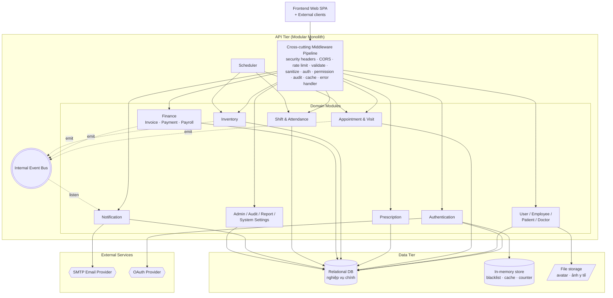

**Subsystems:**

- **Authentication module** – Đăng ký, đăng nhập mật khẩu / OAuth bên thứ ba / OTP, đặt lại mật khẩu, thu hồi token.
- **User & Employee module** – Hồ sơ người dùng và nhân viên, quản trị Role–Permission, ảnh đại diện.
- **Patient module** – Hồ sơ bệnh nhân, thông tin sức khỏe.
- **Doctor & Specialty module** – Hồ sơ bác sĩ, chuyên khoa.
- **Appointment & Visit module** – Đặt lịch (online / offline), hủy / đổi lịch, check-in / check-out, ghi chẩn đoán + triệu chứng + dấu hiệu sinh tồn.
- **Prescription module** – Kê đơn theo lượt khám, chi tiết đơn thuốc.
- **Inventory module** – Quản lý thuốc, nhập / xuất kho, cảnh báo hết hạn.
- **Finance module** – Hóa đơn, mục hóa đơn, thanh toán, hoàn tiền, bảng lương.
- **Shift & Attendance module** – Mẫu ca, sinh lịch trực tự động, gán ca cho bác sĩ, chấm công.
- **Notification module** – Thông báo in-app, email, cài đặt thông báo cá nhân.
- **Admin module** – Audit log, dashboard, báo cáo PDF / Excel, cấu hình hệ thống, maintenance mode.
- **Cross-cutting middleware** – Security headers, CORS, rate limit, body parser, validate, sanitize, auth, permission, audit, cache, error handler.

Các module giao tiếp qua **service API nội bộ**. Sự kiện nghiệp vụ giữa các module (ví dụ Appointment → Notification) đi qua **internal event bus**.

---

### 3.2. Implementation View

View này thấy cách mã nguồn được phân tầng và tổ chức thành package.

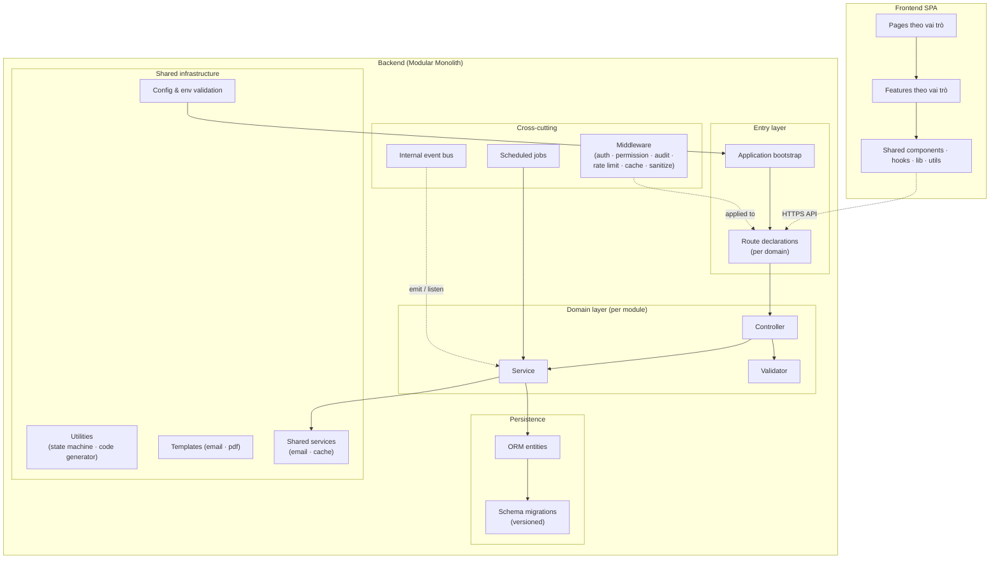

**Structure:**

- Backend là **modular monolith** theo package-by-feature: mỗi domain sở hữu các thành phần routes, controller, service, validator riêng.
- Cross-cutting (middleware, scheduled jobs, internal event bus) và shared infrastructure (config, utils, templates, shared services) gom ở lớp dùng chung.
- Frontend tổ chức theo vai trò người dùng và features.
- Schema DB version-controlled qua migration đánh số theo thời điểm để rollback an toàn.
- Test tách thành unit và integration.

**Technology choices:**

- **Backend runtime**: Node.js + Express + TypeScript.
- **ORM & DB**: ORM trên cơ sở dữ liệu quan hệ (MySQL).
- **Cache / shared state**: In-memory store ngoài tiến trình (Redis) cho danh sách thu hồi token, cache đọc, counter rate limit.
- **Authentication**: JWT cho token stateless; thuật toán hash adaptive cho mật khẩu; OAuth provider tích hợp qua thư viện strategy chuẩn.
- **Boundary defense**: thư viện security headers, CORS allow-list, rate limit middleware, schema validation, HTML sanitization, file upload middleware.
- **Scheduling**: cron-based scheduler.
- **Notification**: SMTP client cho email; internal event bus cho fan-out.
- **Reporting**: thư viện sinh PDF, Excel và biểu đồ ở backend.
- **Frontend**: React + Vite + TypeScript.
- **CI/CD**: container hoá bằng Docker; build TypeScript; test bằng test runner và HTTP client tích hợp.

---

### 3.3. Deployment View

View này thấy cách hệ thống chạy trên hạ tầng thực tế.

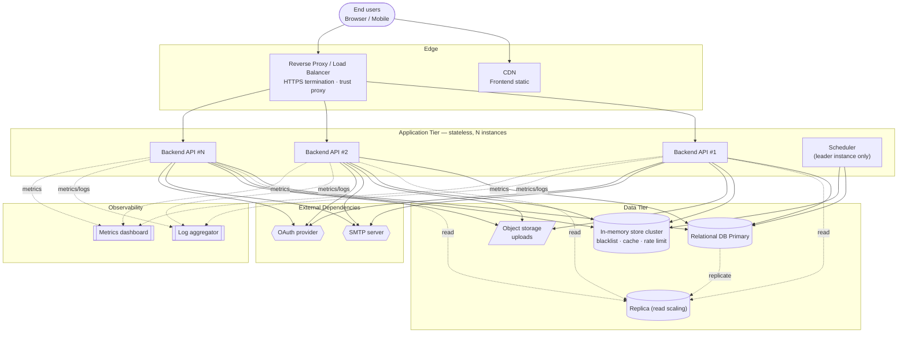

**Environment:**

- Triển khai trên cloud (AWS / GCP / Azure) hoặc on-prem server tại phòng khám.
- **Reverse proxy / Load balancer** đứng trước Backend; bật trust proxy để rate limit hoạt động đúng phía sau proxy.
- **Backend API tier** chạy nhiều instance stateless.
- **Frontend** build tĩnh, host trên CDN hoặc tích hợp với reverse proxy.
- **Relational DB** chạy primary + replica (nếu cần read scaling).
- **In-memory store** là điều kiện để API tier thực sự stateless khi scale ≥ 2 instance.
- **Scheduler** chạy ở một instance duy nhất (leader) để tránh trùng job.
- **Monitoring** – log tổng hợp; có thể export sang ELK hoặc Prometheus / Grafana.

**Deployment Example:**

- Region: ap-southeast-1 (Singapore) hoặc on-prem tại Việt Nam.
- Backend container hoá bằng Docker; orchestration tuỳ chọn (Docker Compose cho phòng khám đơn lẻ, Kubernetes cho chuỗi phòng khám).
- HTTPS bắt buộc ở reverse proxy; bảo vệ tầng nội bộ giữa backend ↔ in-memory store ↔ DB trong môi trường shared.

---

### 3.4. Data View

View này tập trung vào mô hình dữ liệu **khái niệm** và quan hệ chính giữa các thực thể (không phải full schema).

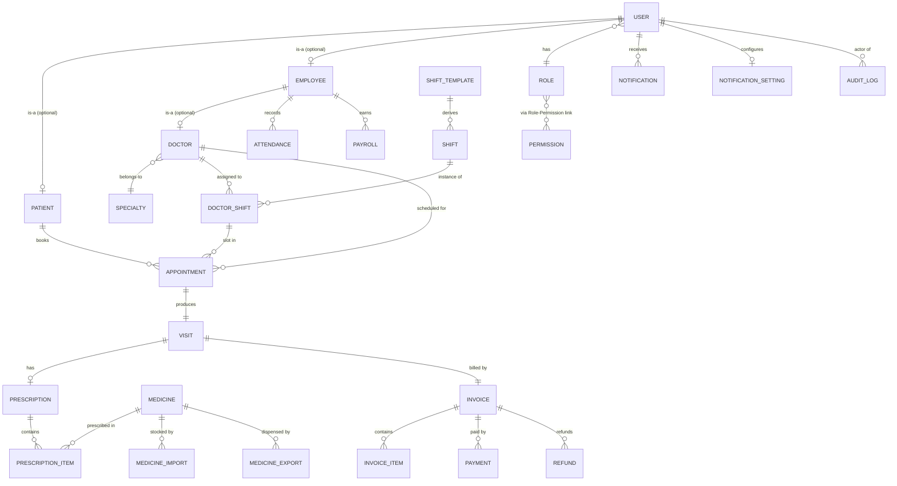

> Tên thực thể trong sơ đồ là **khái niệm domain**, không phải tên bảng cuối cùng trong CSDL. Schema chi tiết, tên cột, chỉ mục cụ thể, ràng buộc thuộc về tài liệu thiết kế chi tiết (SAD).

**Primary Storage:**

- **Relational DB (qua ORM)** – Store nghiệp vụ chính, gồm các nhóm thực thể:
  - Định danh & phân quyền: User, Role, Permission, Role-Permission link.
  - Bệnh nhân & nhân viên: Patient (kèm hồ sơ y tế), Employee, Doctor, Specialty.
  - Ca trực & chấm công: Shift Template, Shift, Doctor-Shift assignment, Attendance.
  - Nghiệp vụ khám: Appointment, Visit (kèm chẩn đoán), Disease Category.
  - Thuốc & kê đơn: Medicine, Medicine Import, Medicine Export, Prescription (kèm item).
  - Tài chính: Invoice (kèm item), Payment, Refund, Payroll.
  - Hệ thống: Notification, Notification Setting, Audit Log, System Settings.
- **In-memory store** – Dữ liệu phù du và shared state:
  - Danh sách thu hồi token với TTL bằng thời hạn token.
  - Cache GET cho dữ liệu read-heavy (TTL ngắn).
  - Rate limit counter khi scale ≥ 2 instance.
- **File / Object storage** – avatar người dùng, ảnh y tế đính kèm.

**Indexing & Migration Strategy:**

- Chỉ mục có chủ đích cho các trường lọc thông dụng — xác định ở giai đoạn schema design, không bổ sung patch sau.
- Mã định danh nghiệp vụ (patient code, appointment code, invoice code) sinh trong cùng transaction với bản ghi để tránh trùng.
- Migration version-controlled theo thời điểm để rollback an toàn.

**Security Measures:**

- HTTPS bắt buộc ở reverse proxy cho mọi client–server traffic.
- Mật khẩu hash bằng thuật toán adaptive với salt; bí mật tách khỏi mã nguồn và validate khi khởi động.
- Truy cập DB / store ngoài hạn chế theo network policy; tài khoản ứng dụng có quyền tối thiểu.
- Audit log lưu chủ thể, hành động, đối tượng, giá trị trước / sau, đủ cho yêu cầu compliance nội bộ.

---

### 3.5. Process View

View này mô tả hành vi runtime của các luồng nghiệp vụ nhạy cảm — nơi xảy ra concurrency, transaction, retry, fallback. Diagram dùng tên thành phần khái niệm (Authentication Service, Token Store, Internal Event Bus...) — không phải tên function / endpoint cụ thể.

#### 3.5.1. Concurrent appointment booking (ASR-DI-01)

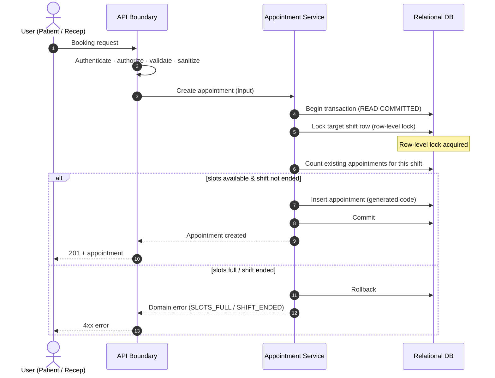

#### 3.5.2. Atomic invoice + inventory dispense (ASR-DI-02)

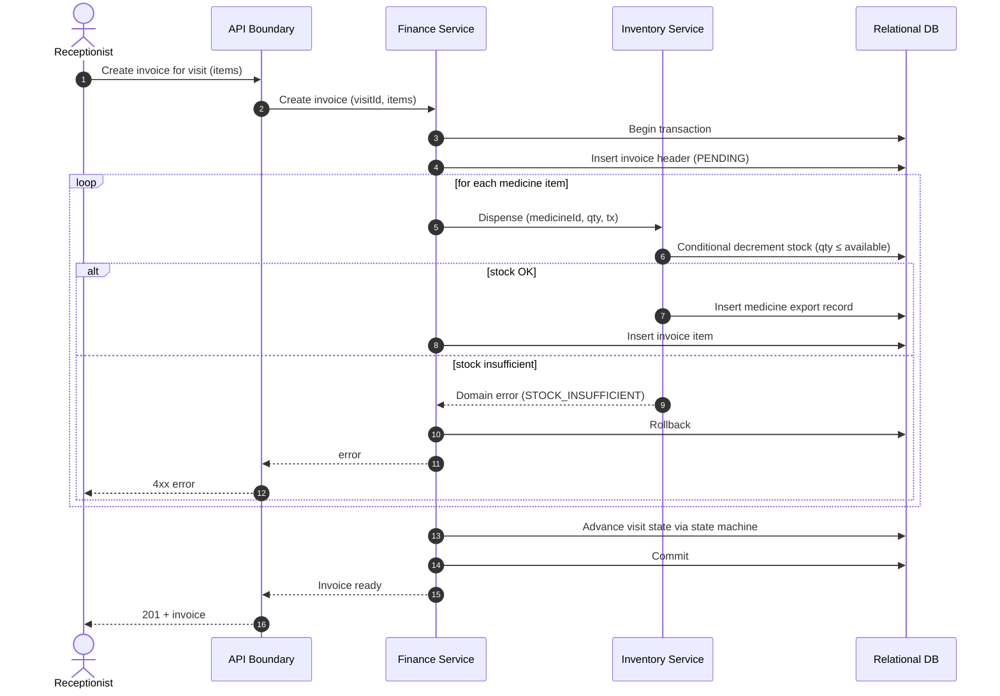

#### 3.5.3. Authentication, request validation và token revocation (ASR-SEC-01)

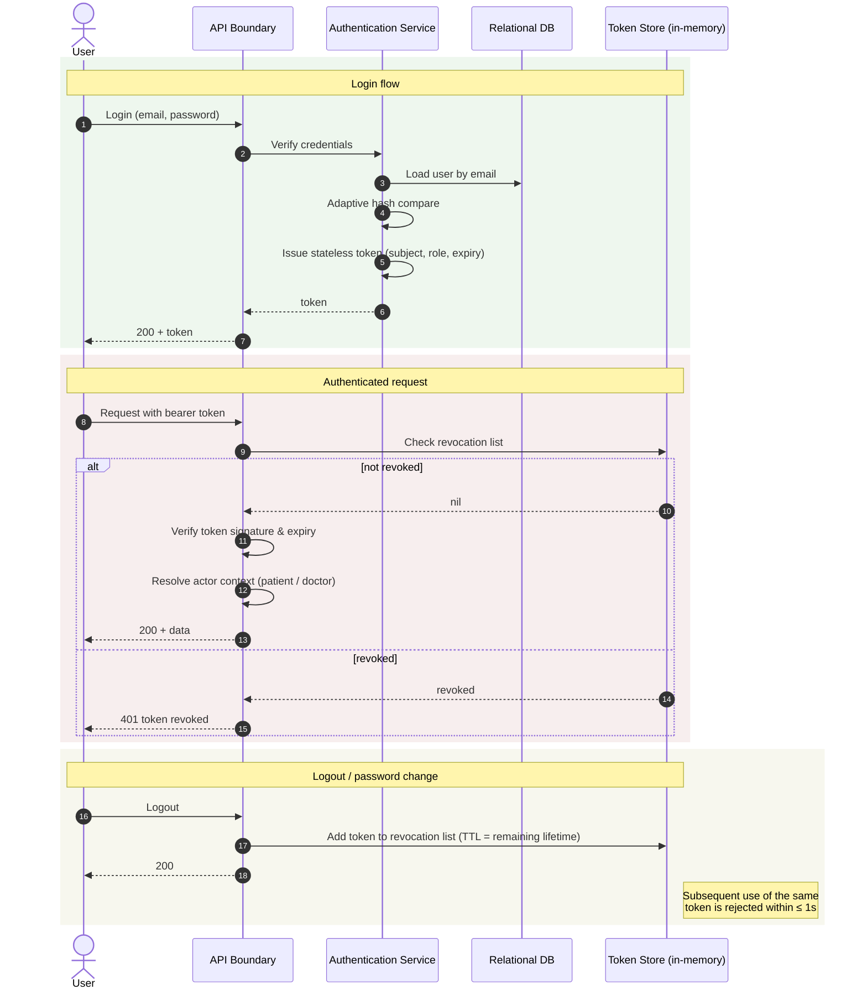

#### 3.5.4. Scheduled auto-no-show job (ASR-AVL-01)

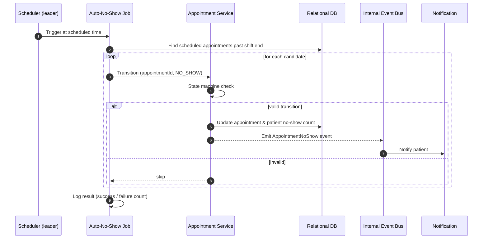

---

### 3.6. Security View

View này gom mọi quyết định an ninh thành một bức tranh thống nhất.

#### 3.6.1. Request defense pipeline (ASR-SEC-01 → SEC-04)

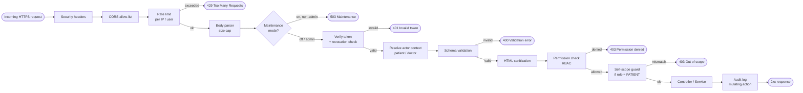

#### 3.6.2. RBAC model (ASR-SEC-02)

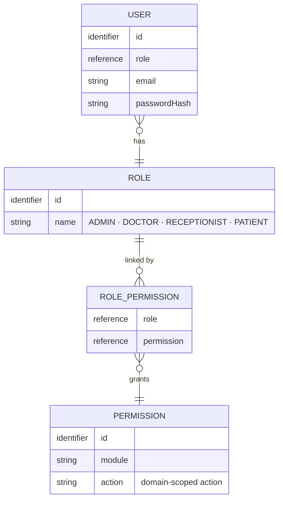

#### 3.6.3. Token lifecycle (ASR-SEC-01)

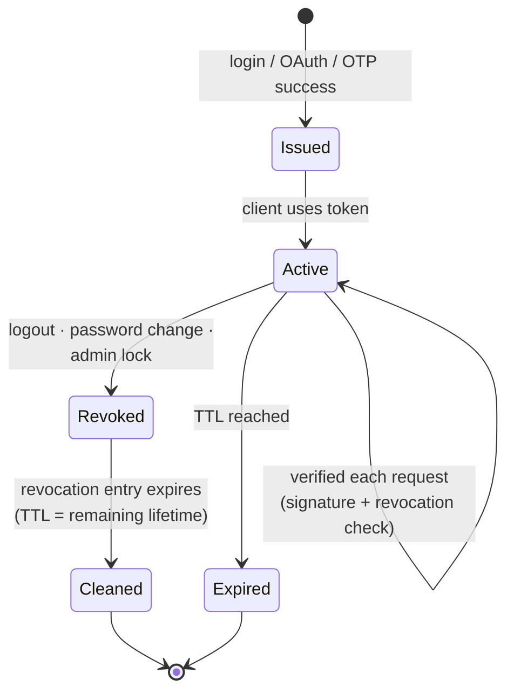

#### 3.6.4. Defense-in-depth summary

| Layer | Tactic | ASR liên quan |
| --- | --- | --- |
| Transport | HTTPS bắt buộc ở reverse proxy; bảo vệ tầng nội bộ giữa backend ↔ store ngoài | ASR-SEC-05 |
| Edge | Security headers, CORS allow-list, rate limit theo IP/user, giới hạn kích thước body | ASR-SEC-04, ASR-PERF-02 |
| Identity | Token stateless + danh sách thu hồi ngoài tiến trình; hash adaptive + salt; OTP qua email; OAuth provider ngoài | ASR-SEC-01, ASR-SEC-05 |
| Authorization | RBAC (Role × Permission) + self-scope cho bệnh nhân | ASR-SEC-02, ASR-SEC-03 |
| Input | Schema validation + HTML sanitization ở biên | ASR-SEC-04 |
| State change | Centralized state machine cho lifecycle nghiệp vụ | ASR-DI-03 |
| Observability | Audit log đầy đủ giá trị trước / sau cho mọi mutating action | ASR-DI-04, ASR-MAN-01 |
| Secret | Bí mật đọc từ biến môi trường / secret store + validate khi khởi động | ASR-SEC-05 |

---

## 4. Phụ lục: Traceability ASR ↔ ADD

| ASR | Tên ASR | ADD section |
| --- | --- | --- |
| ASR-SEC-01 | Xác thực mạnh kèm thu hồi phiên | 2.1.1 |
| ASR-SEC-02 | RBAC + permission chi tiết | 2.1.2 |
| ASR-SEC-03 | Bệnh nhân chỉ thấy dữ liệu của mình | 2.1.3 |
| ASR-SEC-04 | Phòng thủ nhiều lớp ở biên API | 2.1.4 |
| ASR-SEC-05 | Bảo vệ credential & secret | 2.1.5 |
| ASR-PERF-01 | Đáp ứng nhanh cho list/search/dashboard | 2.2.1 |
| ASR-PERF-02 | Khống chế tài nguyên dưới burst | 2.2.2 |
| ASR-DI-01 | Đặt lịch đồng thời nhất quán | 2.3.1 |
| ASR-DI-02 | Tài chính nguyên tử | 2.3.2 |
| ASR-DI-03 | State machine tường minh | 2.3.3 |
| ASR-DI-04 | Audit log cho thao tác nhạy cảm | 2.3.4 |
| ASR-AVL-01 | Tác vụ nền không cản trở request | 2.4.1 |
| ASR-AVL-02 | Maintenance mode runtime | 2.4.2 |
| ASR-AVL-03 | Graceful degradation | 2.4.3 |
| ASR-USA-01 | API contract đồng nhất | 2.5.1 |
| ASR-USA-02 | UI theo vai trò | 2.5.2 |
| ASR-MAN-01 | Quan sát vận hành | 2.6.1 |
| ASR-MAN-02 | Cấu hình runtime | 2.6.2 |
| ASR-MAN-03 | Báo cáo/xuất dữ liệu | 2.6.3 |
| ASR-MOD-01 | Tách module theo domain | 2.7.1 |
| ASR-MOD-02 | Pluggable auth provider | 2.7.2 |
| ASR-MOD-03 | Thêm kênh notification | 2.7.3 |
| ASR-SCA-01 | API stateless + state ngoài | 2.8.1 |
| ASR-SCA-02 | Tăng trưởng dữ liệu | 2.8.2 |

**Độ phủ:** 24 ASR ↔ 24 section – 1:1 – 100%.
