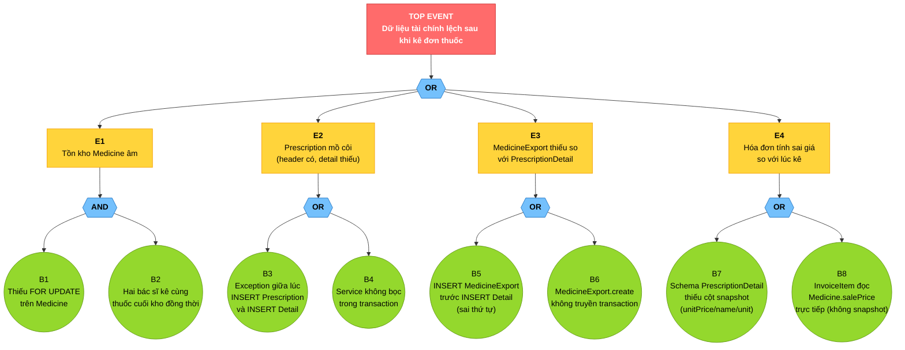

# Bước 9: Fault Tree Analysis cho ASR-DI-02

## Bối cảnh — Giảng viên hỏi gì?

> *"Sử dụng Fault Tree để phân tích một feature trong đề tài của các bạn tương ứng với một thuộc tính chất lượng cần phải đảm bảo."*

Đây là **yêu cầu số 2** của giảng viên (sau yêu cầu về Design Pattern — xem [03_ADD_va_design_pattern.md](03_ADD_va_design_pattern.md)). File này chứa toàn bộ kịch bản trình bày FTA cho **feature kê đơn thuốc** với **quality attribute Data Integrity (ASR-DI-02)**.

---

## 1. Fault Tree Analysis là gì? (nói trong 30 giây)

> "**Fault Tree Analysis (FTA)** là kỹ thuật phân tích lỗi **từ trên xuống** (top-down). Bắt đầu từ một sự cố không mong muốn (gọi là **Top Event**), rồi đi ngược từng bước để tìm **tất cả nguyên nhân gốc rễ** có thể gây ra sự cố đó.
>
> Ra đời năm 1962 tại Bell Labs để phân tích an toàn cho tên lửa Minuteman, sau đó được NASA, hàng không, hạt nhân, y tế áp dụng rộng rãi. Trong software architecture, FTA dùng để phân tích rủi ro liên quan đến quality attribute và tìm các điểm yếu kiến trúc."

**Một câu để nhớ**: *"Hỏi ngược — cái này hỏng VÌ những lý do gì?"*

---

## 2. Ký hiệu cần biết để vẽ và đọc cây

### 2.1. Sự kiện (Events)

| Hình | Tên | Ý nghĩa |
|---|---|---|
| ▭ chữ nhật | **Top Event / Intermediate Event** | Sự cố có thể phân rã tiếp |
| ◯ tròn | **Basic Event** | Nguyên nhân gốc rễ — không phân rã thêm |
| ◇ thoi | **Undeveloped Event** | Có thể phân rã nhưng không xét trong scope |
| ⌂ nhà | **External Event** | Sự kiện bên ngoài, không kiểm soát được |

### 2.2. Cổng logic (Gates)

| Cổng | Ý nghĩa | Khi nào dùng |
|---|---|---|
| **AND** | Sự cố cha xảy ra **chỉ khi TẤT CẢ** sự kiện con xảy ra | Cần đồng thời nhiều điều kiện |
| **OR** | Sự cố cha xảy ra **khi BẤT KỲ** sự kiện con xảy ra | Một trong các điều kiện đủ |
| **XOR** | Đúng 1 sự kiện con xảy ra | Ít dùng trong software |
| **Priority AND** | Sự kiện con xảy ra theo đúng thứ tự | Ít dùng trong software |

---

## 3. Top Event — Sự cố cần phân tích

### 3.1. Phát biểu Top Event

> **TOP EVENT**: *"Dữ liệu tài chính lệch sau khi bác sĩ kê đơn thuốc — một hoặc nhiều trong 4 dấu hiệu: (a) tồn kho Medicine âm, (b) Prescription mồ côi (header tồn tại nhưng thiếu detail), (c) MedicineExport thiếu so với PrescriptionDetail, (d) hóa đơn tính sai giá so với lúc bác sĩ kê."*

### 3.2. Ánh xạ với Quality Attribute

| Yếu tố | Giá trị |
|---|---|
| **Feature được phân tích** | Kê đơn thuốc (UC15 — Create Prescription) |
| **Quality Attribute** | Data Integrity |
| **ASR liên quan** | ASR-DI-02 — Tính nguyên tử của giao dịch tài chính |
| **Architectural Impact** | ⭐ Very High (xem [UtilityTree.md](../UtilityTree.md) UT-DI-02) |
| **Hậu quả nghiệp vụ** | Mất tiền, sai pháp lý, audit không truy được, vi phạm kế toán |

### 3.3. Vì sao chọn Top Event này?

> "Em chọn Data Integrity và feature kê đơn thuốc vì 3 lý do:
> 1. **Architectural Impact cao nhất** — Very High theo Utility Tree.
> 2. **Xuyên 4 module + 8 bảng** — nhiều điểm có thể fail nhất → cây phân rã giàu nhánh nhất.
> 3. **Hậu quả không thể phục hồi** — sai một lần là sai vĩnh viễn, không tự sửa được."

---

## 4. Cây Fault Tree

### 4.1. Sơ đồ đầy đủ (Mermaid)



### 4.2. Phiên bản ASCII (in giấy hoặc copy nhanh)

```
                  ┌───────────────────────────────────────────┐
                  │  TOP EVENT                                │
                  │  Dữ liệu tài chính lệch sau khi kê đơn   │
                  └────────────────────┬──────────────────────┘
                                       │
                                      OR
        ┌──────────────────┬───────────┴────────────┬────────────────┐
        ▼                  ▼                        ▼                ▼
   ┌─────────┐      ┌──────────────┐         ┌──────────────┐  ┌─────────────┐
   │   E1    │      │      E2      │         │     E3       │  │     E4      │
   │ Tồn kho │      │ Prescription │         │ MedicineExp  │  │ Hóa đơn     │
   │ Medi.âm │      │   mồ côi     │         │   thiếu      │  │ tính sai giá│
   └────┬────┘      └──────┬───────┘         └──────┬───────┘  └──────┬──────┘
        │                  │                        │                 │
       AND                OR                       OR                OR
     ┌──┴──┐            ┌──┴──┐                  ┌──┴──┐           ┌──┴──┐
     ▼     ▼            ▼     ▼                  ▼     ▼           ▼     ▼
   ┌──┐  ┌──┐         ┌──┐  ┌──┐               ┌──┐  ┌──┐        ┌──┐  ┌──┐
   │B1│  │B2│         │B3│  │B4│               │B5│  │B6│        │B7│  │B8│
   └──┘  └──┘         └──┘  └──┘               └──┘  └──┘        └──┘  └──┘

B1: Thiếu FOR UPDATE trên Medicine
B2: Hai bác sĩ kê cùng thuốc cuối kho đồng thời
B3: Exception giữa INSERT Prescription và INSERT Detail
B4: Service không bọc trong transaction
B5: INSERT MedicineExport trước INSERT Detail (sai thứ tự)
B6: MedicineExport.create không truyền transaction
B7: Schema PrescriptionDetail thiếu cột snapshot
B8: InvoiceItem đọc Medicine.salePrice trực tiếp
```

---

## 5. Phân tích từng nhánh trung gian

### 5.1. Nhánh E1 — Tồn kho Medicine âm

**Gate: AND** — Cần **đồng thời** 2 điều kiện.

> "Em chọn AND vì: nếu chỉ thiếu lock (B1) mà không có concurrent (B2) → không lệch. Nếu có concurrent mà có lock → cũng không lệch. Phải gặp cả 2."

#### Basic Event B1 — Thiếu `FOR UPDATE` trên Medicine

- **Nguyên nhân**: Dev quên thêm `lock: t.LOCK.UPDATE` khi gọi `Medicine.findByPk(...)`.
- **Hậu quả**: Hai transaction đọc cùng `quantity = 10`, mỗi transaction trừ độc lập, kết quả lệch.
- **Vị trí code**: [prescription.service.ts:162-165](../../Backend/src/modules/appointment/prescription.service.ts)

#### Basic Event B2 — Hai bác sĩ kê cùng thuốc đồng thời

- **Nguyên nhân**: Sự kiện ngoài kiểm soát — giờ cao điểm 7-9h, nhiều bệnh nhân.
- **Hậu quả**: Race condition khi cùng đọc + cùng trừ Medicine.quantity.
- **Không thể chặn từ ngoài** — chỉ có thể bảo vệ bằng B1's lock.

### 5.2. Nhánh E2 — Prescription mồ côi

**Gate: OR** — Bất kỳ lý do nào trong 2.

> "Em chọn OR vì: chỉ cần một trong hai lỗi là Prescription header tồn tại nhưng PrescriptionDetail không có / không đủ."

#### Basic Event B3 — Exception giữa INSERT Prescription và INSERT Detail

- **Nguyên nhân**: Lỗi mạng tới DB, exception trong vòng lặp medicine, timeout, deadlock.
- **Hậu quả nếu không transaction**: Header đã commit, detail chưa kịp commit → mồ côi.

#### Basic Event B4 — Service không bọc trong transaction

- **Nguyên nhân**: Dev mới viết code không tuân quy ước, gọi `Prescription.create()` rồi `PrescriptionDetail.create()` rời rạc.
- **Hậu quả**: Mỗi INSERT auto-commit độc lập → exception giữa chừng = mồ côi.

### 5.3. Nhánh E3 — MedicineExport thiếu

**Gate: OR**:

#### B5 — INSERT MedicineExport TRƯỚC INSERT PrescriptionDetail

- **Nguyên nhân**: Dev đảo thứ tự code.
- **Hậu quả**: Nếu Detail INSERT fail (ví dụ violate UNIQUE), Export đã ghi → có Export mà không có Detail tương ứng.

#### B6 — `MedicineExport.create()` không truyền `{ transaction: t }`

- **Nguyên nhân**: Dev quên tham số.
- **Hậu quả**: Export auto-commit độc lập, các bước khác rollback → có Export mồ côi.

### 5.4. Nhánh E4 — Hóa đơn tính sai giá

**Gate: OR**:

#### B7 — Schema thiếu cột snapshot

- **Nguyên nhân**: Lúc thiết kế DB, dev chỉ thêm `medicineId` (FK), không thêm `medicineName/unit/unitPrice`.
- **Hậu quả**: Khi tạo hóa đơn, buộc phải JOIN Medicine → đọc giá hiện tại → sai.

#### B8 — InvoiceItem đọc `Medicine.salePrice` trực tiếp

- **Nguyên nhân**: Code `invoice.service.ts` không tuân Memento pattern, đọc Medicine thay vì PrescriptionDetail.
- **Hậu quả**: Admin đổi giá → hóa đơn lập sau đổi giá → tính sai.

---

## 6. Minimal Cut Sets

**Định nghĩa**: Tổ hợp **tối thiểu** các Basic Event đủ để gây Top Event xảy ra.

| # | Cut Set | Số phần tử | Loại |
|---|---|---|---|
| 1 | {B1, B2} | 2 | Cut set AND — cần cả 2 |
| 2 | {B3} | 1 | **Single Point of Failure** ⚠️ |
| 3 | {B4} | 1 | **Single Point of Failure** ⚠️ |
| 4 | {B5} | 1 | **Single Point of Failure** ⚠️ |
| 5 | {B6} | 1 | **Single Point of Failure** ⚠️ |
| 6 | {B7} | 1 | **Single Point of Failure** ⚠️ |
| 7 | {B8} | 1 | **Single Point of Failure** ⚠️ |

### Bài học từ Cut Sets

> "Có **6 single point of failure** trong feature kê đơn — nghĩa là chỉ cần MỘT lỗi đơn lẻ là dữ liệu lệch. Đây chính là lý do ASR-DI-02 buộc kiến trúc phải chặt mọi cửa, không chỉ một vài chỗ."
>
> "Cut set duy nhất có 2 phần tử (B1, B2) — Pessimistic Lock đã làm cho 'thiếu lock' không đủ một mình gây lỗi, cần có cả 'concurrent traffic'. Đây là lý do em chọn pessimistic thay vì optimistic — biến SPOF thành cut set 2 phần tử khó xảy ra hơn."

---

## 7. Mitigation Table — Cơ chế đã có trong code

| Basic Event | Cơ chế phòng ngừa | Vị trí code / Tactic |
|---|---|---|
| **B1** Thiếu FOR UPDATE | Pessimistic Locking | [prescription.service.ts:162](../../Backend/src/modules/appointment/prescription.service.ts) — `Medicine.findByPk(item.medicineId, { transaction: t, lock: t.LOCK.UPDATE })` |
| **B2** Concurrent race | Đã chặn bởi B1's lock — bác sĩ B phải đợi A commit/rollback | (cùng vị trí với B1) |
| **B3** Exception giữa INSERT | Template Method via `sequelize.transaction()` → auto rollback | [prescription.service.ts:85-90](../../Backend/src/modules/appointment/prescription.service.ts) — `sequelize.transaction({ isolationLevel: READ_COMMITTED }, async (t) => {...})` |
| **B4** Quên transaction | Code review convention + comment block đầu file (Pattern (GoF)) | [prescription.service.ts:27-43](../../Backend/src/modules/appointment/prescription.service.ts) |
| **B5** Thứ tự sai | Code đặt INSERT Detail **trước** INSERT MedicineExport có chủ đích | [prescription.service.ts:191-219](../../Backend/src/modules/appointment/prescription.service.ts) — Detail (dòng 191) → Export (dòng 209) |
| **B6** MX ngoài transaction | Truyền `{ transaction: t }` vào `MedicineExport.create(...)` | [prescription.service.ts:218](../../Backend/src/modules/appointment/prescription.service.ts) |
| **B7** Schema thiếu snapshot | Migration thêm cột `medicineName`, `unit`, `unitPrice` vào `PrescriptionDetail` từ đầu | [Backend/migrations/](../../Backend/migrations/) — model [PrescriptionDetail.ts](../../Backend/src/models/PrescriptionDetail.ts) |
| **B8** Đọc Medicine trực tiếp | Invoice service đọc snapshot từ PrescriptionDetail (Memento Pattern) | [invoice.service.ts:264-282](../../Backend/src/modules/finance/invoice.service.ts) — đọc `detail.unitPrice`, `detail.medicineName` (không JOIN Medicine) |

---

## 8. Bonus — Probabilistic Analysis (định lượng)

> Phần này tham khảo — chỉ nói nếu giảng viên hỏi sâu.

Nếu gán xác suất ước lượng cho từng Basic Event (giả định):

| Basic Event | P (ước lượng) | Ghi chú |
|---|---|---|
| B1 (thiếu lock) | 0.02 | Code review tốt sẽ catch |
| B2 (concurrent) | 0.30 | Cao trong giờ cao điểm |
| B3 (exception mid-INSERT) | 0.01 | Sequelize transaction wrap đã chặn |
| B4 (quên transaction) | 0.01 | Convention review |
| B5 (sai thứ tự) | 0.01 | Code review |
| B6 (MX ngoài tx) | 0.01 | Code review |
| B7 (thiếu cột) | 0.001 | Đã design ngay từ đầu |
| B8 (đọc Medicine) | 0.005 | Code review |

**Tính P(Top Event) — giả sử các sự kiện độc lập:**

- P(E1) = P(B1) × P(B2) = 0.02 × 0.30 = **0.006**
- P(E2) = 1 − (1 − P(B3)) × (1 − P(B4)) = 1 − 0.99 × 0.99 ≈ **0.0199**
- P(E3) = 1 − (1 − P(B5)) × (1 − P(B6)) ≈ **0.0199**
- P(E4) = 1 − (1 − P(B7)) × (1 − P(B8)) ≈ **0.006**

- P(Top Event) = 1 − ∏(1 − P(Ei)) ≈ 1 − 0.994 × 0.980 × 0.980 × 0.994 ≈ **0.052** (~5.2%)

→ **Diễn giải**: ở giả định P trên, có khoảng 5% khả năng dữ liệu lệch trong 1 lần kê đơn nếu **không có** các cơ chế mitigation. Sau mitigation, các P thực tế giảm xuống gần 0 — đó là giá trị của FTA + đầu tư vào architectural tactics.

---

## 9. Cách trình bày khi defense (5-7 phút)

### Cấu trúc bài

> **(1) Khai báo Top Event + QA (30 giây)**
> "Em phân tích feature *Kê đơn thuốc* với quality attribute *Data Integrity* — ASR-DI-02. Top Event: *Dữ liệu tài chính lệch sau khi kê đơn — bốn dấu hiệu: tồn kho âm, prescription mồ côi, MedicineExport thiếu, hóa đơn tính sai giá.*"
>
> **(2) Vẽ cây — đi từ Top Event xuống (2-3 phút)**
> Vẽ trên bảng/slide. Mỗi node giải thích ngắn + chọn gate AND/OR có lý do.
>
> - "OR ở Top → bất kỳ một trong 4 dấu hiệu là Top Event xảy ra"
> - "AND ở E1 → tồn âm cần cả thiếu lock + concurrent đồng thời"
> - "OR ở E2,E3,E4 → từng nguyên nhân đủ một mình"
>
> **(3) Chỉ ra Minimal Cut Sets (1 phút)**
> "Em xác định 7 cut set. **6 là single point of failure** — chỉ 1 lỗi đã đủ. Cut set duy nhất 2 phần tử là {B1,B2} — Pessimistic Lock đã biến SPOF thành cut set khó xảy ra."
>
> **(4) Mitigation Table với code thực tế (2 phút)**
> Mở [prescription.service.ts](../../Backend/src/modules/appointment/prescription.service.ts) → chỉ vào từng dòng code đã chặn từng Basic Event.
>
> **(5) Chốt — vì sao FTA giúp kiến trúc tốt hơn (30 giây)**
> "FTA cho em **bức tranh đầy đủ** các điểm yếu — không chỉ test cái em nghĩ ra. Mỗi Basic Event = 1 test case fault injection. Và quan trọng: nó giúp em hiểu rõ **giá trị của từng tactic** — không phải dùng vì 'có sẵn' mà vì 'chặn cụ thể basic event nào'."

---

## 10. Q&A — Câu hỏi giảng viên hay hỏi

| Câu hỏi | Câu trả lời |
|---|---|
| *"FTA khác FMEA thế nào?"* | "FTA top-down — bắt đầu từ failure → tìm nguyên nhân. FMEA bottom-up — bắt đầu từ component → liệt kê mọi failure mode component đó có thể gây. Hai cách bổ sung, không thay thế. FTA dùng khi đã biết failure cụ thể muốn phòng; FMEA dùng khi khám phá toàn diện." |
| *"Có gate nào ngoài AND/OR không?"* | "Có. XOR (đúng 1 sự kiện con xảy ra), Priority AND (theo thứ tự thời gian), Inhibit (cần điều kiện kích hoạt). Trong software, AND/OR đủ cho 90% bài toán. Em chỉ dùng AND/OR cho bài này." |
| *"Cây em không cân — nhánh E1 chỉ 2 lá còn nhánh khác cũng tương tự, không đào sâu hơn được sao?"* | "Em ưu tiên đào sâu đến **mức đủ actionable** — mỗi basic event phải gán được mitigation cụ thể. Đào sâu hơn (ví dụ 'vì sao dev quên lock' → 'vì training', 'vì code review thiếu') sẽ dẫn vào nguyên nhân con người không thuộc kiến trúc phần mềm. Em dừng đúng ranh giới kỹ thuật." |
| *"Em có tính probability quantitative không?"* | "Em có ước lượng định tính trong file (mục 8). Tính được P(Top) ≈ 5.2% trước mitigation. Tuy nhiên software thường không có data thống kê đáng tin để định lượng — khác với phần cứng có MTBF rõ. Em giữ định tính làm chính." |
| *"Vì sao chọn Data Integrity, không phải Security hay Availability?"* | "Theo Utility Tree, ASR-DI-02 có Architectural Impact = Very High. Hậu quả lệch dữ liệu trong tài chính + y tế là **không thể phục hồi** — khác với Availability (downtime ngắn) hay Security (có thể audit + sửa). Đây là rủi ro 'một lần sai, sai vĩnh viễn'." |
| *"Nếu phòng khám scale lên 50 chi nhánh, cây của em có đổi không?"* | "Có. Sẽ thêm các nhánh Basic Event mới: split-brain giữa các DB chi nhánh, network partition giữa chi nhánh và trung tâm, sync conflict giữa các bản ghi cùng visitId... Lúc đó FTA sẽ chỉ ra nhu cầu Saga Pattern. Hiện tại 1 chi nhánh + 1 DB, các nhánh đó không tồn tại." |
| *"Em chứng minh được mitigation thực sự work không?"* | "Có — Demo 2 trong [05_Demo_huong_dan.md](05_Demo_huong_dan.md): kê 50 viên Augmentin khi kho chỉ có 8 → throw INSUFFICIENT_STOCK → kiểm DB → không có dòng nào thay đổi. Đây là chứng cứ trực quan rằng Template Method + Pessimistic Lock chặn được nhánh E1 và E3." |
| *"Có khi nào cây bị 'common cause' không? Tức là 2 basic event không độc lập?"* | "Có thể. Ví dụ B4 (quên transaction) và B6 (MX ngoài tx) đều xuất phát từ 'dev không hiểu transaction'. Nếu coi đây là common cause, em sẽ thêm intermediate event 'Dev không tuân quy ước transaction' trên cả B4 và B6. Cây sẽ chính xác hơn nhưng phức tạp hơn — em chấp nhận trade-off." |

---

## 11. Mở rộng — Nếu giảng viên muốn xem thêm Top Event khác

Để phòng giảng viên hỏi "thử Top Event khác xem", chuẩn bị sẵn 2 alternative trong các ASR:

### Alternative 1 — Top Event cho ASR-DI-01 (Concurrent Booking)

> **Top Event**: *"Đặt lịch khám vượt số slot tối đa của ca trực"*
>
> Cây tương tự: AND gate(thiếu FOR UPDATE trên DoctorShift, concurrent booking) ∨ OR(check slot count sai, sinh appointmentCode ngoài transaction).

### Alternative 2 — Top Event cho ASR-SEC-01 (Token Revocation)

> **Top Event**: *"Token đã thu hồi vẫn truy cập được API"*
>
> Cây: OR(Redis blacklist không được kiểm tra trước verify chữ ký, Redis chết và không có fallback, TTL của blacklist ngắn hơn TTL của token, race giữa logout và request kế tiếp).

→ Cho thấy bạn hiểu FTA áp dụng được cho nhiều QA khác nhau, không chỉ Data Integrity.

---

## Tóm 1 câu để nhớ

> "FTA cho ASR-DI-02 phân rã Top Event 'dữ liệu tài chính lệch' thành **4 nhánh trung gian** với 8 Basic Event. Có **6 SPOF** và 1 cut set 2 phần tử. Mỗi Basic Event được chặn bởi một tactic kiến trúc cụ thể trong code — Template Method, Pessimistic Lock, Memento Pattern. FTA chứng minh tactic không phải dùng vì 'có sẵn' mà vì 'chặn cụ thể basic event nào'."

---

*Cuối tài liệu Fault Tree Analysis cho ASR-DI-02. Quay về [README](README.md) để xem các file khác trong folder.*
