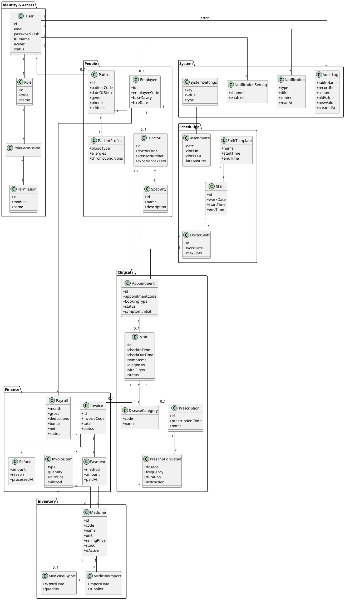
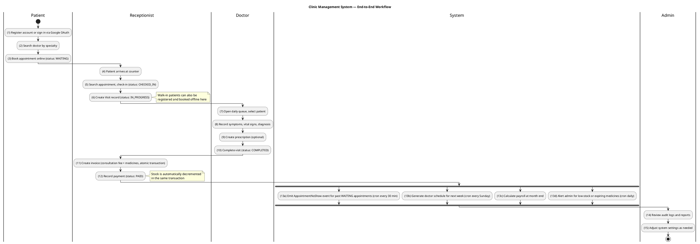
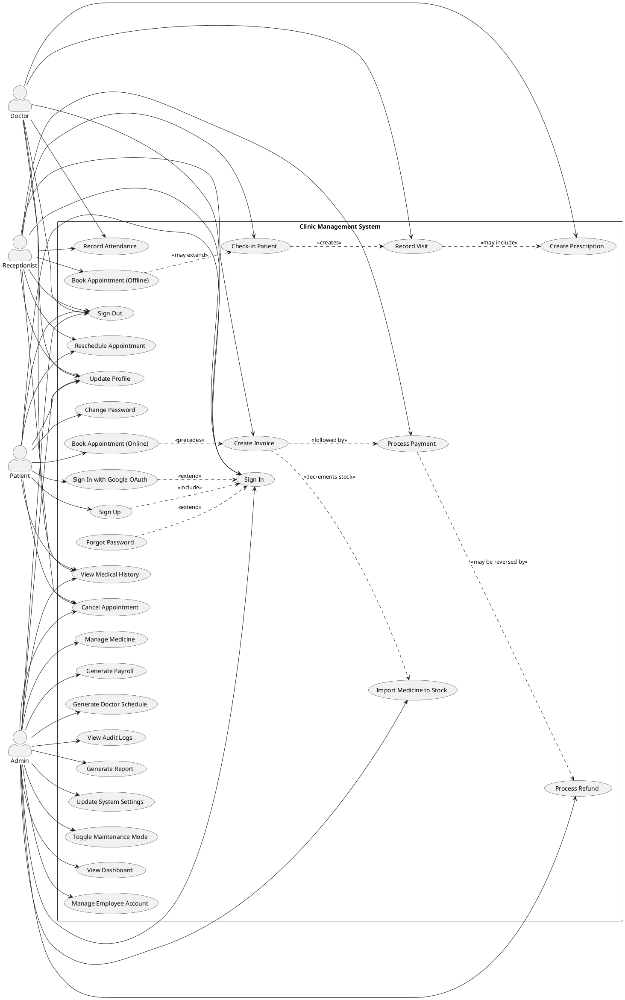

# BUSINESS REQUIREMENTS

**Prepared for:** Clinic Management System
**Date:** 2026-05-20
**Version:** 1.0

---

## Revision History

| Date | Version | Author | Change Description |
| --- | --- | --- | --- |
| 2026-04-15, 09:00 AM | 0.1 | Nguyen Minh Thien | Initial creation |
| 2026-04-18, 02:30 PM | 0.2 | Nguyen Minh Thien | Define application overview |
| 2026-04-22, 10:15 AM | 0.3 | Nguyen Minh Thien | Upload domain model |
| 2026-04-25, 11:40 AM | 0.4 | Nguyen Minh Thien | Modify domain model |
| 2026-04-28, 04:20 PM | 0.5 | Nguyen Minh Thien | Upload use case diagram |
| 2026-05-02, 09:30 AM | 0.6 | Nguyen Minh Thien | Write description for use cases |
| 2026-05-08, 03:15 PM | 0.7 | Nguyen Minh Thien | Add Security Matrix |
| 2026-05-12, 10:00 AM | 0.8 | Nguyen Minh Thien | Add User Stories and Change Requirements |
| 2026-05-20, 09:00 AM | 1.0 | Nguyen Minh Thien | Final version approval ready |

## Approval

| Date | Version | Approver Name | Position |
| --- | --- | --- | --- |
| 2026-04-16 | 0.1 | | Application Owner |
| 2026-04-16 | 0.1 | | ITPM |
| 2026-04-19 | 0.2 | | Application Owner |
| 2026-04-19 | 0.2 | | ITPM |
| 2026-04-26 | 0.3, 0.4, 0.5 | | Application Owner |
| 2026-04-26 | 0.3, 0.4, 0.5 | | ITPM |
| 2026-05-03 | 0.6 | | Application Owner |
| 2026-05-03 | 0.6 | | ITPM |
| 2026-05-09 | 0.7 | | Application Owner |
| 2026-05-09 | 0.7 | | ITPM |
| 2026-05-13 | 0.8 | | Application Owner |
| 2026-05-13 | 0.8 | | ITPM |
| 2026-05-20 | 1.0 | | Application Owner |
| 2026-05-20 | 1.0 | | ITPM |

---

## Table of Contents

1. [Objective and Scope](#1-objective-and-scope)
2. [Business Requirement](#2-business-requirement)
   - 2.1. Application Overview
   - 2.2. Domain Model
     - 2.2.1. Diagram
     - 2.2.2. Domain Objects Description
   - 2.3. Workflow
   - 2.4. Use Cases and Actors
     - 2.4.1. Diagram
     - 2.4.2. Description of Actors
     - 2.4.3. Description of Use Cases
   - 2.5. Security Matrix
   - 2.6. User Story
   - 2.7. Change Requirement
3. [Appendix](#3-appendix)
   - 3.1. Glossary
   - 3.2. Open Issues

---

# 1 Objective and Scope

This document describes the business requirements for the **Clinic Management System** Project. It contains the overall description of the application, the scope of data migration, and any changes needed to be performed during migration of the application.

This document along with the prototype demo is used for requirements confirmation, and it is to be signed off by the business. Details of business logic and graphic user interface of the application, which are not mentioned in this document, will be migrated as they are in the application.

---

# 2 Business Requirement

## 2.1. Application Overview

The Clinic Management System is a digital platform that digitizes end-to-end operations of a private clinic, from patient self-service registration to clinical examination, prescription, and financial settlement. It targets small-to-medium private clinics that need full operational coverage without the complexity and cost of large hospital information systems.

**Patients** can self-register through email with OTP verification or Google OAuth login. They can search doctors by specialty, view available shifts, and book appointments online without calling the clinic. Patients can view their own medical records, prescriptions, and invoices. They can also cancel or reschedule their appointments according to the clinic's policy.

**Receptionists** operate the front desk. They can register walk-in patients, book appointments on behalf of phone or in-person customers, check patients in upon arrival (which creates a clinical visit record), create invoices at the end of each visit (combining consultation fee and dispensed medicines into a single atomic transaction), and record patient payments.

**Doctors** view their daily shift schedule and the queue of checked-in patients. They record clinical findings (symptoms, vital signs, diagnosis) during each visit, optionally upload symptom images, classify the case by disease category, and issue digital prescriptions referencing the clinic's medicine catalog. Once a visit is completed, it becomes eligible for invoicing by the receptionist.

**Administrators** oversee the entire system. They manage employees and assign role-based permissions, manage the medicine catalog and stock-ins from suppliers, generate monthly payroll based on attendance records, generate doctor schedules automatically based on shift templates, view full audit logs of all sensitive operations, and produce financial and operational reports in Excel or PDF format. Admins also configure business parameters at runtime (such as slots per shift, consultation fee, expiry warning thresholds) and can enable system maintenance mode without redeploying the application.

The system guarantees **data integrity** for two critical flows: (1) concurrent appointment booking — multiple patients attempting to book the same near-full doctor shift will not exceed the slot limit, achieved through transactional row-level locking; (2) atomic invoice creation — the financial document, its line items, the dispensed medicine export records, and the corresponding inventory deduction all commit together or roll back together. The system also maintains a comprehensive audit log for all mutating operations on sensitive data (patients, visits, prescriptions, invoices, employees).

Notifications are sent through in-app banners and email (with hooks ready for future SMS or push channels). Email and external dependencies are designed for graceful degradation: if the SMTP server or OAuth provider is temporarily unavailable, core business flows (booking, examination, prescription, payment) continue to operate uninterrupted.

---

## 2.2. Domain Model

### 2.2.1. Diagram

> Paste the above into [https://www.planttext.com](https://www.planttext.com) to render the domain model.

### 2.2.2. Domain Objects Description

| # | Object Name | Object Description |
| --- | --- | --- |
| 1 | Admin | Users in this group have permission to manage employees, roles & permissions, medicine inventory, system settings, audit logs, and reports. |
| 2 | Receptionist | Users in this group handle front-desk operations: walk-in patient registration, offline appointment booking, patient check-in, invoice creation, payment processing. |
| 3 | Doctor | Medical practitioners who view their shift schedule, conduct examinations, record diagnoses and vital signs, and issue prescriptions. |
| 4 | Patient | End users seeking medical consultation. They can self-register, book online appointments, view their own medical records and prescriptions, and cancel or reschedule appointments. |
| 5 | User | The base account entity. Holds credentials (email, password hash), profile fields, and a foreign key to Role. May be linked to a Patient or Employee record. |
| 6 | Role | One of four pre-defined roles: ADMIN, RECEPTIONIST, DOCTOR, PATIENT. Linked to permissions through the RolePermission join table. |
| 7 | Permission | A fine-grained permission for a specific action in a domain module (e.g. `appointments.create`, `invoices.refund`). |
| 8 | Patient | Stores patient personal info (full name, date of birth, gender, phone, address). Linked to a User account (optional, for walk-in patients without account). |
| 9 | PatientProfile | Extended medical info: blood type, allergies, chronic conditions, current medications. |
| 10 | Employee | Stores staff personal and HR info: employee code, base salary, hire date. Linked to a User account. |
| 11 | Doctor | Specialized Employee with medical license info: license number, specialty, years of experience. |
| 12 | Specialty | Categorizes doctors (e.g. General Medicine, Pediatrics, Dermatology). |
| 13 | ShiftTemplate | Defines standard work periods (e.g. Morning 07:00–11:00, Afternoon 13:00–17:00, Evening 18:00–21:00). |
| 14 | Shift | A concrete instance of a ShiftTemplate on a specific date. |
| 15 | DoctorShift | An assignment of a specific Doctor to a specific Shift with a configurable `maxSlots` capacity. |
| 16 | Attendance | Daily clock-in / clock-out records for employees, with calculated late minutes and overtime. |
| 17 | Appointment | A scheduled booking by a Patient for a specific DoctorShift. Goes through states: WAITING → CHECKED_IN → IN_PROGRESS → COMPLETED (or CANCELLED / NO_SHOW). |
| 18 | Visit | A clinical examination record derived from a checked-in Appointment. Contains symptoms, vital signs, diagnosis, and links to Prescription and Invoice. |
| 19 | DiseaseCategory | A standardized classification of medical conditions (e.g. ICD-10 categories) referenced by Visit. |
| 20 | Prescription | A list of medicines prescribed by a Doctor during a Visit. |
| 21 | PrescriptionDetail | A line item within a Prescription: medicine, dosage, frequency, duration, instruction. |
| 22 | Medicine | A medicine in the clinic's catalog: code, name, unit, selling price, current stock, active flag. |
| 23 | MedicineImport | A stock-in record from a supplier, containing batch number, expiry date, cost price. Increments Medicine.stock. |
| 24 | MedicineExport | A stock-out record automatically created when an invoice includes medicine items. Decrements Medicine.stock. |
| 25 | Invoice | A billing document for a completed Visit. Contains consultation fee and optional medicine items. Goes through states: PENDING → PARTIALLY_PAID → PAID (or REFUNDED). |
| 26 | InvoiceItem | A line item in an Invoice: type (CONSULTATION or MEDICINE), unit price, quantity, subtotal. |
| 27 | Payment | A recorded payment against an Invoice. Multiple payments may apply to one invoice until fully paid. |
| 28 | Refund | A refund issued against a Payment when the visit is cancelled or items are returned. |
| 29 | Payroll | Monthly salary calculation per Employee: gross, deductions (late minutes), bonus (overtime), net. |
| 30 | Notification | An in-app notification record for a User (e.g. appointment confirmation, prescription ready, invoice issued). |
| 31 | NotificationSetting | Per-user preference for notification channels (email, in-app, future SMS). |
| 32 | AuditLog | Append-only record of every mutating action on sensitive data, capturing actor, action, target table, old value, and new value. |
| 33 | SystemSettings | Runtime-configurable business parameters (e.g. default slots per shift, consultation fee, expiry warning days, maintenance mode flag). |

---

## 2.3. Workflow

The clinic's end-to-end workflow combines online patient self-service, front-desk operations, clinical examination, and back-office settlement:

---

## 2.4. Use Cases and Actors

### 2.4.1. Diagram

> Paste the above into [https://www.planttext.com](https://www.planttext.com) to render the use case diagram.

### 2.4.2. Description of Actors

| # | Actor Name | Definition |
| --- | --- | --- |
| 1 | **Admin** | The administrator of the entire system. Responsible for employee and role management, medicine inventory management, payroll, schedule generation, audit log review, report generation, and runtime system configuration. |
| 2 | **Receptionist** | Front-desk staff. Handles walk-in patient registration, offline appointment booking, patient check-in (creating Visit records), invoice creation, and payment processing. |
| 3 | **Doctor** | Medical practitioner. Views daily shift schedule, conducts examinations, records clinical findings (symptoms, vital signs, diagnosis), and creates digital prescriptions. |
| 4 | **Patient** | End user who registers in the system to receive medical consultation. Can self-register via email or Google OAuth, book online appointments, view personal medical records, and cancel or reschedule appointments. |

### 2.4.3. Description of Use Cases

| # | Use Case Name | Definition |
| --- | --- | --- |
| 1 | Sign In | This use case describes the process by which a user (Patient, Doctor, Receptionist, or Admin) logs into the system using email and password. |
| 2 | Sign Up | This use case describes how a new Patient self-registers an account with email verification via OTP. |
| 3 | Forgot Password | This use case describes how users reset their password when they have forgotten it, via a reset link sent to their registered email. |
| 4 | Sign In with Google OAuth | This use case describes how users can sign in using their Google account; new users are auto-provisioned as Patient. |
| 5 | Sign Out | This use case describes how a user signs out from the system with immediate token revocation across all servers. |
| 6 | Change Password | This use case describes how a logged-in user changes their password; all existing sessions are revoked. |
| 7 | Update Profile | This use case describes how a user updates their personal information and avatar. |
| 8 | Manage Employee Account | This use case describes how Admin creates, updates, or deactivates employee accounts (Doctor, Receptionist). |
| 9 | Book Appointment (Online) | This use case describes how a Patient books an appointment online by selecting specialty, doctor, shift, and date. The system guarantees no over-booking under concurrent requests. |
| 10 | Book Appointment (Offline) | This use case describes how a Receptionist books an appointment on behalf of a walk-in or phone patient. |
| 11 | Cancel Appointment | This use case describes how a Patient can cancel their own appointment, or Receptionist/Admin can cancel any appointment within policy. |
| 12 | Reschedule Appointment | This use case describes how an appointment is rescheduled to a different doctor shift while preserving the appointment record. |
| 13 | Check-in Patient | This use case describes how a Receptionist checks in a patient upon arrival, creating a Visit record and updating the appointment status. |
| 14 | Record Visit | This use case describes how a Doctor records clinical examination details: symptoms, vital signs, diagnosis, and optionally attaches images. |
| 15 | Create Prescription | This use case describes how a Doctor creates a prescription tied to a visit, specifying medicines, dosages, and instructions. |
| 16 | Manage Medicine | This use case describes how Admin creates, updates, or deactivates medicines in the catalog. |
| 17 | Import Medicine to Stock | This use case describes how Admin records a stock-in of medicines from a supplier, incrementing the inventory. |
| 18 | Create Invoice | This use case describes how a Receptionist creates an invoice for a completed visit, atomic across Invoice, InvoiceItem, MedicineExport, and Medicine.stock. |
| 19 | Process Payment | This use case describes how a Receptionist records a payment against an invoice (cash, bank transfer, or future online gateways). |
| 20 | Process Refund | This use case describes how Admin processes a refund for a paid invoice (e.g. wrong medicine dispensed, service not delivered). |
| 21 | Generate Payroll | This use case describes how Admin generates monthly payroll for all employees based on base salary, attendance, and overtime. |
| 22 | Generate Doctor Schedule | This use case describes how doctor shift assignments for a future period are generated automatically (cron) or manually (Admin). |
| 23 | Record Attendance | This use case describes how employees clock in and clock out, recording their attendance. |
| 24 | View Audit Logs | This use case describes how Admin queries and inspects audit log entries for compliance and incident investigation. |
| 25 | Generate Report | This use case describes how Admin generates analytical reports (revenue, visits, inventory, payroll) for a specified period, exportable as Excel or PDF with charts. |
| 26 | Update System Settings | This use case describes how Admin changes runtime business parameters (slots per shift, consultation fee, etc.) without redeploying. |
| 27 | Toggle Maintenance Mode | This use case describes how Admin enables or disables maintenance mode, blocking normal user API access while keeping admin endpoints available. |
| 28 | View Medical History | This use case describes how Patients view their own medical history (appointments, visits, prescriptions, invoices), and how staff view records of patients within their scope. |
| 29 | View Dashboard | This use case describes how Admin views the consolidated business dashboard (today's appointments, revenue, inventory alerts, attendance summary). |

---

## 2.5. Security Matrix

Based on the system's roles (`ADMIN`, `RECEPTIONIST`, `DOCTOR`, `PATIENT`), the following table defines the access rights for each key function.

| Function | Admin | Receptionist | Doctor | Patient |
| --- | :---: | :---: | :---: | :---: |
| **Auth & Profile** | | | | |
| Sign In / Sign Up | x | x | x | x |
| Reset Password | x | x | x | x |
| Manage Personal Profile | x | x | x | x |
| **System & User Management** | | | | |
| Manage System Settings | x | | | |
| Manage Users & Roles | x | | | |
| View Audit Logs | x | | | |
| View Dashboard & Reports | x | | | |
| **Clinic Resource Management** | | | | |
| Manage Specialties & Doctors | x | | | |
| Manage Shifts & Templates | x | | | |
| Auto-generate Schedules | x | | | |
| Check-in / Check-out Attendance | x | x | x | |
| **Patient Journey** | | | | |
| Book Appointment (Online) | | | | x |
| Book Appointment (Offline) | x | x | | |
| Cancel Appointment | x | x | | x |
| Check-in Patient (Create Visit) | x | x | | |
| Conduct Medical Examination | | | x | |
| Manage Internal Referrals | | | x | |
| View Medical History | x | x | x | x |
| **Pharmacy & Finance** | | | | |
| Create / Update Prescription | | | x | |
| Dispense Prescription | x | x | | |
| Manage Medicine Inventory | x | | | |
| Generate & Manage Invoices | x | x | | |
| Process Payments & Refunds | x | x | | |
| Calculate & Approve Payroll | x | | | |

**Legend:** `x` = User has full permission to perform the action.

---

## 2.6. User Story

The following user stories describe the required system behaviors from the perspective of different actors.

### Common Users

- **As a User**, I want to be able to sign in using my email/password or Google OAuth so that I can securely access the platform.
- **As a User**, I want to be able to reset my password via OTP sent to my email so that I can regain access if I forget my credentials.
- **As a User**, I want to be able to update my personal profile and avatar so that my information remains accurate.
- **As a User**, I want to be able to sign out so that my session is immediately revoked and my account is safe even on shared devices.

### Patient

- **As a Patient**, I want to be able to view available doctors and their shifts so that I can choose a suitable time for my consultation.
- **As a Patient**, I want to be able to book an appointment online so that I can secure a time slot without calling the clinic.
- **As a Patient**, I want to be able to cancel my appointment in advance so that I am not marked as a "no-show".
- **As a Patient**, I want to be able to reschedule my appointment to a different shift so that I can accommodate schedule changes.
- **As a Patient**, I want to be able to view my medical history and prescriptions so that I can keep track of my past treatments.
- **As a Patient**, I want to receive automated email confirmations when I book, cancel, or reschedule an appointment so that I have a written record.

### Receptionist

- **As a Receptionist**, I want to be able to book offline appointments for walk-in or calling patients so that their slots are officially recorded in the system.
- **As a Receptionist**, I want to be able to check-in patients upon their arrival so that the system updates their status and notifies the doctor.
- **As a Receptionist**, I want to be able to create an invoice that combines the consultation fee and dispensed medicines so that patients pay a single total.
- **As a Receptionist**, I want to be able to process payments and split them across multiple methods so that patients can settle their medical bills flexibly.
- **As a Receptionist**, I want to be able to mark prescriptions as "Dispensed" so that the pharmacy workflow is completed.

### Doctor

- **As a Doctor**, I want to be able to view my upcoming daily schedule so that I can prepare for my consultations.
- **As a Doctor**, I want to be able to view the queue of checked-in patients for my current shift so that I know who is waiting.
- **As a Doctor**, I want to be able to start a medical examination and record vital signs, symptoms, and diagnoses so that the patient's visit is properly documented.
- **As a Doctor**, I want to be able to attach symptom images to a visit so that I can document visual findings.
- **As a Doctor**, I want to be able to create a prescription for a patient so that they can receive the necessary medications.
- **As a Doctor**, I want to be able to refer a patient to another specialist in the clinic so that they receive specialized care.

### Admin

- **As an Admin**, I want to be able to manage the medicine inventory (imports, exports, thresholds) so that the clinic does not run out of essential drugs.
- **As an Admin**, I want to receive automated system alerts for low-stock or expiring medicines so that I can restock or dispose of them timely.
- **As an Admin**, I want to be able to calculate and approve monthly payrolls for employees so that staff are compensated accurately based on their base salary, attendance, and commissions.
- **As an Admin**, I want to view visual dashboards and export financial reports (revenue, profit, expenses) so that I can monitor the clinic's business performance.
- **As an Admin**, I want to be able to manage shifts, assign doctors, and trigger auto-generation of schedules so that clinic operations run smoothly.
- **As an Admin**, I want to be able to enable maintenance mode and update system settings at runtime so that I can manage operational changes without redeploying.
- **As an Admin**, I want to view audit logs of all sensitive operations so that I can investigate incidents and prove compliance.
- **As an Admin**, I want to be able to issue refunds for cancelled visits or returned medicines so that customer service issues are handled fairly.

---

## 2.7. Change Requirement

This section outlines the requested changes, enhancements, or migration tasks required for the Clinic Management System.

| # | Item Name | Change Description |
| --- | --- | --- |
| 1 | **Data Migration** | Migrate existing patient records, historical visit data, and employee profiles from the legacy local Excel/paper-based records to the new cloud-based MySQL database. |
| 2 | **OAuth2 Integration** | Implement and enforce Google OAuth2 login as an alternative to standard email/password authentication to improve user convenience and security. |
| 3 | **Automated Scheduling** | Shift from manual doctor schedule creation (paper rota) to an automated Weekly Schedule Generation system using Cron Jobs and predefined Shift Templates. |
| 4 | **Digital Prescription** | Transition from paper-based prescriptions to a digital prescription module integrated with the medicine inventory; medicine quantities are automatically deducted from inventory upon invoice creation. |
| 5 | **Automated No-Show Tracking** | Implement a background job that automatically marks appointments as "No-Show" 30 minutes after their scheduled time if the patient has not checked in. |
| 6 | **Automated Notifications** | Replace manual phone call reminders with automated email notifications for appointment confirmations, cancellations, doctor reassignments, and prescription readiness. |
| 7 | **Payroll Calculation** | Automate the monthly payroll calculation for clinic staff, incorporating base salary, role-based coefficients, doctor overtime, and attendance penalties (late minutes). |
| 8 | **Online Payment Gateway** | (Future, post-1.0) Integrate VNPay/MoMo for online invoice settlement. The system architecture (Payment entity, PaymentMethod enum, webhook structure) is prepared for this integration. |
| 9 | **Multi-Branch Support** | (Future) Extend the data model to support multiple clinic branches under one operator. Currently single-clinic deployment only. |
| 10 | **Mobile Native App** | (Future) Native iOS / Android apps. Current v1.0 provides responsive web only. |

---

# 3 Appendix

## 3.1. Glossary

| Term | Description |
| --- | --- |
| **BRD** | Business Requirements Document |
| **SRS** | Software Requirements Specification |
| **ASR** | Architecturally Significant Requirement |
| **ADD** | Attribute-Driven Design |
| **SAD** | Solution Architecture Document |
| **UC** | Use Case |
| **OTP** | One-Time Password |
| **JWT** | JSON Web Token |
| **OAuth** | Open Authorization standard for delegated authentication |
| **RBAC** | Role-Based Access Control |
| **PII** | Personally Identifiable Information |
| **CRUD** | Create, Read, Update, Delete |
| **Appointment** | A scheduled meeting between Patient and Doctor at a specific DoctorShift. |
| **Visit** | A clinical examination event derived from a checked-in Appointment, containing diagnosis and vital signs. |
| **Prescription** | A list of medicines prescribed by a Doctor during a Visit. |
| **DoctorShift** | An assignment of a Doctor to a specific Shift on a specific date, with a configurable `maxSlots` capacity. |
| **Shift** | A standardized work period on a specific date (e.g. Morning of 2026-05-20, 07:00–11:00). |
| **Shift Template** | A reusable definition of a recurring shift (e.g. "Morning 07:00–11:00") used to generate concrete Shift instances. |
| **Invoice** | A billing document for a completed Visit, containing consultation fee and optional medicine items. |
| **Medicine Export** | A record of medicines dispensed to a patient as part of an invoice; decrements stock. |
| **Medicine Import** | A record of medicines stocked in from a supplier; increments stock. |
| **No-show** | An appointment status indicating the patient did not check in by the end of the shift. |
| **State Machine** | A centralized utility enforcing valid status transitions for Appointment, Visit, and Invoice entities. |
| **Audit Log** | A record of every mutating action capturing actor, action, target, before/after values, and timestamp. |
| **Maintenance Mode** | A runtime flag that returns 503 to non-admin users while allowing admins to continue operations. |
| **Token Blacklist** | A Redis-backed set of revoked JWT tokens checked on every authenticated request. |
| **TBD** | To be determined or to be defined |
| **N/A** | Not Available or Not Applicable |

## 3.2. Open Issues

| # | Issue | Status | Owner | Notes |
| --- | --- | --- | --- | --- |
| 1 | Online payment gateway integration (VNPay / MoMo) | Open | Backend Team | Structure ready; gateway sandbox accounts pending. Target: Phase 2 release. |
| 2 | Multi-branch / chain-of-clinics support | Out of Scope (v1.0) | — | Requires data model extension and tenant isolation. Possible future enhancement. |
| 3 | Native mobile apps (iOS, Android) | Out of Scope (v1.0) | — | Web responsive supports mobile browsers in v1.0. |
| 4 | Telemedicine (video consultation) | Out of Scope (v1.0) | — | Possible Phase 3 enhancement. |
| 5 | Insurance claim processing | Out of Scope (v1.0) | — | Pending regulatory clarification with insurance partners. |
| 6 | Lab result integration with external lab systems | Out of Scope (v1.0) | — | Requires HL7/FHIR adapter; future enhancement. |
| 7 | English UI localization | Deferred | Frontend Team | Currently Vietnamese only. i18n framework will be added in Phase 2. |
| 8 | Patient-doctor in-app messaging | Open | Product Team | Pending stakeholder decision on scope. |
| 9 | Audit log retention policy & archive strategy | Open | DevOps | Currently all audit logs kept in primary DB. Plan needed for archiving after 2 years. |
| 10 | Scheduler leader election when scaling to multiple backend instances | Open | DevOps | See SAD Section 9.1 — needs `ENABLE_SCHEDULER` env flag implementation. |

---

*End of Business Requirements Document.*
