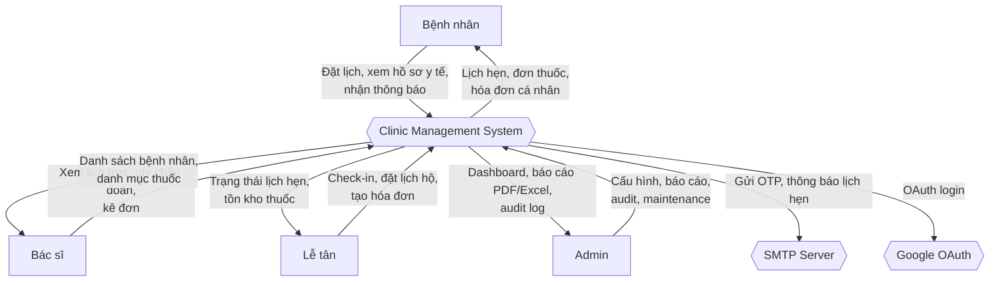
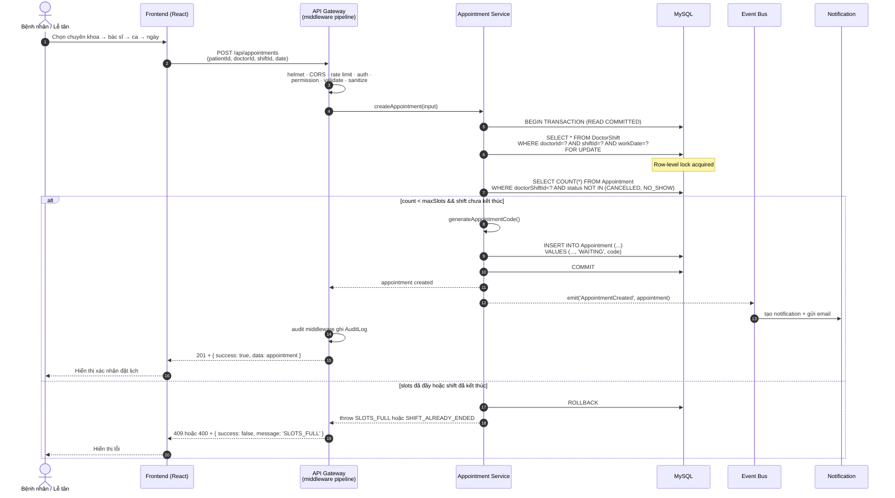
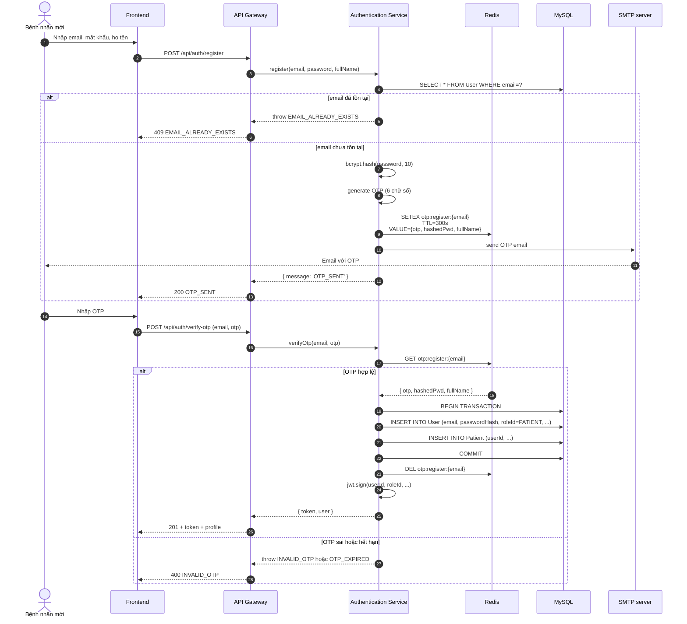
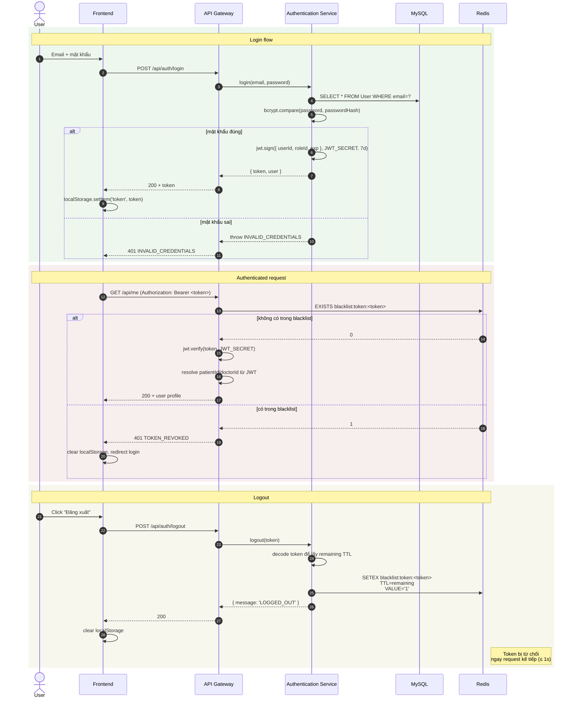
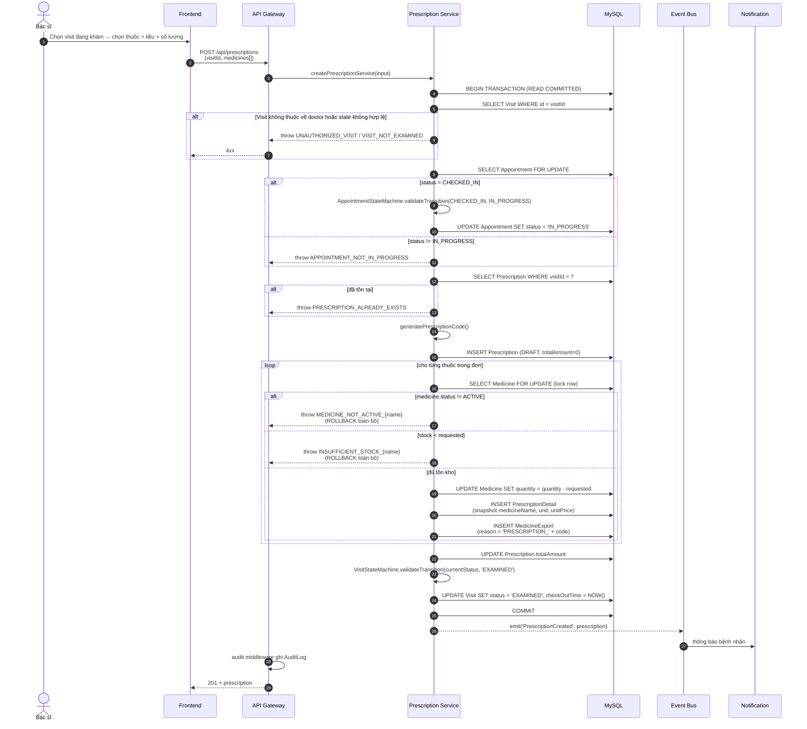
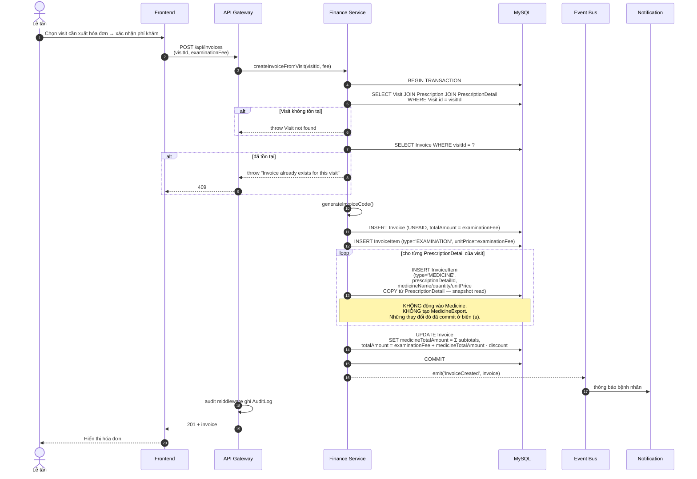
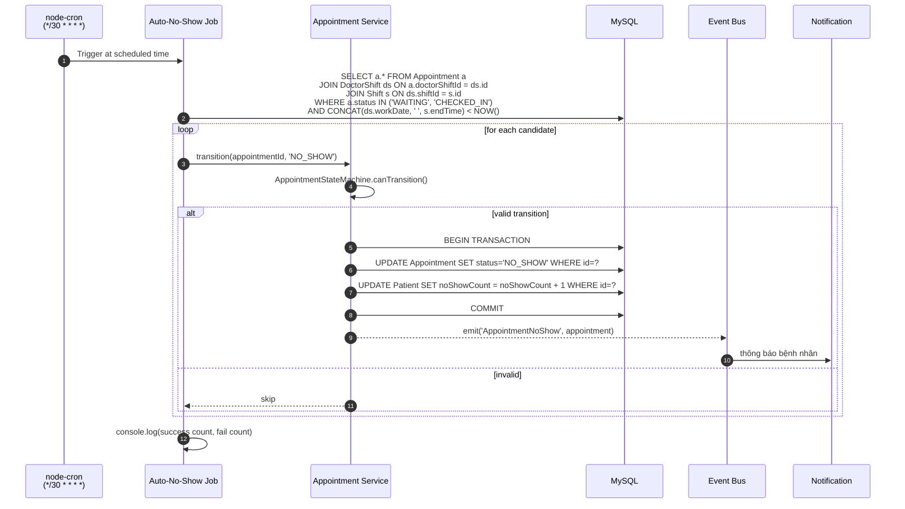
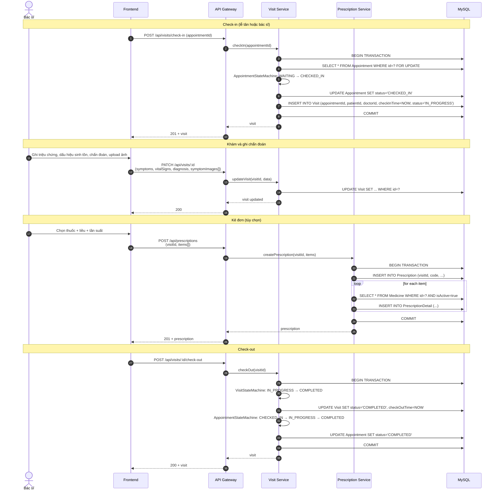
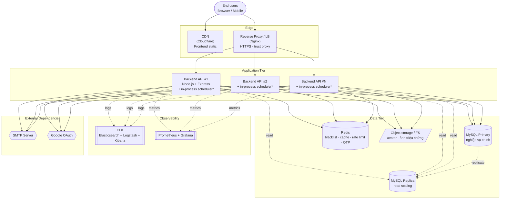

# SOLUTION ARCHITECTURE DOCUMENT
## Clinic Management System

---

## Revision and Sign Off Sheet

### Change Record

| Author | Version | Change reference | Date |
| --- | --- | --- | --- |
| Nguyen Minh Thien | 1.0 | Initial SAD draft | 2026-05-14 |
| | | | |

### Reviewers

| Name | Company | Version | Position | Date |
| --- | --- | --- | --- | --- |
| | | | | |
| | | | | |
| | | | | |

---

## Table of Contents

1. Tổng quan về giải pháp
   - 1.1. Mục tiêu của giải pháp
   - 1.2. Phạm vi của hệ thống
   - 1.3. Các bên liên quan chính
   - 1.4. Bối cảnh kinh doanh và kỹ thuật
2. Kiến trúc tổng thể
   - 2.1. Mô hình kiến trúc
   - 2.2. Các thành phần chính và quan hệ
3. Các quyết định kiến trúc
   - 3.1. Các quyết định quan trọng và lý do
   - 3.2. Các ràng buộc kỹ thuật
   - 3.3. Các nguyên tắc thiết kế
4. Kiến trúc logic
   - 4.1. Các module chính
   - 4.2. Luồng dữ liệu và xử lý
5. Kiến trúc vật lý
   - 5.1. Tổng quan triển khai
   - 5.2. Thành phần sử dụng
6. Bảo mật
   - 6.1. Xác thực
   - 6.2. Phân quyền
   - 6.3. Bảo vệ API và dịch vụ
   - 6.4. Mã hóa dữ liệu
   - 6.5. Bảo vệ tài nguyên hạ tầng
7. Hiệu năng và khả năng mở rộng
   - 7.1. Đảm bảo hiệu năng
   - 7.2. Phương án mở rộng
8. Rủi ro và phương án giảm thiểu
9. Known Limitations và Future Work
   - 9.1. In-process scheduler chạy ở mọi instance
   - 9.2. Rate limit counter in-process
   - 9.3. Cache middleware in-process
   - 9.4. Pagination chưa bắt buộc đồng đều
   - 9.5. Cổng thanh toán online chưa nối
   - 9.6. Triển khai single-region
   - 9.7. Bảng tóm tắt mức độ ưu tiên

---

# 1. Tổng quan về giải pháp

## 1.1. Mục tiêu của giải pháp

Mục tiêu cốt lõi của Hệ thống Quản lý Phòng khám (Clinic Management System) là số hóa toàn bộ vận hành của một phòng khám tư nhân, từ tiếp nhận bệnh nhân đến hoàn tất khám và thanh toán, đồng thời cung cấp cho ban quản lý công cụ giám sát, báo cáo và quản trị nhân sự:

- **Tự phục vụ cho bệnh nhân**: cho phép bệnh nhân tự đăng ký tài khoản, đặt lịch khám online theo bác sĩ / chuyên khoa, hủy / đổi lịch, xem lại lịch sử khám, đơn thuốc và hóa đơn của chính mình.
- **Tối ưu vận hành cho lễ tân**: cung cấp công cụ quản lý lịch hẹn, check-in / check-out lượt khám, đặt lịch thay cho bệnh nhân (offline), tạo hóa đơn cuối kỳ khám và xử lý hoàn tiền.
- **Hỗ trợ chuyên môn cho bác sĩ**: hiển thị lịch trực, danh sách bệnh nhân của ca khám, giao diện ghi chẩn đoán, dấu hiệu sinh tồn, kê đơn theo danh mục thuốc của phòng khám.
- **Quản trị & báo cáo cho admin**: dashboard tổng hợp (doanh thu, lượt khám, kho thuốc, chấm công), audit log đầy đủ thao tác, cấu hình tham số nghiệp vụ (số slot/ca, giá khám, ngưỡng cảnh báo), maintenance mode, sinh báo cáo PDF / Excel.
- **Đảm bảo tính toàn vẹn nghiệp vụ**: ngăn đặt trùng slot ca trực; đảm bảo tính nguyên tử cho hai biên giao dịch tài chính tách biệt — biên kê đơn (gồm trừ kho và xuất kho do bác sĩ kích hoạt) và biên tạo hóa đơn (đọc snapshot từ đơn thuốc); kiểm soát chuyển trạng thái nghiệp vụ qua state machine tập trung; lưu audit trail đầy đủ cho mọi thao tác nhạy cảm.
- **Khả năng vận hành liên tục**: giữ uptime ≥ 99% cho luồng nghiệp vụ cốt lõi (đặt lịch, khám, kê đơn, thanh toán) ngay cả khi các phụ thuộc phụ trợ (email, OAuth, cache) gặp sự cố tạm thời.

Việc tích hợp chặt chẽ giữa các module (Authentication, Appointment, Visit, Prescription, Inventory, Finance) phản ánh đặc thù nghiệp vụ phòng khám — nơi một lượt khám duy nhất kéo theo chuỗi nghiệp vụ liên tiếp và phải nhất quán dữ liệu xuyên module. Kiến trúc hệ thống do đó cần bảo đảm tính giao dịch (transaction) xuyên các bảng nghiệp vụ và một state machine rõ ràng cho từng thực thể.

## 1.2. Phạm vi của hệ thống

### In-Scope (Những gì có trong phạm vi dự án)

- **Định danh & xác thực**
  - Đăng ký bằng email + xác thực OTP, đăng nhập, đăng xuất.
  - Đăng nhập bằng Google OAuth.
  - Quên mật khẩu, đặt lại mật khẩu qua OTP email.
  - Đổi mật khẩu trong tài khoản đã đăng nhập.
  - Hồ sơ người dùng + cập nhật ảnh đại diện.

- **Quản lý người dùng & nhân viên**
  - CRUD người dùng, nhân viên, bác sĩ với phân quyền chi tiết.
  - Mô hình Role–Permission cấu hình ở dữ liệu (4 vai trò: Admin, Doctor, Receptionist, Patient).
  - Cập nhật ảnh đại diện cho bệnh nhân, nhân viên, người dùng.

- **Quản lý bệnh nhân**
  - Hồ sơ bệnh nhân (kèm hồ sơ y tế: nhóm máu, tiền sử dị ứng, bệnh mãn tính).
  - Bệnh nhân tự xem / sửa hồ sơ; lễ tân tạo hồ sơ tại quầy.

- **Bác sĩ & chuyên khoa**
  - CRUD bác sĩ và chuyên khoa.
  - Gán bác sĩ vào chuyên khoa.

- **Đặt lịch khám**
  - Bệnh nhân đặt lịch online theo chuyên khoa → bác sĩ → ca trực → ngày.
  - Lễ tân đặt lịch offline thay bệnh nhân.
  - Hủy lịch và đổi lịch theo chính sách.
  - Cron tự động chuyển lịch không check-in đúng giờ sang trạng thái no-show.

- **Khám bệnh (Visit)**
  - Check-in / check-out lượt khám.
  - Ghi chẩn đoán, triệu chứng, dấu hiệu sinh tồn (huyết áp, nhịp tim, nhiệt độ, cân nặng…).
  - Upload ảnh triệu chứng đính kèm.
  - Phân loại theo danh mục bệnh (Disease Category).

- **Kê đơn**
  - Kê đơn thuốc gắn với một lượt khám.
  - Chi tiết liều dùng, số lần / ngày, hướng dẫn sử dụng.

- **Quản lý kho thuốc**
  - CRUD danh mục thuốc.
  - Nhập kho (Medicine Import) với thông tin nhà cung cấp.
  - Xuất kho (Medicine Export) tự động khi bác sĩ chốt đơn thuốc (trong cùng transaction kê đơn — không phải lúc tạo hóa đơn).
  - Cron cảnh báo thuốc sắp hết hạn.

- **Tài chính**
  - Tạo hóa đơn cuối kỳ khám (gồm phí khám + thuốc).
  - Thanh toán (tiền mặt — luồng hiện tại, cấu trúc sẵn cho cổng thanh toán online).
  - Hoàn tiền (refund).
  - Bảng lương nhân viên dựa trên chấm công.

- **Ca trực & chấm công**
  - Mẫu ca (Shift Template) định nghĩa giờ làm chuẩn.
  - Tạo các ca cụ thể theo ngày (Shift).
  - Gán ca cho bác sĩ (Doctor Shift) — có thể đổi ca.
  - Cron sinh lịch trực tự động cho tuần kế tiếp.
  - Chấm công nhân viên kèm cron tổng hợp.

- **Thông báo**
  - Thông báo in-app khi có lịch hẹn mới, đổi lịch, hủy lịch, đơn thuốc mới, hóa đơn mới.
  - Email confirmation cho các sự kiện quan trọng.
  - Cài đặt thông báo theo từng người dùng (NotificationSetting).

- **Quản trị & báo cáo**
  - Audit log đầy đủ (ai – làm gì – khi nào – trước / sau).
  - Dashboard tổng hợp (doanh thu, lượt khám, kho thuốc, chấm công).
  - Báo cáo dải tháng xuất Excel / PDF kèm biểu đồ.
  - System Settings runtime cho tham số nghiệp vụ.
  - Maintenance mode (admin bật/tắt không cần redeploy).
  - Tìm kiếm tổng hợp xuyên domain.

- **Tính năng kỹ thuật cross-cutting**
  - Rate limit theo IP / user.
  - Security headers, CORS allow-list, body size cap.
  - Schema validation + HTML sanitization ở biên API.
  - Cache GET cho dữ liệu read-heavy.
  - Maintenance mode middleware.

### Out-of-Scope (Những gì không trong phạm vi dự án)

- Telemedicine (khám online qua video call).
- Tích hợp thiết bị xét nghiệm và máy chẩn đoán hình ảnh (X-quang, siêu âm).
- Tích hợp bảo hiểm y tế (claim insurance).
- Tích hợp HIS / LIS của bệnh viện lớn.
- Ứng dụng di động native (iOS / Android) — chỉ hỗ trợ qua responsive web.
- Tích hợp cổng thanh toán online (VNPay, MoMo) — cấu trúc service đã sẵn nhưng chưa nối thực tế.
- Hệ thống đặt lịch nhiều chi nhánh / chuỗi phòng khám.
- AI gợi ý chẩn đoán hoặc tương tác thuốc tự động.

## 1.3. Các bên liên quan chính

**Bệnh nhân (Patient)**
- Người dùng cuối có nhu cầu khám chữa bệnh.
- Có thể tự đăng ký tài khoản, đặt lịch online, xem lại hồ sơ y tế.
- Quan tâm đến: tính thuận tiện, riêng tư dữ liệu y tế, độ tin cậy của lịch hẹn.

**Bác sĩ (Doctor)**
- Trực tiếp khám bệnh và kê đơn.
- Cần truy cập nhanh danh sách bệnh nhân của ca trực, ghi chẩn đoán tiện lợi.
- Quan tâm đến: tốc độ thao tác, ghi chú lượt khám nhanh, danh mục thuốc đầy đủ.

**Lễ tân (Receptionist)**
- Tiếp nhận bệnh nhân tại quầy, đặt lịch hộ, check-in, tạo hóa đơn.
- Quan tâm đến: thao tác nhanh, không xảy ra trùng slot, hóa đơn chính xác.

**Quản trị viên (Admin / Manager)**
- Quản lý vận hành tổng thể, nhân sự, kho thuốc, tài chính.
- Cần dashboard, báo cáo định kỳ, audit log, cấu hình tham số runtime.
- Quan tâm đến: hiệu quả vận hành, kiểm soát rủi ro, tuân thủ.

**Nhân viên IT / DevOps**
- Vận hành hệ thống production, xử lý sự cố, theo dõi log.
- Quan tâm đến: khả năng quan sát (observability), khả năng phục hồi, maintenance mode runtime.

**Đội ngũ phát triển**
- Team developer, team design, team BA, team QA.
- Quan tâm đến: cấu trúc mã rõ ràng, dễ thêm tính năng, dễ test.

## 1.4. Bối cảnh kinh doanh và kỹ thuật

### Bối cảnh Kinh doanh

Phòng khám tư nhân vừa và nhỏ tại Việt Nam đang chuyển dịch từ quản lý giấy / Excel sang phần mềm quản lý chuyên biệt. Các hệ thống lớn của bệnh viện (HIS) thường quá phức tạp và đắt cho phòng khám đơn lẻ; trong khi các phần mềm rẻ tiền thì thiếu nhiều tính năng nghiệp vụ quan trọng. Hệ thống Quản lý Phòng khám hướng đến phân khúc giữa: đủ tính năng cho vận hành đầy đủ (lịch hẹn, khám, kê đơn, tài chính, nhân sự, báo cáo) nhưng vẫn nhẹ và dễ triển khai cho một phòng khám đơn lẻ.

Lợi thế cạnh tranh đến từ:
- Trải nghiệm bệnh nhân tự phục vụ (đặt lịch online, xem hồ sơ y tế).
- Khả năng tùy chỉnh tham số nghiệp vụ runtime (số slot/ca, ngưỡng cảnh báo, giá khám) mà không cần đụng vào code.
- Audit log đầy đủ phục vụ thanh tra nội bộ và đối soát.

### Bối cảnh Kỹ thuật

Hệ thống được xây dựng trên một stack JavaScript / TypeScript end-to-end, kết hợp ORM trên cơ sở dữ liệu quan hệ và in-memory store cho shared state. Lựa chọn này phù hợp với quy mô một phòng khám (hàng chục lượt khám/ngày, hàng trăm bệnh nhân) và đội phát triển nhỏ.

**Frontend:**
- **React 18 + Vite + TypeScript**: SPA hiệu năng cao, build nhanh, kiểu dữ liệu chặt chẽ.
- **TailwindCSS + component library**: giao diện responsive, design system thống nhất, dễ tùy biến theo vai trò.
- **Firebase hosting** (tùy chọn) cho môi trường staging.

**Backend:**
- **Node.js + Express 5 + TypeScript**: runtime non-blocking I/O phù hợp với workload nặng I/O (DB + email + file upload), TypeScript đảm bảo type safety xuyên service.
- **Modular monolith**: tổ chức theo `src/modules/{domain}/{controller, route, service, validator}` — package-by-feature, không chia microservice (lý do xem 3.1).
- **Sequelize ORM** trên **MySQL 8** (qua driver `mysql2`): mô hình quan hệ, transaction + row-level lock cho nghiệp vụ nhạy cảm.
- **Redis (ioredis)**: token blacklist, cache GET, rate limit counter khi scale.
- **JWT (jsonwebtoken) + bcrypt**: stateless authentication + adaptive password hashing.
- **Passport.js + passport-google-oauth20**: adapter cho OAuth Google.
- **Nodemailer**: SMTP client cho email OTP và thông báo.
- **Multer**: file upload middleware cho avatar và ảnh triệu chứng.
- **node-cron**: scheduler cho các tác vụ định kỳ (auto no-show, expiry check, schedule generation, attendance).

**Boundary defense:**
- **Helmet**: security headers.
- **express-rate-limit**: rate limit toàn cục cho `/api`.
- **express-validator**: schema validation.
- **isomorphic-dompurify**: HTML sanitization để chống XSS.

**Reporting:**
- **exceljs**: xuất báo cáo Excel.
- **pdfkit**: sinh PDF (báo cáo, mặt hóa đơn).
- **chart.js + chartjs-node-canvas**: render biểu đồ ở backend nhúng vào PDF.

**Logging & Monitoring:**
- **morgan**: HTTP request logger.
- **winston**: structured application logger.
- Có thể export sang **ELK** (Elasticsearch + Logstash + Kibana) hoặc **Prometheus + Grafana** khi production.

**DevOps:**
- **Docker + Docker Compose**: container hoá backend, frontend, MySQL, Redis.
- **GitHub Actions** (đề xuất): pipeline CI/CD chạy test + build image.
- **Nginx** (đề xuất): reverse proxy + HTTPS termination + static serving cho frontend build.

### Bảng 1: Công nghệ Cốt lõi và Lý do Lựa chọn

| Thành phần Công nghệ | Vai trò trong Hệ thống | Lý do Chính cho Lựa chọn |
| --- | --- | --- |
| **React + Vite + TypeScript** | Xây dựng giao diện người dùng (Frontend SPA) | SPA tải nhanh nhờ Vite, type safety của TypeScript, hệ sinh thái component lớn, dễ tích hợp Tailwind. |
| **Node.js + Express + TypeScript** | Backend runtime + framework HTTP | Non-blocking I/O phù hợp workload I/O-bound của phòng khám (DB + email + file). Cùng ngôn ngữ với frontend giảm chi phí context-switch của đội dev nhỏ. |
| **Sequelize ORM** | ORM trên MySQL | Hỗ trợ transaction kèm row-level lock — bắt buộc cho luồng đặt lịch và tài chính. Migrations versioned. |
| **MySQL 8** | Cơ sở dữ liệu quan hệ chính | ACID, hỗ trợ row-level lock + isolation level tốt, phù hợp dữ liệu giao dịch (lịch hẹn, hóa đơn). |
| **Redis (ioredis)** | In-memory store cho shared state | Token blacklist với TTL, cache GET, rate limit counter khi scale. Là điều kiện để API tier stateless. |
| **JWT (jsonwebtoken)** | Stateless authentication token | Cho phép horizontal scaling không cần sticky session. Kết hợp Redis blacklist để hỗ trợ thu hồi. |
| **bcrypt** | Hash mật khẩu adaptive với salt | Tiêu chuẩn ngành cho password storage; cost factor có thể tăng theo thời gian. |
| **Passport.js + passport-google-oauth20** | OAuth integration | Adapter pattern dùng được cho nhiều provider tương lai (Facebook, Microsoft SSO). |
| **Nodemailer** | SMTP client | Gửi OTP, email xác nhận lịch hẹn / hóa đơn. Có thể đổi provider qua config. |
| **Helmet** | HTTP security headers | Đặt các header chuẩn OWASP để chống clickjacking, XSS reflection, MIME sniffing. |
| **express-rate-limit** | Rate limit middleware | Bảo vệ endpoint xác thực khỏi brute-force; counter có thể chuyển sang Redis khi scale. |
| **express-validator** | Schema validation | Validate body / query / params trước khi vào lớp nghiệp vụ. |
| **isomorphic-dompurify** | HTML sanitization | Làm sạch HTML user-supplied (ghi chú khám, triệu chứng) chống XSS lưu trữ. |
| **Multer** | File upload middleware | Xử lý avatar, ảnh triệu chứng; giới hạn kích thước + MIME type. |
| **node-cron** | In-process scheduler | Đơn giản, không cần infrastructure bên ngoài; phù hợp scale 1–2 instance với leader. |
| **exceljs, pdfkit, chartjs-node-canvas** | Sinh báo cáo Excel / PDF kèm biểu đồ | Render ở backend, gửi file trực tiếp về client — không cần render-service riêng. |
| **winston, morgan** | Logging | Morgan log HTTP request, Winston log application + error; định dạng JSON cho ELK. |
| **Docker** | Container hoá | Đóng gói backend + frontend + DB + Redis; triển khai nhất quán giữa dev / staging / prod. |

---

# 2. Kiến trúc tổng thể

## 2.1. Mô hình kiến trúc

### Modular Monolith (không phải Microservices)

Hệ thống được tổ chức theo mô hình **modular monolith với package-by-feature**, không tách thành các microservice riêng. Lý do:

- **Quy mô phù hợp**: một phòng khám tiêu chuẩn có hàng chục đến hàng trăm lượt khám/ngày — workload chưa đến mức cần microservice.
- **Tính giao dịch xuyên domain**: luồng tài chính được tách thành **hai biên transaction** (xem §4.2.4). Biên kê đơn (UC15) atomic across `Prescription`, `PrescriptionDetail`, `Medicine.quantity`, `MedicineExport`, `Appointment.status`, `Visit.status`. Biên tạo hóa đơn (UC18) atomic across `Invoice`, `InvoiceItem` và đọc snapshot từ `PrescriptionDetail`. Microservice với eventual consistency sẽ làm phức tạp đáng kể cả hai biên này.
- **Đội phát triển nhỏ**: modular monolith giảm overhead vận hành (chỉ một deployment, một codebase, một set test suite).
- **Đường nâng cấp rõ**: cấu trúc package-by-feature đã sẵn sàng để tách thành microservice khi nhu cầu thực sự xuất hiện.

### Patterns hỗ trợ

- **API Gateway pattern** (lightweight): một entry point Express với pipeline middleware cross-cutting (security headers, CORS, rate limit, auth, permission, validate, sanitize, audit, error handler) áp dụng đồng nhất cho mọi route.
- **Service Layer pattern**: mỗi module có lớp service tách biệt với controller; service không nhận `req/res` mà nhận DTO + actor context — dễ test và tái sử dụng.
- **Transaction Script + Row-level Lock**: cho các luồng concurrency-sensitive (đặt lịch, xuất thuốc) — bao bọc logic trong `sequelize.transaction()` với `SELECT ... FOR UPDATE`.
- **State Machine pattern**: cho các thực thể có vòng đời rõ (Appointment, Visit, Invoice). Mọi chuyển trạng thái đi qua state machine utility tập trung.
- **Adapter pattern**: cho Authentication (mỗi provider OAuth là một adapter) và Notification (mỗi kênh là một handler).
- **Internal Event Bus**: emitter nội bộ để fan-out các sự kiện nghiệp vụ (Appointment created → Notification) — không qua message broker ngoài.
- **Cross-cutting middleware**: audit, cache, rate limit, maintenance được áp dụng qua middleware thay vì gọi explicit trong từng controller.
- **Token Revocation List**: trên Redis với TTL bằng thời hạn token — hỗ trợ thu hồi JWT ngay lập tức.

## 2.2. Các thành phần chính và quan hệ

### Context Diagram



### Các module backend chính

#### API Gateway / Cross-cutting Middleware

- **Chức năng chính**: là điểm vào duy nhất cho toàn bộ request `/api/*`. Áp pipeline middleware đồng nhất: security headers (helmet) → CORS → rate limit (`express-rate-limit`) → body parser → maintenance mode check → JWT verification + Redis blacklist check → context resolver (gắn `patientId`/`doctorId` từ JWT) → validator (`express-validator`) → sanitizer (`isomorphic-dompurify`) → permission check → controller → audit middleware → error handler.
- **Giao tiếp với**: client web, tất cả module domain bên trong.
- **Lưu ý triển khai**: bật `trust proxy = 1` để rate limit nhận đúng IP client khi đứng sau reverse proxy. Cấu hình rate limit qua biến môi trường (`RATE_LIMIT_WINDOW_MS`, `RATE_LIMIT_MAX_REQUESTS`). Đảm bảo response schema chuẩn `{ success, message, data }` qua global error handler.

#### Authentication Module

- **Chức năng chính**: đăng ký với OTP email, đăng nhập mật khẩu, đăng nhập Google OAuth, quên/đặt lại mật khẩu, đổi mật khẩu, đăng xuất với thu hồi token. Quản lý profile người dùng đăng nhập.
- **Giao tiếp với**: API Gateway, User module (đọc/ghi `User`), Redis (blacklist token), SMTP (gửi OTP), Google OAuth.
- **Lưu ý triển khai**: token JWT thời hạn ngắn (mặc định 7 ngày, cấu hình qua `JWT_EXPIRES_IN`). Mật khẩu hash bằng bcrypt với salt round 10. OTP lưu trong Redis với TTL 5 phút. Tổ chức Passport strategy riêng cho Google OAuth. Mọi đăng xuất / đổi mật khẩu thêm token hiện tại vào blacklist với TTL bằng thời hạn còn lại.

#### User & Employee Module

- **Chức năng chính**: CRUD `User`, `Employee`, `Doctor`. Quản lý ma trận Role–Permission qua `Role`, `Permission`, `RolePermission`. Upload avatar.
- **Giao tiếp với**: API Gateway, Authentication (user info), Doctor module (tạo Doctor từ Employee), file storage (avatar).
- **Lưu ý triển khai**: 4 vai trò hard-code trong enum `RoleCode` (ADMIN=1, RECEPTIONIST=2, PATIENT=3, DOCTOR=4) để có hằng số kiểu mạnh. Phân quyền ở route layer hiện dùng middleware `requireRole(...allowedRoles)` (coarse-grained). Mô hình Permission + RolePermission ở DB đã sẵn sàng cùng với middleware `requirePermission(name)` (đọc role từ JWT, join sang `Permission`) — giữ ở trạng thái ready-but-not-active để kích hoạt khi cần fine-grained.

#### Patient Module

- **Chức năng chính**: CRUD hồ sơ bệnh nhân (`Patient`) và hồ sơ y tế (`PatientProfile`: nhóm máu, dị ứng, bệnh mãn tính). Upload avatar bệnh nhân. Quản lý `noShowCount` cho mỗi bệnh nhân.
- **Giao tiếp với**: API Gateway, Authentication (link `userId` → `patientId`), Appointment (lookup `patientId`), middleware `requireSelfPatient` ép self-scope.
- **Lưu ý triển khai**: bệnh nhân tự đăng ký tài khoản sẽ được tự động tạo bản ghi `Patient` link với `User`. Lễ tân có thể tạo `Patient` mà không cần `User` (walk-in patient).

#### Doctor & Specialty Module

- **Chức năng chính**: CRUD bác sĩ (`Doctor`) và chuyên khoa (`Specialty`). Quản lý mối quan hệ Doctor ↔ Specialty.
- **Giao tiếp với**: API Gateway, Employee (Doctor là một loại Employee), Appointment (lookup bác sĩ theo chuyên khoa), Shift module.
- **Lưu ý triển khai**: `Doctor` có field `isActive` để vô hiệu hóa bác sĩ mà không cần xóa dữ liệu lịch sử.

#### Appointment & Visit Module

- **Chức năng chính**: đặt lịch (`Appointment`), hủy lịch, đổi lịch, check-in (chuyển từ Appointment → Visit), check-out, ghi chẩn đoán + triệu chứng + dấu hiệu sinh tồn trong `Visit`. Phân loại bệnh theo `DiseaseCategory`.
- **Giao tiếp với**: API Gateway, Doctor module, Patient module, Shift module (đọc `DoctorShift` để xác định slot), Prescription module, Finance module, Notification module (qua event bus), Scheduler (auto no-show job).
- **Lưu ý triển khai**: **đây là module nhạy cảm nhất**. Logic tạo Appointment phải nằm trong transaction với row-level lock trên `DoctorShift` để không vượt số slot tối đa. Mọi chuyển trạng thái Appointment đi qua state machine utility (`AppointmentStateMachine`) — `SCHEDULED → CHECKED_IN → COMPLETED`, hoặc `SCHEDULED → CANCELLED`, hoặc `SCHEDULED → NO_SHOW`. Sinh `appointmentCode` trong cùng transaction để tránh trùng.

#### Prescription Module

- **Chức năng chính**: kê đơn (`Prescription`) gắn với một `Visit`. Chi tiết liều / tần suất / hướng dẫn trong `PrescriptionDetail`. Reference `Medicine`.
- **Giao tiếp với**: API Gateway, Visit module, Inventory module (validate medicine còn tồn kho), Finance module (tạo InvoiceItem từ đơn thuốc).
- **Lưu ý triển khai**: **module nhạy cảm thứ nhất về Data Integrity (biên kê đơn của ASR-DI-02)**. Toàn bộ luồng tạo Prescription → trừ `Medicine.quantity` (kèm row-level lock `SELECT ... FOR UPDATE` trên từng dòng Medicine) → tạo `PrescriptionDetail` (snapshot `medicineName`, `unit`, `unitPrice` — Memento Pattern) → tạo `MedicineExport` → đẩy `Appointment` và `Visit` qua state machine phải nằm trong **một transaction duy nhất** (READ COMMITTED). Sinh `prescriptionCode` trong cùng transaction. Sửa đơn / hủy đơn cũng nguyên tử với việc phục hồi tồn kho và đồng bộ lại các mục thuốc trên hóa đơn (nếu hóa đơn đã tồn tại).

#### Inventory Module

- **Chức năng chính**: CRUD `Medicine`. Nhập kho (`MedicineImport`) với thông tin nhà cung cấp, hạn dùng. Xuất kho (`MedicineExport`) tự động khi bác sĩ chốt đơn thuốc (trong transaction kê đơn — UC15). Cảnh báo thuốc sắp hết hạn / sắp hết tồn.
- **Giao tiếp với**: API Gateway, Prescription module (Prescription service trực tiếp lock dòng Medicine và trừ kho trong cùng transaction kê đơn), Scheduler (cron expiry check), Notification module. Finance module **không** gọi Inventory khi tạo hóa đơn — chỉ đọc snapshot từ `PrescriptionDetail`.
- **Lưu ý triển khai**: tồn kho thuốc lưu trong field `quantity` của `Medicine`. Để tránh tồn âm dưới concurrency, mỗi dòng Medicine được khóa bằng `Medicine.findByPk(id, { lock: t.LOCK.UPDATE })` ngay đầu mỗi iteration trong vòng lặp kê đơn; sau đó so sánh `quantity` với số lượng cần kê, throw `INSUFFICIENT_STOCK_*` và rollback nếu không đủ.

#### Finance Module

- **Chức năng chính**: tạo hóa đơn (`Invoice` + `InvoiceItem`), ghi nhận thanh toán (`Payment`), hoàn tiền (`Refund`). Bảng lương nhân viên (`Payroll`) tự động tổng hợp từ `Attendance`.
- **Giao tiếp với**: API Gateway, Visit module (link `visitId`), Inventory module (xuất thuốc trong cùng transaction), Notification module.
- **Lưu ý triển khai**: **module nhạy cảm thứ hai về Data Integrity (biên tạo hóa đơn của ASR-DI-02)**. Toàn bộ luồng tạo `Invoice` header → tạo `InvoiceItem` cho phí khám → đọc từng `PrescriptionDetail` và tạo `InvoiceItem` MEDICINE bằng cách **copy snapshot** (`medicineName`, `quantity`, `unitPrice`) từ PrescriptionDetail → cập nhật `Invoice.medicineTotalAmount` và `Invoice.totalAmount` phải nằm trong **một transaction duy nhất**. Sinh `invoiceCode` trong cùng transaction. **Biên này không động vào `Medicine.quantity` và không tạo `MedicineExport`** — những thay đổi đó đã commit ở biên kê đơn (UC15). Idempotency check (`SELECT Invoice WHERE visitId = ?`) chống tạo hóa đơn trùng cho cùng visit. Hoàn tiền cũng nguyên tử với cập nhật trạng thái Invoice; nếu hủy đơn thuốc sau khi đã có hóa đơn thì việc đồng bộ lại InvoiceItem MEDICINE và phục hồi tồn kho được làm trong transaction sửa/hủy đơn (UC15), không trong UC18.

#### Shift & Attendance Module

- **Chức năng chính**: mẫu ca (`ShiftTemplate` — định nghĩa giờ làm chuẩn), tạo ca cụ thể theo ngày (`Shift`), gán bác sĩ vào ca (`DoctorShift`), đổi ca, chấm công (`Attendance`). Cron tự sinh `DoctorShift` cho tuần kế tiếp dựa trên template.
- **Giao tiếp với**: API Gateway, Doctor module, Appointment module (đặt lịch tham chiếu `DoctorShift`), Scheduler (cron schedule generation + attendance aggregation), Finance module (bảng lương).

#### Notification Module

- **Chức năng chính**: tạo thông báo in-app (`Notification`), gửi email confirmation, quản lý cài đặt thông báo theo người dùng (`NotificationSetting`).
- **Giao tiếp với**: Internal event bus (listen các event nghiệp vụ), SMTP (qua Nodemailer), Authentication (OTP).
- **Lưu ý triển khai**: gửi email bất đồng bộ, không chặn request gốc. Nếu SMTP lỗi tạm thời, ghi log và retry — không rollback nghiệp vụ chính.

#### Admin Module

- **Chức năng chính**: audit log tra cứu (`AuditLog`), dashboard tổng hợp, sinh báo cáo PDF / Excel, cấu hình hệ thống (`SystemSettings`), maintenance mode toggle, tìm kiếm cross-domain.
- **Giao tiếp với**: tất cả module (đọc qua service API hoặc qua audit log).
- **Lưu ý triển khai**: service báo cáo truy vấn read-only, có thể chạy trên replica DB nếu scale. PDF generate có thể tốn CPU — chạy bất đồng bộ với progress indicator nếu báo cáo lớn.

#### Scheduler (Jobs)

- **Chức năng chính**: chứa các job định kỳ — auto-no-show (mỗi 30 phút), medicine expiry check (hằng ngày), schedule generation (hằng tuần), attendance aggregation (hằng ngày).
- **Giao tiếp với**: các service nghiệp vụ tương ứng (qua direct call trong cùng process).
- **Lưu ý triển khai**: khởi tạo trong `server.ts` qua `initializeScheduler()`. Khi scale ≥ 2 instance, chỉ một instance giữ vai trò leader (cấu hình qua biến môi trường `ENABLE_SCHEDULER=true`).

---

# 3. Các quyết định kiến trúc

## 3.1. Các quyết định quan trọng và lý do

| ID Quyết định | Tuyên bố Quyết định | Lý do | Trade-off Chính |
| --- | --- | --- | --- |
| AD-001 | **Áp dụng Modular Monolith (không phải Microservices)** | Quy mô phòng khám đơn lẻ chưa đến mức cần microservice. Tính giao dịch xuyên domain (Finance ↔ Inventory ↔ Visit) yêu cầu transaction ACID — microservice với eventual consistency làm phức tạp. Đội phát triển nhỏ. | Khi scale lên chuỗi phòng khám, có thể phải refactor sang microservice. Một deployment đơn → blast radius lớn hơn khi lỗi. Bù lại: chi phí vận hành thấp, dễ debug. |
| AD-002 | **API Gateway lightweight = pipeline middleware Express** | Tránh thêm thành phần hạ tầng riêng (như Kong, AWS API Gateway) — phù hợp scale nhỏ. Toàn bộ cross-cutting (auth, rate limit, audit, validate) áp dụng đồng nhất qua middleware. | Khi tách microservice, sẽ phải lift middleware ra một service riêng hoặc trùng lặp. |
| AD-003 | **JWT stateless + Redis blacklist cho thu hồi** | JWT cho phép horizontal scaling không cần sticky session. Redis blacklist với TTL bằng remaining lifetime giải quyết điểm yếu kinh điển của JWT (không thu hồi được). | Phụ thuộc Redis cho mỗi request → nếu Redis chết sẽ ảnh hưởng auth. Mitigation: fallback in-memory blacklist với cảnh báo cho admin. |
| AD-004 | **Sequelize + MySQL + transaction kèm row-level lock** | MySQL hỗ trợ tốt `SELECT ... FOR UPDATE`. Sequelize wrap transaction tốt. ACID là điều kiện sống cho luồng đặt lịch và tài chính. | Row-level lock tăng độ trễ một chút dưới concurrency cao. ORM có thể che giấu SQL — cần kiểm tra query thực tế khi tối ưu. |
| AD-005 | **State machine tập trung cho Appointment / Visit / Invoice** | Nhiều API và role cùng cập nhật trạng thái — nếu không tập trung sẽ rải if/else khắp controller. State machine giúp transition tường minh, dễ test, dễ extend. | Cần kỷ luật code: mọi update status phải đi qua state machine, không update trực tiếp. |
| AD-006 | **Internal event bus (Node.js EventEmitter) thay vì message broker ngoài** | Quy mô không cần message broker; internal event bus đủ cho fan-out trong cùng process. Tránh phụ thuộc Kafka / RabbitMQ. | Nếu scale lên nhiều process / nhiều instance, internal event bus không cross-instance. Khi đó cần đổi sang Redis Pub/Sub hoặc message broker thực sự. |
| AD-007 | **Audit log qua cross-cutting middleware, ghi bất đồng bộ** | Đảm bảo 100% endpoint mutating được audit mà không phải nhớ gọi explicit. Ghi bất đồng bộ để không tăng độ trễ. | Nếu audit ghi lỗi, request chính vẫn thành công → có rủi ro mất audit (nhỏ). Cần monitor failure rate của audit. |
| AD-008 | **In-process cron scheduler thay vì cron riêng / job queue** | Đơn giản, không cần infrastructure ngoài. Phù hợp các tác vụ nhỏ (auto-no-show, expiry check). Hiện tại scheduler khởi tạo trực tiếp trong `server.ts` qua `initializeScheduler()` cho mọi instance. | Khi scale nhiều instance, **cần thêm cơ chế leader election** (ví dụ env flag `ENABLE_SCHEDULER=true` chỉ ở một instance, hoặc Redis distributed lock) để tránh trùng job — chi tiết ở mục *Known Limitations*. Job lỗi không retry tự động — phải code retry trong handler. |
| AD-009 | **Sinh Excel / PDF inline trong API thay vì service riêng** | Quy mô báo cáo nhỏ; thư viện `pdfkit` + `exceljs` chạy đủ nhanh trong process. | Báo cáo lớn (export hàng chục nghìn record) có thể block process — khi đó nên chuyển sang queue + worker. |
| AD-010 | **Frontend phân vùng theo vai trò (admin / doctor / recep / patient)** | Mỗi vai trò có UX rất khác nhau. Phân vùng theo `pages/{role}` và `features/{role}` giúp lazy-load và phát triển song song. | Một số component dùng chung phải lift lên shared — cần kỷ luật về phân loại. |

## 3.2. Các ràng buộc kỹ thuật (Technical Constraints)

- **Stack công nghệ bắt buộc**: Node.js + Express + TypeScript ở backend, React + Vite + TypeScript ở frontend, MySQL + Redis cho lưu trữ. Đây là quyết định stack ngay từ đầu dự án — không thương lượng.
- **Triển khai trên hạ tầng phòng khám**: hệ thống có thể chạy on-prem trên server vật lý tại phòng khám (không phụ thuộc cloud cứng). Yêu cầu này loại bỏ các managed service (RDS, ElastiCache, S3) khỏi mặc định.
- **Tuân thủ bảo vệ dữ liệu y tế cá nhân**: tuân thủ Nghị định 13/2023/NĐ-CP (Việt Nam) về bảo vệ dữ liệu cá nhân — hash mật khẩu, mã hóa dữ liệu nhạy cảm khi lưu trữ, audit log đầy đủ.
- **Mục tiêu hiệu năng**: P95 < 500 ms cho API danh sách, < 1.5 s cho dashboard, < 5 s cho báo cáo dải tháng. Uptime nghiệp vụ cốt lõi ≥ 99%.
- **Tích hợp bên thứ ba**: Google OAuth (đã tích hợp), SMTP email (đã tích hợp). Cổng thanh toán online (VNPay/MoMo) có cấu trúc service sẵn nhưng chưa nối thật.
- **Trình duyệt hỗ trợ**: Chrome / Edge / Safari / Firefox phiên bản 2 năm gần nhất. Không hỗ trợ IE.

## 3.3. Các nguyên tắc thiết kế (Design Principles)

- **Single Responsibility Principle (SRP)**: mỗi module domain chỉ chịu trách nhiệm cho một bounded context nghiệp vụ. Cross-cutting tách thành middleware.
- **Loose Coupling**: module gọi nhau qua service API, không qua model trực tiếp. Sự kiện nghiệp vụ phát qua event bus.
- **High Cohesion**: trong mỗi module, controller / service / validator / route có quan hệ chặt và nằm cùng folder.
- **Design for Failure**: mỗi adapter ngoài (SMTP, OAuth, Redis) có try/catch + log + fallback. Lõi nghiệp vụ không phụ thuộc cứng vào phụ trợ.
- **Horizontal Scalability**: tầng API stateless. State chia sẻ (blacklist, cache, rate limit counter) đặt trên Redis. Scheduler chạy leader.
- **Security by Design**: validate + sanitize ở biên, không tin client. Audit cho mọi mutating action. Password / secret không bao giờ xuất hiện trong response hay log.
- **Stateless Services**: tầng backend không lưu state trong process — toàn bộ trạng thái persistent ở MySQL, trạng thái phù du ở Redis.
- **API-First**: định nghĩa rõ contract API trước khi code. Response schema chuẩn `{ success, message, data }` áp dụng đồng nhất.
- **Configuration over Code**: tham số nghiệp vụ (số slot/ca, ngưỡng cảnh báo, giá khám) lưu ở `SystemSettings` runtime, đọc qua wrapper cache. Không hard-code.
- **Migration-driven schema**: thay đổi schema bắt buộc đi qua migration đánh số theo thời điểm, không sửa DB tay.

---

# 4. Kiến trúc logic

## 4.1. Các Module chính

### API Gateway (Cross-cutting Middleware)

- **Chức năng**: điểm vào duy nhất cho `/api/*`; áp pipeline middleware đồng nhất (helmet → CORS → rate limit → body parser → maintenance check → auth → context resolver → validator → sanitizer → permission → controller → audit → error handler).
- **Đầu vào**: HTTPS request từ client (React SPA).
- **Đầu ra**: HTTPS response chuẩn schema `{ success, message, data }`.
- **Tương tác**: tất cả module domain.
- **Lưu trữ**: không lưu trữ lâu dài; chỉ cache GET in-process với TTL ngắn.

### Authentication Module

- **Chức năng**: đăng ký (UC-AUTH-01) với OTP email, đăng nhập mật khẩu (UC-AUTH-02), đăng nhập Google OAuth (UC-AUTH-03), quên mật khẩu (UC-AUTH-04), đổi mật khẩu (UC-AUTH-05), đăng xuất (UC-AUTH-06) với thu hồi token.
- **Đầu vào**: thông tin đăng nhập / đăng ký, OAuth callback.
- **Đầu ra**: JWT access token, profile người dùng.
- **Tương tác**: User module, Notification module (gửi OTP), Redis (blacklist), Google OAuth.
- **Lưu trữ**: `User` table (MySQL); OTP và blacklist trên Redis với TTL.

### User & Employee Module

- **Chức năng**: CRUD `User`, `Employee`, `Doctor`; quản lý ma trận Role–Permission; upload avatar.
- **Đầu vào**: thông tin user / employee / permission.
- **Đầu ra**: danh sách / chi tiết user, employee, ma trận quyền.
- **Tương tác**: Authentication, Doctor module, file storage.
- **Lưu trữ**: `User`, `Employee`, `Role`, `Permission`, `RolePermission` trong MySQL; avatar trong file system `uploads/`.

### Patient Module

- **Chức năng**: CRUD hồ sơ bệnh nhân (`Patient`) và hồ sơ y tế (`PatientProfile`); upload avatar.
- **Đầu vào**: thông tin bệnh nhân, hồ sơ y tế.
- **Đầu ra**: danh sách / chi tiết bệnh nhân (lọc theo scope nếu role = Patient).
- **Tương tác**: Authentication, Appointment module, middleware self-scope guard.
- **Lưu trữ**: `Patient`, `PatientProfile` trong MySQL; ảnh trong `uploads/`.

### Doctor & Specialty Module

- **Chức năng**: CRUD `Doctor`, `Specialty`; gán bác sĩ vào chuyên khoa; danh sách bác sĩ theo chuyên khoa.
- **Đầu vào**: thông tin bác sĩ, chuyên khoa.
- **Đầu ra**: danh sách / chi tiết bác sĩ, chuyên khoa.
- **Tương tác**: Employee module, Appointment module, Shift module.
- **Lưu trữ**: `Doctor`, `Specialty` trong MySQL.

### Appointment & Visit Module

- **Chức năng**: đặt lịch (UC-APPT-01), hủy lịch (UC-APPT-02), đổi lịch (UC-APPT-03), check-in (UC-VISIT-01), khám và ghi chẩn đoán (UC-VISIT-02), check-out (UC-VISIT-03), phân loại bệnh.
- **Đầu vào**: yêu cầu đặt lịch (`patientId`, `doctorId`, `shiftId`, `date`), thông tin khám.
- **Đầu ra**: appointment với code, visit record kèm chẩn đoán.
- **Tương tác**: Doctor, Patient, Shift, Prescription, Finance, Notification, Scheduler.
- **Lưu trữ**: `Appointment`, `Visit`, `Diagnosis`, `DiseaseCategory` trong MySQL; ảnh triệu chứng trong `uploads/`.

### Prescription Module

- **Chức năng**: kê đơn (UC-RX-01), xem đơn thuốc (UC-RX-02).
- **Đầu vào**: visitId, danh sách medicine + liều + tần suất.
- **Đầu ra**: prescription kèm chi tiết.
- **Tương tác**: Visit, Inventory, Finance.
- **Lưu trữ**: `Prescription`, `PrescriptionDetail` trong MySQL.

### Inventory Module

- **Chức năng**: CRUD `Medicine`; nhập kho (UC-INV-01); xuất kho (UC-INV-02 — tự động khi bác sĩ chốt đơn thuốc, trong transaction kê đơn của UC15); cảnh báo hết hạn.
- **Đầu vào**: thông tin thuốc, phiếu nhập, lệnh xuất.
- **Đầu ra**: danh sách thuốc kèm tồn kho, danh sách phiếu nhập / xuất.
- **Tương tác**: Finance, Prescription, Scheduler, Notification.
- **Lưu trữ**: `Medicine`, `MedicineImport`, `MedicineExport` trong MySQL.

### Finance Module

- **Chức năng**: tạo hóa đơn (UC-FIN-01), ghi nhận thanh toán (UC-FIN-02), hoàn tiền (UC-FIN-03), bảng lương (UC-FIN-04).
- **Đầu vào**: visitId, items, thông tin thanh toán.
- **Đầu ra**: hóa đơn với code, biên lai thanh toán, biên lai hoàn tiền.
- **Tương tác**: Visit, Inventory, Notification.
- **Lưu trữ**: `Invoice`, `InvoiceItem`, `Payment`, `Refund`, `Payroll` trong MySQL.

### Shift & Attendance Module

- **Chức năng**: CRUD `ShiftTemplate`, `Shift`; gán `DoctorShift`; đổi ca; chấm công (`Attendance`); sinh lịch trực tự động.
- **Đầu vào**: mẫu ca, ngày làm, bác sĩ.
- **Đầu ra**: lịch trực, danh sách chấm công.
- **Tương tác**: Doctor, Appointment, Scheduler, Finance.
- **Lưu trữ**: `ShiftTemplate`, `Shift`, `DoctorShift`, `Attendance` trong MySQL.

### Notification Module

- **Chức năng**: tạo thông báo in-app, gửi email confirmation, quản lý `NotificationSetting`.
- **Đầu vào**: event nghiệp vụ từ event bus.
- **Đầu ra**: bản ghi notification + email gửi qua SMTP.
- **Tương tác**: Internal event bus, SMTP, Authentication (OTP).
- **Lưu trữ**: `Notification`, `NotificationSetting` trong MySQL.

### Admin Module

- **Chức năng**: tra cứu audit log, dashboard, báo cáo PDF / Excel, system settings, maintenance mode.
- **Đầu vào**: filter audit, khoảng thời gian báo cáo, key-value config.
- **Đầu ra**: bảng audit, dashboard JSON, file Excel / PDF, cấu hình.
- **Tương tác**: tất cả module (read-only).
- **Lưu trữ**: `AuditLog`, `SystemSettings` trong MySQL.

---

## 4.2. Luồng dữ liệu và xử lý

### 4.2.1. Đặt lịch khám (concurrent booking)

**Mô tả:** Khi bệnh nhân hoặc lễ tân yêu cầu đặt lịch, hệ thống phải đảm bảo không vượt số slot tối đa của ca trực ngay cả khi có nhiều người đặt cùng lúc. Quá trình nằm trong một transaction với row-level lock trên `DoctorShift`.



**Điểm quan trọng:**
- Mức cô lập `READ COMMITTED` đủ vì có `SELECT ... FOR UPDATE` khóa hàng cụ thể.
- Sinh `appointmentCode` (dạng `APT-YYYYMMDD-XXXXX`) trong cùng transaction để tránh trùng dưới concurrency.
- Kiểm tra real-time `shift.endTime` cho ngày hiện tại — không cho đặt lịch ca đã qua giờ.
- Đếm appointment phải loại trừ `CANCELLED` và `NO_SHOW` để không tính nhầm.
- Trạng thái khởi tạo của Appointment là `WAITING` (theo `AppointmentStateMachine` thực tế). State machine: `WAITING → CHECKED_IN → IN_PROGRESS → COMPLETED`, với các nhánh phụ `→ CANCELLED` và `→ NO_SHOW` từ `WAITING` hoặc `CHECKED_IN`.

---

### 4.2.2. Đăng ký tài khoản với OTP email

**Mô tả:** Bệnh nhân tự đăng ký bằng email + mật khẩu. Hệ thống lưu thông tin tạm vào Redis, gửi OTP qua email, xác thực OTP rồi mới ghi vào MySQL.



---

### 4.2.3. Đăng nhập + thu hồi token (logout)

**Mô tả:** Đăng nhập trả về JWT stateless. Mọi request sau đó qua middleware xác thực kiểm tra cả chữ ký token và blacklist trên Redis. Khi đăng xuất hoặc đổi mật khẩu, token hiện tại được thêm vào blacklist với TTL bằng thời hạn còn lại.



---

### 4.2.4. Kê đơn + tạo hóa đơn (hai biên transaction tách biệt)

**Mô tả:** Luồng tài chính trong hệ thống được tách thành **hai biên transaction nguyên tử độc lập** theo trách nhiệm nghiệp vụ. Đây là quyết định kiến trúc cốt lõi phục vụ ASR-DI-02.

| Biên | Actor | Mục tiêu | Bảng thay đổi |
| --- | --- | --- | --- |
| **(a) Prescription transaction** | Bác sĩ | Chốt đơn thuốc + xuất kho ngay tại thời điểm khám | `Prescription`, `PrescriptionDetail`, `Medicine.quantity`, `MedicineExport`, `Appointment.status`, `Visit.status` |
| **(b) Invoice transaction** | Lễ tân | Tạo hóa đơn từ snapshot đơn thuốc, không động kho | `Invoice`, `InvoiceItem` |

Lý do chia hai biên: hai actor khác nhau, hai thời điểm khác nhau (bệnh nhân có thể đi xét nghiệm giữa lúc kê đơn và lúc thanh toán), tồn kho phải được trừ ngay khi bác sĩ chốt đơn để bác sĩ khác không kê được cùng thuốc lúc cuối kho, và giá thuốc phải được "đóng băng" tại thời điểm kê (Memento) để admin đổi giá sau này không ảnh hưởng hóa đơn.

#### 4.2.4.a. Prescription transaction (biên kê đơn — UC15)



**Điểm quan trọng:**
- Mức cô lập `READ COMMITTED` đủ vì `SELECT ... FOR UPDATE` khóa chính xác dòng cần thiết.
- Mỗi dòng `Medicine` được khóa bằng `findByPk(id, { lock: t.LOCK.UPDATE })` ngay đầu iteration — chống tồn kho âm khi 2 bác sĩ kê cùng thuốc đồng thời.
- `PrescriptionDetail` giữ **snapshot** `medicineName / unit / unitPrice` (Memento Pattern) — đây là cách hai biên transaction phối hợp với nhau qua dữ liệu, không qua call trực tiếp.
- `MedicineExport.reason` đặt theo định dạng `PRESCRIPTION_{code}` để khi sửa/hủy đơn có thể tìm và xóa các bản xuất kho tương ứng.
- Bất kỳ exception nào trong vòng lặp đều `ROLLBACK` toàn bộ — `Prescription` header đã INSERT cũng bị xóa, `Medicine.quantity` không bị trừ, không `MedicineExport` nào tồn tại, `Appointment.status` và `Visit.status` không đổi.

#### 4.2.4.b. Invoice transaction (biên tạo hóa đơn — UC18)



**Điểm quan trọng:**
- Biên này **không** có `SELECT ... FOR UPDATE` trên Medicine và **không** có `UPDATE Medicine`. Tồn kho đã được trừ chính xác ở biên (a).
- `InvoiceItem.unitPrice`, `medicineName`, `quantity` được đọc trực tiếp từ `PrescriptionDetail` (snapshot). Nếu admin đổi `Medicine.salePrice` giữa lúc kê đơn và lúc tạo hóa đơn, hóa đơn vẫn dùng giá tại thời điểm kê — yêu cầu kế toán cơ bản.
- Idempotency check (`SELECT Invoice WHERE visitId = ?`) chống tạo trùng hóa đơn cho cùng visit.
- Việc chuyển `Visit.status` sang `COMPLETED` **không** xảy ra ở biên này — chỉ xảy ra ở biên thanh toán (`addPaymentService` trong UC19) khi hóa đơn được trả đủ.

#### 4.2.4.c. Sửa / hủy đơn thuốc sau khi đã có hóa đơn

Hai biên trên là *forward path*. Khi bác sĩ sửa hoặc hủy đơn thuốc sau khi hóa đơn đã được tạo, `updatePrescriptionService` / `cancelPrescriptionService` đảm bảo nguyên tử xuyên hai biên trong **một transaction duy nhất**:

1. Lock `Prescription` và `Invoice` của visit (nếu có hóa đơn).
2. Xóa toàn bộ `InvoiceItem` MEDICINE cũ.
3. Phục hồi `Medicine.quantity` theo từng `PrescriptionDetail` cũ (cộng lại số lượng đã trừ).
4. Xóa `PrescriptionDetail` cũ và `MedicineExport` có reason = `PRESCRIPTION_{code}`.
5. Trừ tồn kho mới theo đơn mới (với `FOR UPDATE` lock), tạo `PrescriptionDetail` mới (snapshot mới) và `MedicineExport` mới.
6. Tạo `InvoiceItem` MEDICINE mới (đọc snapshot từ PrescriptionDetail mới).
7. Cập nhật lại `Invoice.medicineTotalAmount` và `Invoice.totalAmount`.

Tất cả nằm trong một transaction → nếu một bước fail, kho và hóa đơn đều quay về trạng thái trước update.

---

### 4.2.5. Tác vụ nền auto-no-show (cron 30 phút)

**Mô tả:** Mỗi 30 phút, scheduler chạy job tìm các appointment đã quá giờ kết thúc ca nhưng vẫn ở trạng thái `SCHEDULED`, đánh dấu là `NO_SHOW`, tăng `noShowCount` của bệnh nhân, và gửi thông báo.



---

### 4.2.6. Khám bệnh + kê đơn (Visit flow)

**Mô tả:** Bác sĩ check-in bệnh nhân, ghi chẩn đoán, dấu hiệu sinh tồn, kê đơn (nếu cần), rồi check-out để chuyển sang trạng thái chờ xuất hóa đơn.



---

# 5. Kiến trúc vật lý

## 5.1. Tổng quan triển khai

Hệ thống được thiết kế để triển khai linh hoạt theo nhu cầu của phòng khám:

- **Kịch bản A — On-prem 1 server**: dành cho phòng khám đơn lẻ, lưu lượng thấp. Toàn bộ Backend + Frontend + MySQL + Redis chạy trên một server vật lý / máy chủ ảo nhỏ tại phòng khám. Triển khai bằng Docker Compose. Reverse proxy Nginx đứng ngoài cùng làm HTTPS termination + serve frontend static.

- **Kịch bản B — Cloud 1 region, đa instance**: dành cho chuỗi phòng khám hoặc phòng khám lớn. Backend chạy ≥ 2 instance trên ECS / GKE / EC2 sau load balancer (AWS ALB / GCP Cloud LB / Nginx). MySQL primary + replica. Redis chạy single-node hoặc cluster. Object storage (S3 / GCS) thay file system cho uploads. Scheduler chạy ở 1 instance duy nhất với biến môi trường `ENABLE_SCHEDULER=true`.



> *Ghi chú scheduler:* Trong code hiện tại, `initializeScheduler()` chạy trong **mọi** instance backend. Khi triển khai single-instance (kịch bản A) thì không vấn đề. Khi scale ≥ 2 instance, cần thêm cơ chế leader election để tránh trùng job — xem mục *Known Limitations*.

**Lưu trữ:**
- Dữ liệu nghiệp vụ chính trên **MySQL** (qua Sequelize migration version-controlled).
- Trạng thái phù du trên **Redis** (token blacklist, OTP cache, GET cache, rate limit counter).
- File tĩnh (avatar, ảnh triệu chứng) trên **file system** local (kịch bản A) hoặc **S3 / GCS** (kịch bản B).

## 5.2. Thành phần sử dụng

| Thành phần | Dịch vụ / Công nghệ | Vai trò |
| --- | --- | --- |
| CDN | Cloudflare (tùy chọn) | Phân phối frontend static với độ trễ thấp, chặn DDoS / bot. |
| Reverse Proxy / Load Balancer | Nginx (on-prem) hoặc AWS ALB / GCP Cloud LB (cloud) | HTTPS termination, định tuyến `/` → frontend, `/api/*` → backend, load balancing N instance. |
| Frontend hosting | Nginx serve static (kịch bản A) hoặc S3 + CloudFront / Firebase Hosting (kịch bản B) | Phục vụ build output của Vite. |
| Backend API | Node.js + Express 5 + TypeScript, container hoá bằng Docker | Xử lý toàn bộ API nghiệp vụ. Chạy N instance — stateless cho dữ liệu persistent (đã ngoài tiến trình), còn 2 trạng thái in-process cần đồng bộ khi scale (xem *Known Limitations*). |
| Scheduler | `node-cron` chạy in-process trong backend API | Auto-no-show (mỗi 30 phút), attendance jobs. **Hiện chạy ở mọi instance** — cần leader election khi scale. |
| Cơ sở dữ liệu chính | MySQL 8 (qua Sequelize ORM) | Lưu toàn bộ dữ liệu nghiệp vụ. Triển khai primary + replica nếu cần read scaling. |
| Token blacklist & OTP store | Redis (ioredis) | Token revocation list với TTL bằng remaining lifetime; OTP đăng ký / reset mật khẩu với TTL 5 phút. **Đã ngoài tiến trình, sẵn sàng cho scale.** |
| Cache GET (response) | In-memory `Map` trong tiến trình backend | Cache response GET cho danh mục read-heavy với TTL 5 phút. **Hiện in-process — mỗi instance có cache riêng khi scale.** |
| Rate limit counter | In-memory mặc định của `express-rate-limit` | Đếm request / IP trong cửa sổ 15 phút. **Hiện in-process — cần `rate-limit-redis` khi scale ≥ 2 instance.** |
| File storage | Local file system (kịch bản A) hoặc S3 / GCS (kịch bản B) | Avatar người dùng, ảnh triệu chứng. |
| Email | SMTP server (Gmail SMTP, AWS SES, hoặc on-prem) | OTP, email confirmation. |
| OAuth provider | Google OAuth 2.0 | Đăng nhập bằng Google. |
| Logging | morgan (HTTP) + winston (application) + ELK (tùy chọn) | Request log, error log, audit log truy xuất. |
| Monitoring | Prometheus + Grafana (tùy chọn) | Theo dõi CPU / RAM / network / DB connection pool / response latency. |
| Container Registry | Docker Hub / GitHub Container Registry | Lưu image. |
| CI/CD | GitHub Actions (đề xuất) | Build, test, push image, deploy. |

---

# 6. Bảo mật

## 6.1. Xác thực (Authentication)

- **Stimulus**: Người dùng (Bệnh nhân, Bác sĩ, Lễ tân, Admin) cố gắng đăng ký, đăng nhập, đặt lại mật khẩu, hoặc đăng xuất.
- **Stimulus source**: Người dùng cuối qua frontend web (React); OAuth callback từ Google.
- **Environment**: Vận hành thường xuyên qua HTTPS.
- **Artifact**: Authentication Service, API Gateway middleware xác thực, bảng `User` trong MySQL, Redis blacklist.
- **Response**:
  - Mật khẩu hash bằng **bcrypt** với salt round 10 trước khi lưu vào `User.passwordHash`. Không bao giờ trả về mật khẩu trong response API.
  - Đăng nhập thành công phát hành **JWT** với payload `{ userId, roleId, exp }` ký bằng `JWT_SECRET` (đọc từ biến môi trường), thời hạn mặc định 7 ngày (cấu hình qua `JWT_EXPIRES_IN`).
  - Đăng ký và đặt lại mật khẩu yêu cầu **OTP 6 chữ số** gửi qua email; OTP lưu trong Redis với TTL 5 phút (`otp:register:{email}`, `otp:reset:{email}`).
  - Đăng nhập Google OAuth qua **Passport.js** + `passport-google-oauth20` strategy; tài khoản OAuth ngoài được upsert thành `User` nội bộ.
  - Đăng xuất / đổi mật khẩu thêm token hiện tại vào **Redis blacklist** với TTL = `(token.exp - now)` để vô hiệu hóa ngay lập tức.
  - Mọi request có Authorization header đều đi qua middleware `verifyToken`: (1) kiểm tra blacklist trên Redis, (2) verify chữ ký JWT, (3) resolve `patientId` / `doctorId` từ JWT cho việc self-scope check.
- **Response Measure**:
  - 100% mật khẩu trong DB được hash bằng bcrypt + salt.
  - Thời gian tạo + xác thực JWT < 100 ms ở tải định mức.
  - OTP gửi đến email người dùng trong ≤ 30 giây.
  - Token bị thu hồi không truy cập được sau ≤ 1 giây trên toàn hệ thống.
  - Độ trễ login P95 < 500 ms.

## 6.2. Phân quyền (Authorization)

- **Stimulus**: Người dùng đã xác thực gọi một endpoint nghiệp vụ.
- **Stimulus source**: Frontend với JWT Bearer token.
- **Environment**: Sau bước xác thực.
- **Artifact**: Middleware phân quyền theo vai trò `requireRole(...)` (đang dùng); middleware phân quyền chi tiết `requirePermission`, `requireAnyPermission`, `requireAllPermissions` (sẵn sàng kích hoạt); middleware `requireSelfPatient`; bảng `Role`, `Permission`, `RolePermission`.
- **Response**:
  - Hệ thống dùng **Role-Based Access Control (RBAC) hai tầng**:
    - **Tầng đang được kích hoạt — Role-based (coarse-grained):** 4 vai trò chính `ADMIN`, `RECEPTIONIST`, `PATIENT`, `DOCTOR` định nghĩa hằng số trong `RoleCode` enum. Middleware `requireRole(...allowedRoles)` đọc `roleId` từ JWT, kiểm có nằm trong danh sách vai trò được phép, trả 403 `FORBIDDEN` nếu không. Đây là tầng được gắn ở mọi `*.routes.ts` cho các endpoint nghiệp vụ. Phù hợp với v1.0 vì 4 vai trò cố định đủ phân tách ngữ cảnh truy cập.
    - **Tầng dự phòng — Permission-based (fine-grained):** Mô hình quan hệ Role × Permission đã sẵn ở Database layer (bảng `Permission` chứa các quyền theo domain như `patients.create`, `appointments.cancel`, `invoices.refund`; bảng `RolePermission` gán quyền cho vai trò). Middleware `requirePermission(name)`, `requireAnyPermission([...])`, `requireAllPermissions([...])` đã được implement và unit-test đầy đủ, đọc `roleId` từ JWT và join sang `Permission`. *Hiện chưa được gắn ở route nào* — chờ kích hoạt khi nhu cầu phân quyền tinh hơn xuất hiện.
  - **Đường nâng cấp:** khi cần phân quyền chi tiết (ví dụ thêm vai trò Pharmacist, tách quyền nội bộ trong Admin), chỉ thay middleware ở route layer từ `requireRole(...)` sang `requirePermission(...)`. Mô hình dữ liệu, lớp nghiệp vụ và frontend không cần đổi.
  - Đối với role `PATIENT`, middleware `requireSelfPatient` ép điều kiện scope theo `patientId` của chính người gọi để bệnh nhân chỉ thấy dữ liệu của mình.
  - Thay đổi cấu hình Role × Permission (qua API admin) có hiệu lực ngay phiên kế tiếp mà không cần redeploy — chỉ phát huy tác dụng đầy đủ khi tầng fine-grained được kích hoạt.
- **Response Measure**:
  - 100% endpoint mutating đi qua bước kiểm tra phân quyền (`requireRole` ở tầng hiện tại) trước khi vào nghiệp vụ.
  - Thời gian kiểm tra quyền không thêm > 20 ms vào tổng độ trễ request.
  - 0 trường hợp rò rỉ dữ liệu chéo giữa các bệnh nhân trong test phân quyền.

### Ma trận vai trò × trách nhiệm (Security Matrix)

| Vai trò | Trách nhiệm chính | Ví dụ quyền cụ thể |
| --- | --- | --- |
| **Patient** | Tự đặt lịch, xem hồ sơ y tế của chính mình. | `appointments.create`, `appointments.cancel.own`, `prescriptions.read.own`, `invoices.read.own`, `profile.update.own` |
| **Doctor** | Khám bệnh, ghi chẩn đoán, kê đơn. | `visits.read.own_shift`, `visits.update.own_shift`, `prescriptions.create`, `medicines.read`, `doctors.read.own_profile` |
| **Receptionist** | Tiếp nhận bệnh nhân, đặt lịch hộ, tạo hóa đơn. | `patients.create`, `appointments.create.proxy`, `visits.check_in`, `invoices.create`, `payments.create`, `medicines.read` |
| **Admin** | Quản lý toàn bộ hệ thống. | `users.*`, `employees.*`, `roles.*`, `permissions.*`, `reports.*`, `audit_logs.read`, `system_settings.*`, `maintenance.toggle` |

## 6.3. Bảo vệ API và dịch vụ

- **Stimulus**: Lưu lượng đến `/api/*` từ client hoặc nguồn bên ngoài.
- **Stimulus source**: Trình duyệt người dùng; client độc hại (brute-force, scanner); tích hợp bên thứ ba.
- **Environment**: Vận hành bình thường.
- **Artifact**: Pipeline middleware ở `app.ts` (helmet → CORS → rate limit → body parser → sanitize → maintenance → auth → role check (`requireRole`) → validate → controller). Tầng `requirePermission` được giữ sẵn ở `permission.middlewares.ts` cho nhánh fine-grained.
- **Response**:
  - **HTTPS bắt buộc** ở reverse proxy cho mọi traffic client–server.
  - **Helmet** đặt các security header chuẩn OWASP: `Content-Security-Policy`, `X-Frame-Options: DENY`, `X-Content-Type-Options: nosniff`, `Strict-Transport-Security`, etc.
  - **CORS allow-list** đọc từ biến môi trường `CORS_ORIGINS`; từ chối origin không hợp lệ.
  - **express-rate-limit** áp dụng cho `/api`: mặc định 5000 request / 15 phút / IP (cấu hình qua `RATE_LIMIT_WINDOW_MS`, `RATE_LIMIT_MAX_REQUESTS`). Ngưỡng nghiêm ngặt hơn cho `/api/auth/*`: 10 request / 15 phút.
  - **Body size cap** 10 MB cho JSON và urlencoded.
  - **express-validator** validate schema (body / query / params) cho mọi endpoint mutating; trả 400 với `success: false, errors: [...]` nếu sai.
  - **isomorphic-dompurify** sanitize HTML cho các field user-supplied (ghi chú khám, triệu chứng) để chống XSS lưu trữ.
  - **Multer** giới hạn file upload: max 5 MB cho avatar, max 10 MB cho ảnh triệu chứng; chỉ chấp nhận MIME `image/jpeg`, `image/png`, `image/webp`.
  - **Global error handler** ánh xạ mọi exception → mã HTTP phù hợp + response schema chuẩn, không lộ stack trace ra client.
- **Response Measure**:
  - 100% traffic external qua HTTPS/TLS 1.2+.
  - ≥ 95% trường input validate theo schema.
  - 100% request quá ngưỡng rate limit bị từ chối với 429.
  - Độ trễ pipeline middleware không vượt 10% tổng response time.

## 6.4. Mã hóa dữ liệu

- **Stimulus**: Dữ liệu nhạy cảm (PII y tế, mật khẩu) lưu trữ hoặc truyền qua mạng.
- **Stimulus source**: Quá trình tạo / cập nhật / truy xuất dữ liệu người dùng.
- **Environment**: At rest trong MySQL / Redis; in transit giữa client ↔ API ↔ DB ↔ external services.
- **Artifact**: MySQL, Redis, file system, network channel.
- **Response**:
  - **At rest**: 
    - Mật khẩu hash bằng bcrypt — không thể giải mã ngược.
    - Field PII nhạy cảm (số CMND/CCCD, thông tin bảo hiểm — nếu thu thập) mã hóa AES-256 trước khi lưu, key quản lý qua biến môi trường hoặc KMS.
    - Backup MySQL được mã hóa bằng mật khẩu trước khi đẩy lên storage.
  - **In transit**:
    - HTTPS / TLS 1.2+ bắt buộc cho mọi client–server.
    - Kết nối backend ↔ MySQL / Redis trong cùng VPC; nếu shared network, dùng TLS cho connection string.
    - SMTP outbound qua TLS (STARTTLS hoặc TLS port 465).
- **Response Measure**:
  - 100% mật khẩu lưu dạng hash.
  - 100% communication external mã hóa TLS.
  - Backup files mã hóa với mật khẩu mạnh.

## 6.5. Bảo vệ tài nguyên hạ tầng

- MySQL và Redis có **IP allow-list** — chỉ instance backend được phép kết nối; không mở port public.
- Endpoint quản trị (Grafana, Kibana, phpMyAdmin) **IP allow-list** + Cloudflare WAF chặn DDoS / bot.
- Server SSH **đổi port mặc định** (khác 22) + chỉ chấp nhận **SSH key** (tắt password auth) + tắt root login.
- **Tắt ICMP echo** (ping) để tránh dò IP.
- **Logging command** trên server (auditd hoặc bash history append-only) để phát hiện hành vi bất thường.
- **Cloudflare** đứng trước reverse proxy để ẩn IP gốc và chống DDoS.
- Backup CSDL **mã hóa với mật khẩu mạnh** trước khi đẩy lên storage; key backup lưu riêng.
- Tuân thủ **Nghị định 13/2023/NĐ-CP** (Việt Nam) về bảo vệ dữ liệu cá nhân: cho phép người dùng xem / xóa dữ liệu của họ, không chia sẻ dữ liệu y tế cho bên thứ ba khi không có đồng ý.

---

# 7. Hiệu năng và khả năng mở rộng

## 7.1. Đảm bảo hiệu năng

- **CDN cho frontend static**: phân phối build output của Vite qua Cloudflare → giảm tải reverse proxy, tăng tốc tải trang lần đầu.
- **Cache GET ở backend**: middleware `cacheMiddleware(ttl)` áp dụng cho các endpoint danh sách / dashboard / lookup ít thay đổi (danh mục thuốc, danh sách bác sĩ, chuyên khoa) với TTL 5 phút. Cache key gồm `{userId}:{path}:{query}`.
- **Chỉ mục DB có chủ đích**: migration `add-performance-indexes` tạo index cho các trường lọc thông dụng — `Appointment(doctorId, workDate)`, `Appointment(patientId, status)`, `Visit(appointmentId)`, `Invoice(visitId)`, `Medicine(stock, expiryDate)`, `AuditLog(tableName, recordId, createdAt)`.
- **Phân trang bắt buộc**: mọi API danh sách yêu cầu `?page=&limit=` (mặc định 20, max 100). Service trả về `{ data, pagination: { page, limit, total, totalPages } }`.
- **Truy vấn aggregate tách service**: dashboard và báo cáo dùng service riêng với câu query optimized — tránh ảnh hưởng API thường ngày.
- **Asynchronous notification**: gửi email và tạo audit log bất đồng bộ qua event bus + promise.catch — không chặn response chính.
- **Connection pool**: Sequelize pool mặc định `{ max: 10, min: 0, idle: 10000 }`, cấu hình theo workload.

## 7.2. Phương án mở rộng

### Mở rộng ngang (Horizontal Scaling)

- **Backend API tier**: deploy ≥ 2 instance sau load balancer. Tầng API về cơ bản stateless cho dữ liệu persistent (đã chuyển sang DB / Redis), nhưng còn 2 trạng thái in-process cần xử lý khi scale (xem *Known Limitations*).
- **Token blacklist trên Redis**: ✅ **đã sẵn sàng từ thiết kế** — `TokenBlacklistService` đã đặt trên Redis dùng chung; không cần đổi gì khi scale.
- **Scheduler**: hiện chạy ở mọi instance qua `initializeScheduler()` trong `server.ts`. Khi mở rộng ≥ 2 instance, **cần** một trong hai cách: (a) thêm env flag `ENABLE_SCHEDULER=true` chỉ ở instance leader, hoặc (b) Redis-based distributed lock cho từng job.
- **Rate limit counter**: hiện dùng `express-rate-limit` store in-memory mặc định. Khi scale, **cần** thêm package `rate-limit-redis` để counter chia sẻ giữa các instance — nếu không, mỗi instance đếm riêng và ngưỡng thực tế = N × ngưỡng cấu hình.
- **Cache GET middleware**: hiện dùng `Map` in-process. Khi scale, **cần** chuyển sang Redis hoặc chấp nhận cache không nhất quán giữa các instance (mỗi instance có cache riêng, TTL ngắn nên ảnh hưởng có thể chấp nhận).
- **MySQL replica**: cấu hình primary + replica. Đọc-nặng (báo cáo, dashboard) route sang replica. Sequelize hỗ trợ `read` / `write` connection riêng.

### Mở rộng dọc (Vertical Scaling)

- **Tăng cấu hình MySQL**: tăng RAM (buffer pool) khi DB lớn dần. Đơn giản, ít rủi ro.
- **Tăng cấu hình Redis**: tăng maxmemory + policy LRU khi cache hot.

### Khi cần tách microservice

Cấu trúc package-by-feature hiện tại sẵn sàng để tách thành microservice riêng khi:
- Một domain có workload quá lớn (ví dụ Inventory module cho chuỗi 100+ phòng khám).
- Cần scale độc lập một domain (Reporting service cần CPU lớn nhưng các module khác thì không).
- Cần công nghệ khác cho một domain (ví dụ Notification service muốn dùng Go cho throughput cao).

---

# 8. Rủi ro và phương án giảm thiểu

| Rủi ro | Mô tả | Ảnh hưởng | Giảm thiểu | Xử lý khi xảy ra |
| --- | --- | --- | --- | --- |
| **Rủi ro Liên quan đến Hạ tầng & Dịch vụ** | | | | |
| Mất kết nối Redis | Redis không khả dụng làm mất blacklist token, OTP, cache, rate limit counter. | Cao | Triển khai Redis với persistence (RDB + AOF); cấu hình replica. Backend có fallback in-memory cho blacklist với cảnh báo ngay cho admin. Cache miss đi thẳng DB. | Khởi động lại Redis / failover sang replica. Cảnh báo qua Grafana. Trong thời gian downtime, OTP và đăng nhập mới có thể chậm hơn nhưng nghiệp vụ chính vẫn chạy. |
| Mất kết nối MySQL | DB chính lỗi, mất kết nối, hoặc dữ liệu hỏng. | Rất cao | Cấu hình primary + replica; backup mã hóa hằng đêm + binlog. Test restore định kỳ. Connection pool có retry. | Failover sang replica (manual hoặc tự động qua ProxySQL). Khôi phục từ backup gần nhất nếu cần. Điều tra root cause. |
| Backend API quá tải | Burst traffic vượt khả năng xử lý của N instance. | Cao | Auto-scaling theo CPU/memory; pre-warm instance trước giờ cao điểm; cache hot data; rate limit chặn brute-force / scanner. | Tăng số instance tay nếu auto-scale chậm. Ưu tiên trả từ cache cho GET. Hiển thị thông báo thân thiện. |
| Reverse proxy lỗi / cấu hình sai | Nginx down hoặc cấu hình sai → toàn bộ traffic chết. | Rất cao | Cấu hình Nginx version-controlled (Git). Có thể dùng Ansible để rollback. Test cấu hình trước reload (`nginx -t`). | Rollback về cấu hình version trước. Kiểm tra log Nginx. |
| Scheduler trùng job khi scale | Nếu nhiều instance cùng chạy cron → audit log nhân đôi, no-show sai. | Cao | Chỉ một instance giữ `ENABLE_SCHEDULER=true`. Job idempotent (kiểm tra status trước khi transition). | Phát hiện qua audit log. Reset trạng thái sai bằng script. |
| **Rủi ro Liên quan đến Tích hợp Bên Thứ Ba** | | | | |
| SMTP server lỗi | OTP và email confirmation không gửi được. | Cao | Retry 3 lần với backoff. Có thể cấu hình SMTP dự phòng (AWS SES + Gmail fallback). | Hướng dẫn người dùng dùng OAuth Google thay thế cho OTP. Theo dõi SMTP queue. |
| Google OAuth lỗi | Người dùng OAuth không đăng nhập được. | Trung bình | Người dùng có thể fallback sang đăng nhập mật khẩu. Hiển thị thông báo rõ. | Theo dõi Google status page. Thông báo người dùng dùng password tạm. |
| **Rủi ro Liên quan đến Bảo mật** | | | | |
| Rò rỉ token JWT | Token bị đánh cắp qua XSS hoặc lưu trữ không an toàn. | Cao | Token thời hạn ngắn. Frontend lưu trong `httpOnly cookie` nếu có thể (hiện localStorage — cần migration). Sanitize toàn bộ HTML để chống XSS. CSP header. Cơ chế blacklist sẵn sàng thu hồi. | Buộc user đăng xuất qua blacklist token đáng ngờ. Yêu cầu đổi mật khẩu nếu nghi tài khoản bị xâm phạm. Điều tra log. |
| Lỗ hổng trong thư viện | Vulnerability trong `npm` package (Express, Sequelize, JWT, …). | Cao | Quy trình Secure SDLC. Quét lỗ hổng định kỳ bằng `npm audit`, Snyk, Dependabot. Cập nhật phiên bản đã vá. | Vá khẩn cấp. Cách ly thành phần bị ảnh hưởng. Khôi phục nếu cần. |
| Brute-force đăng nhập | Attacker thử nhiều mật khẩu cho một email. | Trung bình | Rate limit nghiêm ngặt cho `/api/auth/login` (10 request / 15 phút / IP). Khóa tài khoản tạm thời sau 5 lần fail. CAPTCHA tùy chọn. | Theo dõi audit log. Khóa IP nghi ngờ qua firewall / Cloudflare. |
| SQL injection | Input độc hại lọt vào câu query. | Cao | Sequelize dùng parameterized query mặc định. `express-validator` validate input. **Tuyệt đối không** dùng raw query với string concat. | Audit log + rate limit phát hiện. Cập nhật ORM, vá ngay. |
| **Rủi ro Liên quan đến Dữ liệu** | | | | |
| Đặt lịch trùng slot dưới concurrency cao | 2 người đặt cùng slot cuối → vượt số slot tối đa. | Cao | Transaction + `SELECT ... FOR UPDATE` trên `DoctorShift`. Test concurrent đầy đủ. | Audit log phát hiện. Liên hệ bệnh nhân để dời lịch. Hoàn tiền nếu cần. |
| Lệch dữ liệu giữa hai biên transaction (đơn thuốc đã chốt nhưng hóa đơn lệch số lượng / giá; hoặc kho đã trừ nhưng prescription không tồn tại) | Một trong hai biên transaction không atomic, hoặc luồng sửa đơn sau khi có hóa đơn không đồng bộ lại được InvoiceItem. | Cao | Biên kê đơn và biên tạo hóa đơn đều bọc trong `sequelize.transaction()` (Template Method). InvoiceItem đọc snapshot trực tiếp từ PrescriptionDetail (Memento) nên không thể lệch giá. Luồng sửa / hủy đơn thuốc sau khi có hóa đơn nằm trong một transaction duy nhất phục hồi tồn kho cũ + trừ kho mới + đồng bộ InvoiceItem. Test inject lỗi giữa từng bước. | Script đối chiếu định kỳ (so PrescriptionDetail vs InvoiceItem, so MedicineExport vs Medicine.quantity). Sửa thủ công với audit log. |
| Mất audit log | Audit middleware ghi bất đồng bộ + lỗi → mất audit cho thao tác. | Trung bình | Audit ghi với error handling và alert. Cân nhắc đồng bộ cho thao tác critical (xóa user, refund > N triệu). | Theo dõi tỉ lệ audit failure. Báo cáo định kỳ. |
| Tăng trưởng dữ liệu vượt mức | Sau 3–5 năm, các bảng nghiệp vụ chính có hàng triệu bản ghi → query chậm. | Trung bình | Chỉ mục có chủ đích từ đầu (đã có migration). Phân trang bắt buộc. Sẵn sàng partitioning theo thời gian cho `AuditLog`, `Appointment`, `Visit`. | Archiving data cũ sang storage rẻ. Tạo partition mới. Tối ưu query. |
| Lỗi migration trong production | Schema migration trên DB lớn lỗi giữa chừng → schema không nhất quán. | Rất cao | Test migration trên copy production trước. Backup ngay trước khi migrate. Migration nhỏ + atomic. Maintenance mode trong quá trình migrate. | Rollback migration (down). Restore từ backup nếu rollback không khả thi. |
| **Rủi ro Liên quan đến Vận hành** | | | | |
| Maintenance mode bật nhầm | Admin bật bảo trì → user thường bị 503. | Trung bình | Có confirmation dialog. Audit log cho mọi thay đổi cờ. Thông báo qua banner. | Tắt cờ qua API admin hoặc qua DB. |
| Thiếu biến môi trường khi deploy | Ứng dụng khởi động được nhưng lỗi runtime (JWT secret rỗng, DB password sai). | Cao | `env.validation` validate biến môi trường khi khởi động, từ chối khởi động nếu thiếu biến bắt buộc. | Container không start → rollback deployment. Kiểm tra env config. |
| Không có người trực sự cố ngoài giờ | Sự cố xảy ra ngoài giờ làm việc → recovery chậm. | Trung bình | Monitoring + alert qua Grafana / PagerDuty. Rotation on-call cho team DevOps. Runbook chi tiết cho các incident phổ biến. | Báo on-call qua alert. Theo runbook. |

---

---

# 9. Known Limitations và Future Work

Phần này ghi lại các hạn chế hiện tại của bản triển khai và lộ trình mở rộng. Trong kịch bản triển khai **single-instance** (Kịch bản A — on-prem 1 server), các hạn chế dưới đây không gây vấn đề. Chúng chỉ trở thành blocker khi mở rộng sang **multi-instance** (Kịch bản B — cloud N instance).

## 9.1. In-process scheduler chạy ở mọi instance

**Trạng thái hiện tại:** `initializeScheduler()` được gọi trực tiếp trong `server.ts` cho mọi backend instance. Mỗi instance đều khởi tạo cron job auto-no-show và attendance jobs.

**Hệ quả khi scale ≥ 2 instance:**
- Job auto-no-show chạy N lần mỗi chu kỳ → một appointment có thể bị transition `→ NO_SHOW` N lần, `noShowCount` của bệnh nhân bị tăng nhân lên (mặc dù state machine sẽ chặn transition lại từ NO_SHOW nên rủi ro chính là race condition trong vài mili-giây đầu).
- Audit log của job bị trùng lặp.

**Lộ trình:** Thêm env flag `ENABLE_SCHEDULER` (mặc định `false`) và bao quanh `initializeScheduler()` bằng điều kiện:

```typescript
if (process.env.ENABLE_SCHEDULER === 'true') {
  initializeScheduler();
}
```

Trong deployment, set `ENABLE_SCHEDULER=true` cho đúng một instance được chọn làm leader. Hoặc nâng cấp lên Redis-based distributed lock cho từng job (dùng package `redlock`).

## 9.2. Rate limit counter in-process

**Trạng thái hiện tại:** `express-rate-limit` dùng MemoryStore mặc định trong `app.ts`. Counter `windowMs` và số request đếm trong RAM của từng tiến trình.

**Hệ quả khi scale ≥ 2 instance:**
- Một client có thể được đếm riêng ở mỗi instance — ngưỡng thực tế ≈ N × `RATE_LIMIT_MAX_REQUESTS`.
- Tấn công brute-force vào endpoint xác thực có thể vượt ngưỡng nếu load balancer phân phối đều giữa instance.

**Lộ trình:** Cài thêm `rate-limit-redis` và đổi cấu hình:

```typescript
import RedisStore from "rate-limit-redis";
import { redisClient } from "./config/redis.config";

const limiter = rateLimit({
  windowMs,
  max,
  store: new RedisStore({
    sendCommand: (...args) => redisClient.call(...args),
  }),
});
```

## 9.3. Cache middleware in-process

**Trạng thái hiện tại:** `cache.middlewares.ts` dùng `Map<string, CacheEntry>` trong tiến trình; cache key gồm `{userId}:{path}:{query}`.

**Hệ quả khi scale ≥ 2 instance:**
- Mỗi instance có cache riêng — không nhất quán giữa các instance.
- Khi service nghiệp vụ gọi `clearCache(pattern)` sau một mutation, chỉ instance chạy mutation đó xóa cache; các instance khác vẫn trả dữ liệu cũ cho đến hết TTL (mặc định 5 phút).

**Lộ trình (theo độ ưu tiên):**

- **Option A — chấp nhận**: TTL ngắn 5 phút nên độ lệch tối đa 5 phút; với data read-heavy như danh mục thuốc / chuyên khoa thì có thể chấp nhận. Không làm gì.
- **Option B — chuyển sang Redis**: viết lại `cacheMiddleware` để đọc/ghi cache trên Redis với cùng key pattern. Khi đó `clearCache` cũng phải gọi Redis (`SCAN` + `DEL`).
- **Option C — pub/sub invalidation**: giữ cache in-process nhưng phát event qua Redis Pub/Sub khi cần clear, các instance subscribe để xóa cache local.

## 9.4. Pagination chưa bắt buộc đồng đều

**Trạng thái hiện tại:** SAD nói "phân trang bắt buộc cho mọi API danh sách" — đây là *design intent*. Trong code, một số endpoint danh sách (đặc biệt danh mục nhỏ như Specialty, Role, Permission) trả về toàn bộ không phân trang.

**Hệ quả:** Với danh mục nhỏ (< 100 bản ghi) thì không vấn đề. Khi danh mục lớn (User, Patient, Appointment, Visit, AuditLog) tăng nhiều năm, các endpoint chưa phân trang có thể chậm.

**Lộ trình:** Audit các endpoint danh sách qua Postman collection / OpenAPI spec, đảm bảo mọi endpoint trên bảng tăng trưởng đều có `?page=&limit=`. Frontend phải hỗ trợ infinite scroll hoặc pagination control.

## 9.5. Cổng thanh toán online chưa nối thực tế

**Trạng thái hiện tại:** Finance module có cấu trúc `Payment` với enum `PaymentMethod` sẵn sàng cho VNPay / MoMo, nhưng thực tế chỉ luồng tiền mặt được sử dụng.

**Lộ trình:** Khi cần online payment, thêm:
- Adapter cho từng cổng (VNPay, MoMo, ZaloPay).
- Endpoint webhook `/api/payments/webhook/:provider` với chữ ký HMAC verification.
- Idempotency key cho webhook để tránh xử lý trùng.

## 9.6. Triển khai single-region

**Trạng thái hiện tại:** Hệ thống thiết kế cho một region duy nhất (on-prem tại phòng khám hoặc cloud một region).

**Lộ trình nếu mở rộng chuỗi phòng khám đa địa điểm:**
- Multi-region active-passive hoặc active-active.
- DB replication cross-region.
- Cache warming cho region mới.
- Cân nhắc tách microservice cho domain có workload lớn (Reporting, Notification).

## 9.7. Bảng tóm tắt mức độ ưu tiên

| Limitation | Ảnh hưởng khi single-instance | Ảnh hưởng khi multi-instance | Mức ưu tiên fix |
| --- | --- | --- | --- |
| 9.1 Scheduler ở mọi instance | Không vấn đề | **Job trùng, audit log nhân đôi** | Cao — fix ngay khi quyết định scale |
| 9.2 Rate limit in-process | Không vấn đề | **Ngưỡng thực tế = N × cấu hình** | Cao — fix ngay khi quyết định scale |
| 9.3 Cache in-process | Không vấn đề | Cache không nhất quán (TTL 5 phút) | Trung bình — có thể chấp nhận |
| 9.4 Pagination chưa đồng đều | Có thể chậm sau 2–3 năm | Tương tự | Trung bình — fix theo bảng tăng trưởng |
| 9.5 Payment online chưa nối | Không vấn đề | Không vấn đề | Thấp — chỉ khi business yêu cầu |
| 9.6 Single-region | Không vấn đề | Không vấn đề | Thấp — chỉ khi mở chuỗi |

---

*Cuối tài liệu SAD.*
