# SOFTWARE REQUIREMENTS SPECIFICATION
## Clinic Management System

**Prepared for:** Clinic Management System Project
**Version:** 1.0

---

## Revision and Sign Off Sheet

### Change Record

| Author | Version | Change reference | Date |
| --- | --- | --- | --- |
| Nguyen Minh Thien | 0.1 | Initialize | 2026-05-01 |
| Nguyen Minh Thien | 0.2 | Add use case descriptions for Authentication and Appointment modules | 2026-05-05 |
| Nguyen Minh Thien | 0.3 | Add Visit, Prescription, Inventory module use cases | 2026-05-10 |
| Nguyen Minh Thien | 0.4 | Add Finance, Shift, Admin module use cases | 2026-05-15 |
| Nguyen Minh Thien | 1.0 | Add non-functional requirements, glossary, messages list | 2026-05-20 |

### Reviewers

| Name | Version | Position | Date |
| --- | --- | --- | --- |
| Nguyen Minh Thien | 0.1 | Application Owner | 2026-05-02 |
| Nguyen Minh Thien | 0.2 | Application Owner | 2026-05-06 |
| Nguyen Minh Thien | 0.3 | Application Owner | 2026-05-11 |
| Nguyen Minh Thien | 0.4 | Application Owner | 2026-05-16 |
| Nguyen Minh Thien | 1.0 | Application Owner | 2026-05-20 |

---

## Table of Contents

1. [Introduction](#1-introduction)
   - 1.1. Purpose
   - 1.2. Scope
   - 1.3. Intended Audiences and Document Organization
2. [Functional Requirements](#2-functional-requirements)
   - 2.1. Use Case Description
     - UC1: Sign In
     - UC2: Sign Up
     - UC3: Forgot Password
     - UC4: Sign In with Google OAuth
     - UC5: Sign Out
     - UC6: Change Password
     - UC7: Update User Profile
     - UC8: Manage Employee Account
     - UC9: Book Appointment Online (Patient)
     - UC10: Book Appointment Offline (Receptionist)
     - UC11: Cancel Appointment
     - UC12: Reschedule Appointment
     - UC13: Check-in Patient
     - UC14: Record Visit
     - UC15: Create Prescription
     - UC16: Manage Medicine
     - UC17: Import Medicine to Stock
     - UC18: Create Invoice
     - UC19: Process Payment
     - UC20: Process Refund
     - UC21: Generate Payroll
     - UC22: Generate Doctor Schedule
     - UC23: Record Attendance
     - UC24: View Audit Logs
     - UC25: Generate Report
     - UC26: Update System Settings
     - UC27: Toggle Maintenance Mode
   - 2.2. List Description
   - 2.3. View Description
3. [Non-functional Requirements](#3-non-functional-requirements)
   - 3.1. User Access and Security
   - 3.2. Performance Requirements
   - 3.3. Implementation Requirements
4. [Appendixes](#4-appendixes)
   - Glossary
   - Messages
   - Issues List

---

## 1. Introduction

### 1.1. Purpose

This document serves as the comprehensive **Software Requirements Specification (SRS)** for the **Clinic Management System** project. It encapsulates the detailed functional and non-functional requirements that will guide the development process. This document is an essential reference for developers, providing a roadmap for application functionality, business rule implementation, task assignment, and deployment strategies.

The primary purpose of this document is to outline the software requirements for the Clinic Management System project and establish a clear specification framework. It acts as a foundational guide for developers, project managers, business analysts, quality assurance engineers, and other stakeholders involved in the software development lifecycle. By detailing each use case, business rule, and validation logic, this document ensures a shared understanding of project goals, behavior, and acceptance criteria.

### 1.2. Scope

The scope of this document encompasses both the **functional** and **non-functional** requirements of the Clinic Management System project. It defines how the application under development will operate, outlining features, constraints, and interfaces.

The system targets a single private clinic of small-to-medium scale, supporting end-to-end clinic operations:
- Patient self-service (registration, online appointment booking, viewing personal medical records).
- Receptionist operations (offline appointment booking, patient check-in, invoice creation, payment processing).
- Doctor clinical workflow (viewing shift schedule, recording diagnosis, prescribing medication).
- Administrative oversight (audit logs, reports, system configuration, staff payroll, inventory tracking).

The scope extends to cover user interactions, system performance under expected load, security mechanisms (authentication, authorization, audit), and deployment considerations for both on-premise and cloud environments.

### 1.3. Intended Audiences and Document Organization

This document outlines the roles and responsibilities of various teams involved in the Clinic Management System project. Each team plays a crucial role in ensuring the success of the project, and this document aims to provide a detailed overview of business requirements that drive their work.

This document is intended for:

- **Development team**: The development team transforms project requirements into functional, high-quality software. Their responsibilities extend from detailed design to implementation, code review, and unit testing.

- **Documentation Team**: The documentation team creates user-friendly and informative documentation that accompanies the Clinic Management System application. Their work contributes to user understanding, efficient onboarding, and successful application usage.

- **UAT team**: The UAT team is responsible for validating the application's functionality and usability from an end-user perspective. Their role is crucial in ensuring that the application meets clinical staff and patient expectations.

- **Business Analyst team**: The BA team uses this document as the source of truth for business rules and acceptance criteria.

- **Project Manager**: To plan sprints, estimate effort, and track progress against documented requirements.

Below are the main sections of the document:

- **1. Introduction**: This section describes the general introduction of this document.
- **2. Functional Requirements**: This section describes the functional requirements in detail through use cases, activities flow diagrams, and business rules.
- **3. Non-functional Requirements**: This section describes the non-functional requirements of this application such as user access and security matrix, performance targets, and implementation/deployment constraints.
- **4. Appendixes**: This section describes the glossary of terms, list of system messages, and known issues for this document.

---

## 2. Functional Requirements

### 2.1. Use Case Description

---

#### UC1: Sign In

| Name | Sign In |
| --- | --- |
| **Description** | This use case describes the process by which a user (Patient, Doctor, Receptionist, or Admin) logs into the system. |
| **Actor** | User |
| **Trigger** | When the user clicks on the "Sign In" button. |
| **Pre-condition** | The user is not logged in to the system. The user is on the sign in page (refer to "Sign In Form" in "List description" file). |
| **Post-condition** | The user is logged in to the system. The user is redirected to the home page corresponding to their role. |

**Activities Flow**

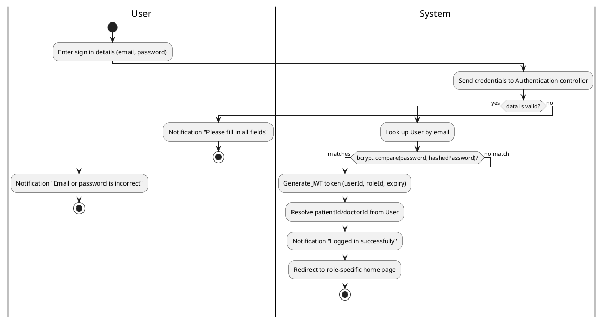
```plantuml
@startuml
|User|
start
:Enter sign in details (email, password);
|System|
:Send credentials to Authentication controller;
if (data is valid?) then (yes)
  :Look up User by email;
  if (bcrypt.compare(password, hashedPassword)?) then (matches)
    :Generate JWT token (userId, roleId, expiry);
    :Resolve patientId/doctorId from User;
    :Notification "Logged in successfully";
    :Redirect to role-specific home page;
    stop
  else (no match)
    |User|
    :Notification "Email or password is incorrect";
    stop
  endif
else (no)
  |User|
  :Notification "Please fill in all fields";
  stop
endif
@enduml
```

**Business Rules**

| Activity | BR Code | Description |
| --- | --- | --- |
| (3) | BR1 | **Validate Rules:** • The system checks the items [email], [password]. • If any of them is null or blank, the system shows error message MSG 2. • [user] = User Repository find by email [email] (call `findByEmail()` function). • If [user] does not exist, the system shows error message MSG 22. • If `bcrypt.compare([password], [user.passwordHash])` returns false, the system shows error message MSG 22. • If [user.status] == 'BANNED', the system shows error message MSG 23. • Else, generate JWT from [user.id, user.roleId] with `JWT_EXPIRES_IN` (default 7d) and record this login session. |
| (4) | BR2 | **Message Rules:** The system shows error message MSG 22. |
| (5) | BR3 | **Message Rules:** The system shows success message MSG 24. |
| (6) | BR4 | **Redirect Rules:** The system redirects to the home page according to user's role: Admin → `/admin`, Doctor → `/doctor`, Receptionist → `/recep`, Patient → `/`. |

---

#### UC2: Sign Up

| Name | Sign Up |
| --- | --- |
| **Description** | This use case describes the process by which a new Patient self-registers an account in the system with email verification via OTP. |
| **Actor** | Patient (Guest) |
| **Trigger** | When the user clicks on the "Sign Up" button. |
| **Pre-condition** | The user is on the sign up page (refer to "Sign Up Form" in "List description" file). The user has a valid email address. |
| **Post-condition** | A new User account has been created with role 'PATIENT' and status 'ACTIVE'. A corresponding Patient profile is created and linked. The user is redirected to the sign in page. |

**Activities Flow**

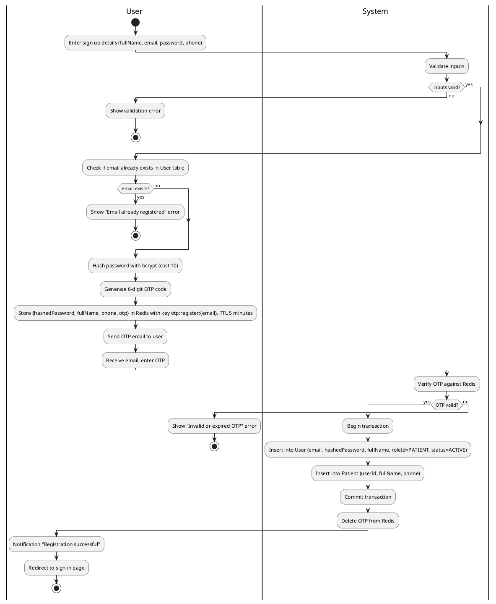
```plantuml
@startuml
|User|
start
:Enter sign up details (fullName, email, password, phone);
|System|
:Validate inputs;
if (inputs valid?) then (no)
  |User|
  :Show validation error;
  stop
else (yes)
endif
:Check if email already exists in User table;
if (email exists?) then (yes)
  |User|
  :Show "Email already registered" error;
  stop
else (no)
endif
:Hash password with bcrypt (cost 10);
:Generate 6-digit OTP code;
:Store {hashedPassword, fullName, phone, otp} in Redis with key otp:register:{email}, TTL 5 minutes;
:Send OTP email to user;
|User|
:Receive email, enter OTP;
|System|
:Verify OTP against Redis;
if (OTP valid?) then (yes)
  :Begin transaction;
  :Insert into User (email, hashedPassword, fullName, roleId=PATIENT, status=ACTIVE);
  :Insert into Patient (userId, fullName, phone);
  :Commit transaction;
  :Delete OTP from Redis;
  |User|
  :Notification "Registration successful";
  :Redirect to sign in page;
  stop
else (no)
  |User|
  :Show "Invalid or expired OTP" error;
  stop
endif
@enduml
```

**Business Rules**

| Activity | BR Code | Description |
| --- | --- | --- |
| (2) | BR5 | **Validate Rules:** • The system checks [fullName], [email], [password], [phone]. • If any entry is empty, the system shows error message MSG 2. • If `pattern.compile('^[a-zA-Z0-9._%+-]+@[a-zA-Z0-9.-]+\\.[a-zA-Z]{2,}$').notMatch([email])`, the system shows error MSG 31. • If `pattern.compile('^(?=.*[0-9])(?=.*[a-zA-Z])(?=.*[@#$%^&+=!])(?=\\S+$).{8,}$').notMatch([password])`, the system shows error MSG 25. • If `pattern.compile('^(84|0[3|5|7|8|9])+([0-9]{8})$').notMatch([phone])`, the system shows error MSG 30. |
| (5) | BR6 | **Email Existence Rules:** • If `userRepository.findByEmail([email]) != null`, the system shows error MSG 27. |
| (8) | BR7 | **OTP Generation Rules:** • Generate 6-digit numeric OTP. • Store in Redis: `SETEX otp:register:{email} 300 {otp, hashedPassword, fullName, phone}`. • Send email using template below. |
| (8) | BR8 | **Email Templates:** **From:** `noreply@clinic.local` **To:** [email] **Subject:** "Verify Your Clinic Account Registration" **Body:** `"Hello [fullName], your verification code is: [otp]. This code will expire in 5 minutes. If you did not request this, please ignore this email."` |
| (11) | BR9 | **OTP Verification Rules:** • `[cached] = redis.get('otp:register:' + [email])`. • If [cached] == null, the system shows error MSG 33. • If [cached.otp] != [enteredOtp], the system shows error MSG 46. • Else, create User and Patient records in a single transaction. • Delete OTP from Redis. |
| (13) | BR10 | **Redirect Rules:** The system redirects to the sign in page with success message MSG 28. |

---

#### UC3: Forgot Password

| Name | Forgot Password |
| --- | --- |
| **Description** | This use case describes how users reset their password when they have forgotten it. |
| **Actor** | User |
| **Trigger** | When the user clicks on the "Forgot Password" link on the sign in page. |
| **Pre-condition** | The user is not logged in. The user is on the sign in page. The user has a registered email. |
| **Post-condition** | The user's password has been changed. The user is redirected to the sign in page. |

**Activities Flow**

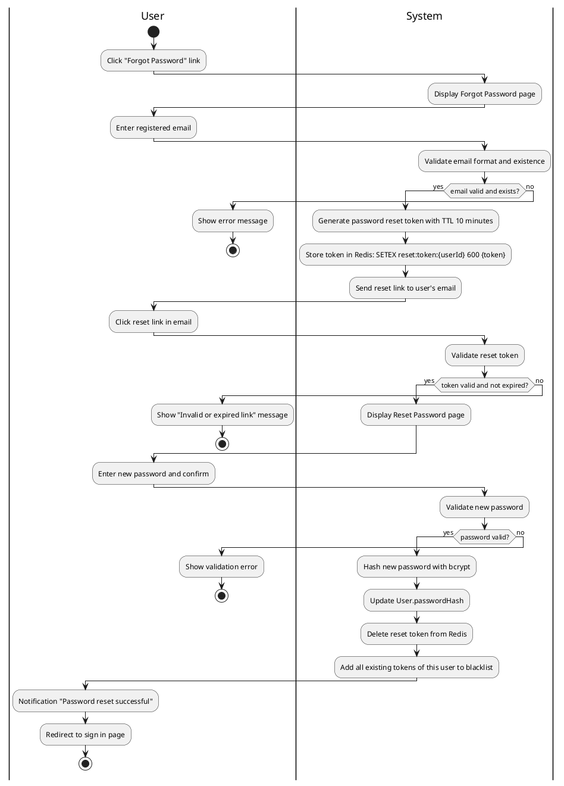
```plantuml
@startuml
|User|
start
:Click "Forgot Password" link;
|System|
:Display Forgot Password page;
|User|
:Enter registered email;
|System|
:Validate email format and existence;
if (email valid and exists?) then (yes)
  :Generate password reset token with TTL 10 minutes;
  :Store token in Redis: SETEX reset:token:{userId} 600 {token};
  :Send reset link to user's email;
else (no)
  |User|
  :Show error message;
  stop
endif
|User|
:Click reset link in email;
|System|
:Validate reset token;
if (token valid and not expired?) then (yes)
  :Display Reset Password page;
else (no)
  |User|
  :Show "Invalid or expired link" message;
  stop
endif
|User|
:Enter new password and confirm;
|System|
:Validate new password;
if (password valid?) then (yes)
  :Hash new password with bcrypt;
  :Update User.passwordHash;
  :Delete reset token from Redis;
  :Add all existing tokens of this user to blacklist;
  |User|
  :Notification "Password reset successful";
  :Redirect to sign in page;
  stop
else (no)
  |User|
  :Show validation error;
  stop
endif
@enduml
```

**Business Rules**

| Activity | BR Code | Description |
| --- | --- | --- |
| (3) | BR11 | **Email Validate Rules:** • If [email] is null or blank, return 400 with MSG 2. • If `pattern.compile('^[a-zA-Z0-9._%+-]+@[a-zA-Z0-9.-]+\\.[a-zA-Z]{2,}$').notMatch([email])`, return 400 with MSG 31. • [user] = userRepository.findByEmail([email]). • If [user] == null, return 400 with MSG 32. |
| (5) | BR12 | **Generate Reset Token Rules:** • Generate UUID v4 token. • Store in Redis: `SETEX reset:token:{userId} 600 {token, expiresAt}`. • Build reset link: `https://clinic.local/reset-password?token={token}&userId={userId}`. |
| (6) | BR13 | **Email Template:** **Subject:** "Reset Your Clinic Account Password" — **Body:** `"Hello [user.fullName], you requested a password reset. Click the link to reset: [link]. The link expires in 10 minutes. If you didn't request this, please ignore this email."` |
| (9) | BR14 | **Token Validate Rules:** • Look up Redis key `reset:token:{userId}`. • If null or `expiresAt < now()`, show error MSG 33. |
| (12) | BR15 | **Password Validate Rules:** • If `pattern.compile('^(?=.*[0-9])(?=.*[a-zA-Z])(?=.*[@#$%^&+=!])(?=\\S+$).{8,}$').notMatch([password])`, show MSG 25. • If `bcrypt.compare([password], [user.passwordHash])` returns true, show error MSG 34 (cannot reuse old password). • Else, [user.passwordHash] = `bcrypt.hash([password], 10)`. |
| (13) | BR16 | **Token Revocation Rules:** • Add all active tokens of [userId] to blacklist via `tokenBlacklistService.revokeAllForUser([userId])`. |

---

#### UC4: Sign In with Google OAuth

| Name | Sign In with Google OAuth |
| --- | --- |
| **Description** | This use case allows users to sign in using their Google account via OAuth 2.0 authorization code flow. |
| **Actor** | User |
| **Trigger** | When the user clicks on the "Sign In with Google" button. |
| **Pre-condition** | The user is on the sign in page. The user has a Google account. The system is configured with Google OAuth client credentials. |
| **Post-condition** | If the email is new, a new Patient account is automatically created. The user is logged in and redirected to the home page. |

**Activities Flow**

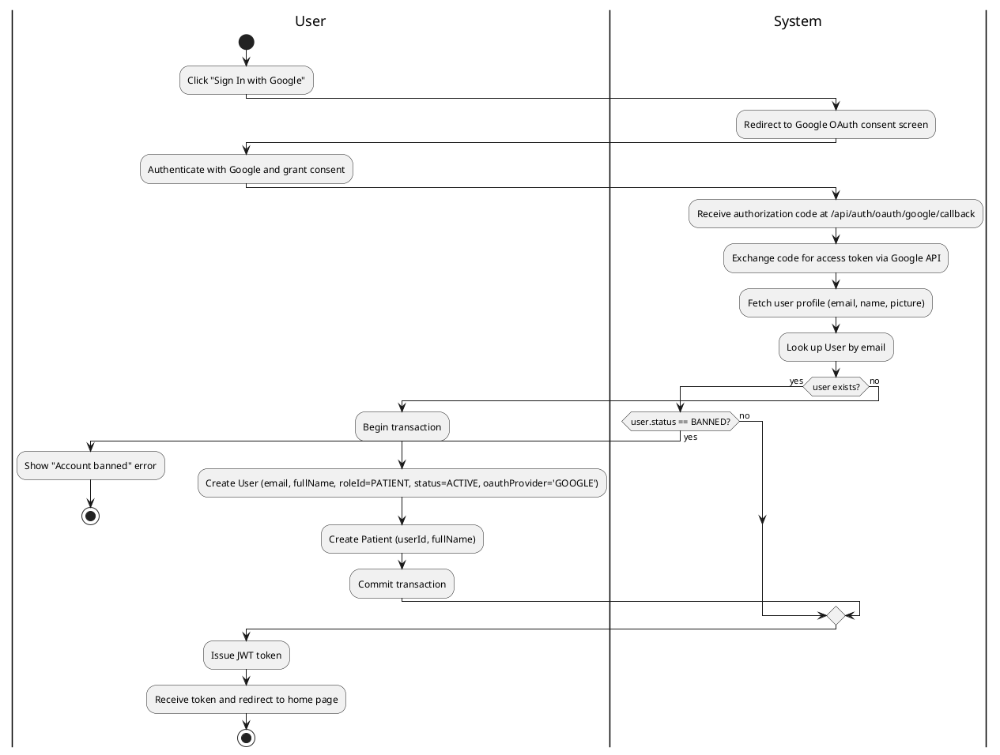
```plantuml
@startuml
|User|
start
:Click "Sign In with Google";
|System|
:Redirect to Google OAuth consent screen;
|User|
:Authenticate with Google and grant consent;
|System|
:Receive authorization code at /api/auth/oauth/google/callback;
:Exchange code for access token via Google API;
:Fetch user profile (email, name, picture);
:Look up User by email;
if (user exists?) then (yes)
  if (user.status == BANNED?) then (yes)
    |User|
    :Show "Account banned" error;
    stop
  else (no)
  endif
else (no)
  :Begin transaction;
  :Create User (email, fullName, roleId=PATIENT, status=ACTIVE, oauthProvider='GOOGLE');
  :Create Patient (userId, fullName);
  :Commit transaction;
endif
:Issue JWT token;
|User|
:Receive token and redirect to home page;
stop
@enduml
```

**Business Rules**

| Activity | BR Code | Description |
| --- | --- | --- |
| (2) | BR17 | **OAuth Redirect Rules:** • Redirect URL: `https://accounts.google.com/o/oauth2/v2/auth?client_id={GOOGLE_CLIENT_ID}&redirect_uri={callback}&scope=openid+email+profile&response_type=code&state={csrf_token}`. |
| (4) | BR18 | **Token Exchange Rules:** • Verify `state` parameter matches CSRF token. • POST to `https://oauth2.googleapis.com/token` with code, client_id, client_secret. • If exchange fails, redirect to sign in page with error MSG 56. |
| (7) | BR19 | **Auto Provisioning Rules:** • If [user] == null: &nbsp;&nbsp;[user] = new User { email: [google.email], fullName: [google.name], oauthProvider: 'GOOGLE', roleId: PATIENT, status: ACTIVE, passwordHash: null }. &nbsp;&nbsp;[patient] = new Patient { userId: [user.id], fullName: [google.name] }. • If [user] exists and [user.oauthProvider] is null, link Google account by setting [user.oauthProvider] = 'GOOGLE'. |

---

#### UC5: Sign Out

| Name | Sign Out |
| --- | --- |
| **Description** | This use case describes how a user signs out from the system with immediate token revocation. |
| **Actor** | User (any role) |
| **Trigger** | When the user clicks on the "Sign Out" button. |
| **Pre-condition** | The user is logged in to the system. |
| **Post-condition** | The user's current JWT token is added to the revocation blacklist. The user is redirected to the sign in page. Subsequent requests with the same token are rejected within ≤ 1 second. |

**Activities Flow**

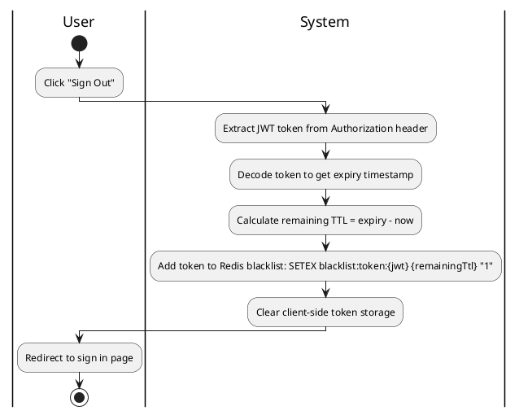
```plantuml
@startuml
|User|
start
:Click "Sign Out";
|System|
:Extract JWT token from Authorization header;
:Decode token to get expiry timestamp;
:Calculate remaining TTL = expiry - now;
:Add token to Redis blacklist: SETEX blacklist:token:{jwt} {remainingTtl} "1";
:Clear client-side token storage;
|User|
:Redirect to sign in page;
stop
@enduml
```

**Business Rules**

| Activity | BR Code | Description |
| --- | --- | --- |
| (3) | BR20 | **Token Revocation Rules:** • [decoded] = `jwt.decode([token])`. • [ttl] = [decoded.exp] - `Math.floor(Date.now() / 1000)`. • If [ttl] > 0, call `redis.setex('blacklist:token:' + [token], [ttl], '1')`. • If [ttl] ≤ 0, skip (token already expired). |
| (5) | BR21 | **Message Rules:** The system shows success message MSG 57. |

---

#### UC6: Change Password

| Name | Change Password |
| --- | --- |
| **Description** | This use case describes how a logged-in user changes their password. |
| **Actor** | User (any role) |
| **Trigger** | When the user clicks on the "Change Password" button in profile settings. |
| **Pre-condition** | The user is logged in. |
| **Post-condition** | The user's password is updated. All existing tokens of this user are revoked. The user is forced to sign in again. |

**Activities Flow**

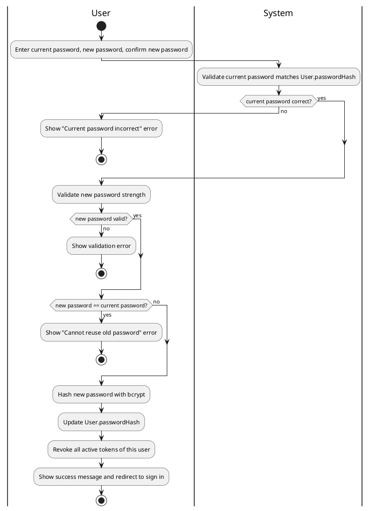
```plantuml
@startuml
|User|
start
:Enter current password, new password, confirm new password;
|System|
:Validate current password matches User.passwordHash;
if (current password correct?) then (no)
  |User|
  :Show "Current password incorrect" error;
  stop
else (yes)
endif
:Validate new password strength;
if (new password valid?) then (no)
  |User|
  :Show validation error;
  stop
else (yes)
endif
if (new password == current password?) then (yes)
  |User|
  :Show "Cannot reuse old password" error;
  stop
else (no)
endif
:Hash new password with bcrypt;
:Update User.passwordHash;
:Revoke all active tokens of this user;
|User|
:Show success message and redirect to sign in;
stop
@enduml
```

**Business Rules**

| Activity | BR Code | Description |
| --- | --- | --- |
| (2) | BR22 | **Validate Current Password:** If `bcrypt.compare([currentPassword], [user.passwordHash])` returns false, show error MSG 22. |
| (4) | BR23 | **Validate New Password:** Same regex as BR5. If invalid, show MSG 25. |
| (6) | BR24 | **Reuse Check:** If `bcrypt.compare([newPassword], [user.passwordHash])` returns true, show error MSG 34. |
| (9) | BR25 | **Token Revocation:** Call `tokenBlacklistService.revokeAllForUser([userId])` to invalidate all sessions. |

---

#### UC7: Update User Profile

| Name | Update User Profile |
| --- | --- |
| **Description** | This use case describes how a user updates their personal information and avatar. |
| **Actor** | User (any role) |
| **Trigger** | When the user clicks on the "Save" button on the profile page. |
| **Pre-condition** | The user is logged in. The user is on the profile page. |
| **Post-condition** | The user's profile information is updated. |

**Activities Flow**

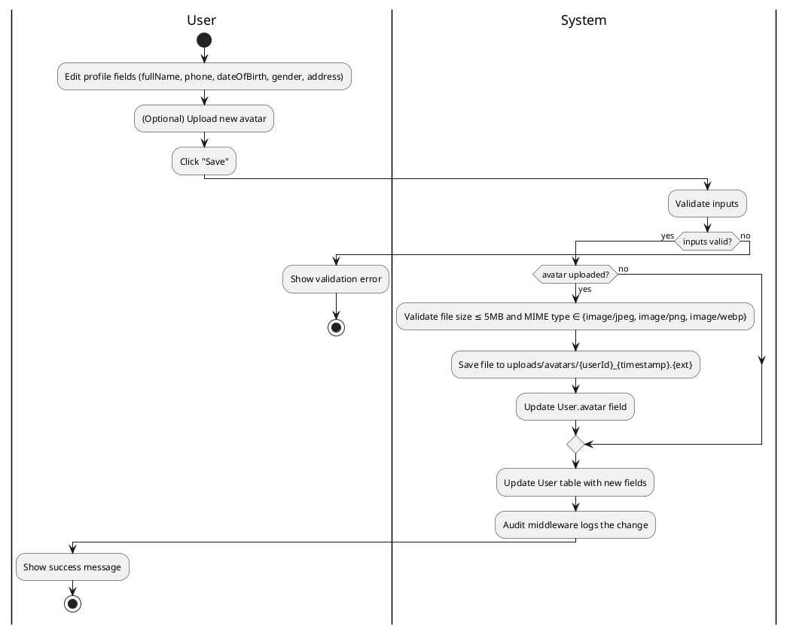
```plantuml
@startuml
|User|
start
:Edit profile fields (fullName, phone, dateOfBirth, gender, address);
:(Optional) Upload new avatar;
:Click "Save";
|System|
:Validate inputs;
if (inputs valid?) then (yes)
  if (avatar uploaded?) then (yes)
    :Validate file size ≤ 5MB and MIME type ∈ {image/jpeg, image/png, image/webp};
    :Save file to uploads/avatars/{userId}_{timestamp}.{ext};
    :Update User.avatar field;
  else (no)
  endif
  :Update User table with new fields;
  :Audit middleware logs the change;
  |User|
  :Show success message;
  stop
else (no)
  |User|
  :Show validation error;
  stop
endif
@enduml
```

**Business Rules**

| Activity | BR Code | Description |
| --- | --- | --- |
| (3) | BR26 | **Validate Rules:** Check [fullName] is not empty, [phone] matches Vietnam phone pattern (BR5), [dateOfBirth] is a valid date in the past, [gender] ∈ {MALE, FEMALE, OTHER}. |
| (4) | BR27 | **Avatar Upload Rules:** If file size > 5MB, show MSG 11. If MIME type not in allowed list, show MSG 58. Store file path in User.avatar. |
| (6) | BR28 | **Audit Rules:** Audit middleware captures old and new values and writes to AuditLog table asynchronously. |

---

#### UC8: Manage Employee Account

| Name | Manage Employee Account |
| --- | --- |
| **Description** | This use case describes how Admin creates, updates, or deactivates employee accounts (Doctor, Receptionist). |
| **Actor** | Admin |
| **Trigger** | When the Admin clicks on "Create Employee" or "Edit" button. |
| **Pre-condition** | The Admin is logged in with role 'ADMIN'. The Admin is on the Employee management page. |
| **Post-condition** | A new Employee account is created, or an existing one is updated. |

**Activities Flow**

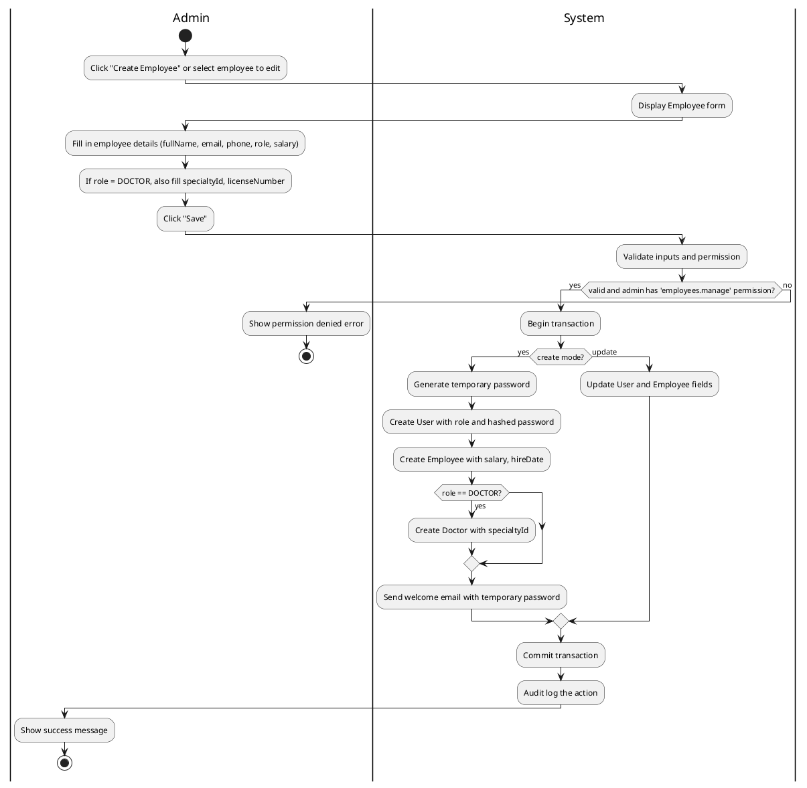
```plantuml
@startuml
|Admin|
start
:Click "Create Employee" or select employee to edit;
|System|
:Display Employee form;
|Admin|
:Fill in employee details (fullName, email, phone, role, salary);
:If role = DOCTOR, also fill specialtyId, licenseNumber;
:Click "Save";
|System|
:Validate inputs and permission;
if (valid and admin has 'employees.manage' permission?) then (yes)
  :Begin transaction;
  if (create mode?) then (yes)
    :Generate temporary password;
    :Create User with role and hashed password;
    :Create Employee with salary, hireDate;
    if (role == DOCTOR?) then (yes)
      :Create Doctor with specialtyId;
    else
    endif
    :Send welcome email with temporary password;
  else (update)
    :Update User and Employee fields;
  endif
  :Commit transaction;
  :Audit log the action;
  |Admin|
  :Show success message;
  stop
else (no)
  |Admin|
  :Show permission denied error;
  stop
endif
@enduml
```

**Business Rules**

| Activity | BR Code | Description |
| --- | --- | --- |
| (3) | BR29 | **Permission Check:** Middleware `requirePermission('employees.manage')` must pass. Else, return 403 with MSG 15. |
| (5) | BR30 | **Validate Rules:** Check [fullName], [email], [phone], [roleId ∈ {DOCTOR, RECEPTIONIST}], [salary ≥ 0]. If [roleId] == DOCTOR, require [specialtyId] and [licenseNumber]. |
| (6) | BR31 | **Create Rules:** Temporary password = `crypto.randomBytes(8).toString('hex')`. Hash with bcrypt. Send welcome email with the temp password and instruction to change on first login. |
| (7) | BR32 | **Audit Rules:** Insert audit log entry with action='CREATE_EMPLOYEE' or 'UPDATE_EMPLOYEE'. |

---

#### UC9: Book Appointment Online (Patient)

| Name | Book Appointment Online |
| --- | --- |
| **Description** | This use case allows a patient to book an appointment online by selecting specialty, doctor, shift, and date. The system must guarantee no over-booking under concurrent requests. |
| **Actor** | Patient |
| **Trigger** | When the patient clicks on "Book Appointment" button. |
| **Pre-condition** | The patient is logged in. The patient does not have an active appointment with the same doctor on the same date. |
| **Post-condition** | A new Appointment record is created with status 'WAITING'. A confirmation notification is sent. |

**Activities Flow**

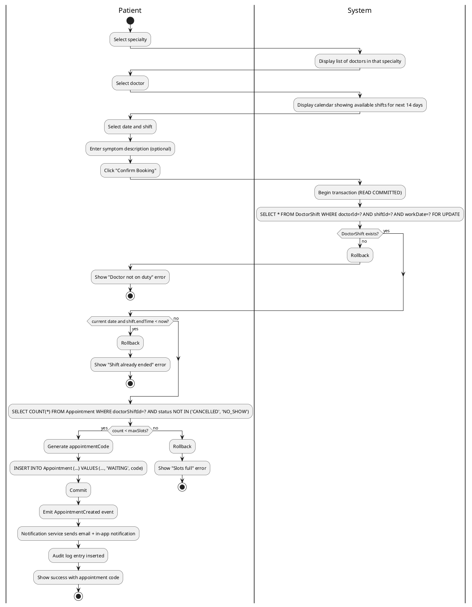
```plantuml
@startuml
|Patient|
start
:Select specialty;
|System|
:Display list of doctors in that specialty;
|Patient|
:Select doctor;
|System|
:Display calendar showing available shifts for next 14 days;
|Patient|
:Select date and shift;
:Enter symptom description (optional);
:Click "Confirm Booking";
|System|
:Begin transaction (READ COMMITTED);
:SELECT * FROM DoctorShift WHERE doctorId=? AND shiftId=? AND workDate=? FOR UPDATE;
if (DoctorShift exists?) then (no)
  :Rollback;
  |Patient|
  :Show "Doctor not on duty" error;
  stop
else (yes)
endif
if (current date and shift.endTime < now?) then (yes)
  :Rollback;
  |Patient|
  :Show "Shift already ended" error;
  stop
else (no)
endif
:SELECT COUNT(*) FROM Appointment WHERE doctorShiftId=? AND status NOT IN ('CANCELLED', 'NO_SHOW');
if (count < maxSlots?) then (yes)
  :Generate appointmentCode;
  :INSERT INTO Appointment (...) VALUES (..., 'WAITING', code);
  :Commit;
  :Emit AppointmentCreated event;
  :Notification service sends email + in-app notification;
  :Audit log entry inserted;
  |Patient|
  :Show success with appointment code;
  stop
else (no)
  :Rollback;
  |Patient|
  :Show "Slots full" error;
  stop
endif
@enduml
```

**Business Rules**

| Activity | BR Code | Description |
| --- | --- | --- |
| (4) | BR33 | **Doctor Listing Rules:** • Fetch all Doctor records WHERE specialtyId=[selected] AND isActive=true. • Sort by experienceYears DESC. |
| (6) | BR34 | **Shift Availability Rules:** • For each date in next 14 days, fetch DoctorShift WHERE doctorId=[selected] AND workDate=[date]. • For each DoctorShift, calculate `availableSlots = ds.maxSlots - count(active appointments)`. • Only show shifts with `availableSlots > 0`. |
| (9) | BR35 | **Concurrent Booking Rules (CRITICAL):** • Wrap booking logic in `sequelize.transaction({ isolationLevel: READ_COMMITTED })`. • Lock the target DoctorShift row using `lock: t.LOCK.UPDATE`. • Count active appointments AFTER acquiring lock. • If `count >= maxSlots`, throw `SLOTS_FULL` error with message MSG 59. • If [date] == today and `now() >= shift.endTime`, throw `SHIFT_ALREADY_ENDED` with MSG 60. |
| (10) | BR36 | **Code Generation Rules:** • Format: `APT-YYYYMMDD-XXXXX` where XXXXX is a 5-digit sequence. • Generated within the same transaction to avoid duplicates. |
| (12) | BR37 | **Event Emission Rules:** • Emit `AppointmentCreated` event via internal event bus AFTER commit. • Notification service listens and: (a) inserts Notification record, (b) queues email via Nodemailer. |
| (13) | BR38 | **Audit Rules:** Audit middleware inserts entry with action='CREATE_APPOINTMENT', tableName='Appointment', recordId=[id], newValue=[appointment]. |

---

#### UC10: Book Appointment Offline (Receptionist)

| Name | Book Appointment Offline |
| --- | --- |
| **Description** | This use case allows a Receptionist to book an appointment on behalf of a walk-in patient. If the patient does not have an account, the Receptionist can create a Patient record without User account. |
| **Actor** | Receptionist |
| **Trigger** | When the Receptionist clicks on "Walk-in Booking" button. |
| **Pre-condition** | The Receptionist is logged in with permission `appointments.create.proxy`. |
| **Post-condition** | A new Appointment is created with status 'CHECKED_IN' (since patient is physically present). |

**Activities Flow**

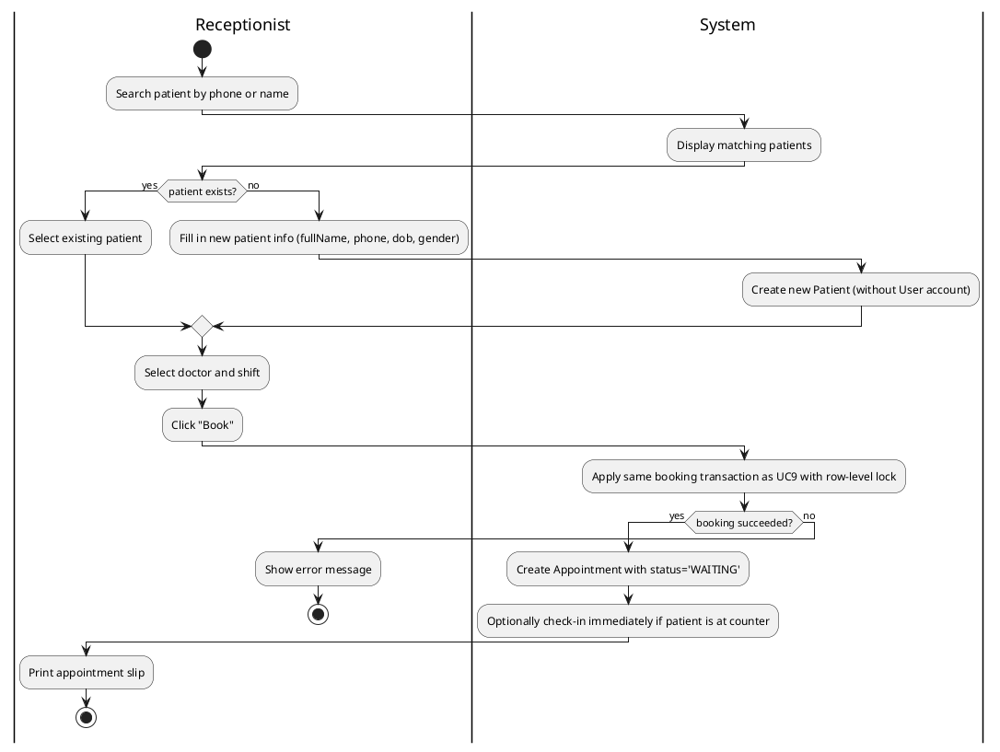
```plantuml
@startuml
|Receptionist|
start
:Search patient by phone or name;
|System|
:Display matching patients;
|Receptionist|
if (patient exists?) then (yes)
  :Select existing patient;
else (no)
  :Fill in new patient info (fullName, phone, dob, gender);
  |System|
  :Create new Patient (without User account);
endif
|Receptionist|
:Select doctor and shift;
:Click "Book";
|System|
:Apply same booking transaction as UC9 with row-level lock;
if (booking succeeded?) then (yes)
  :Create Appointment with status='WAITING';
  :Optionally check-in immediately if patient is at counter;
  |Receptionist|
  :Print appointment slip;
  stop
else (no)
  |Receptionist|
  :Show error message;
  stop
endif
@enduml
```

**Business Rules**

| Activity | BR Code | Description |
| --- | --- | --- |
| (3) | BR39 | **Patient Search Rules:** • `patientRepository.findByPhoneOrName([query])` returns top 10 matches. • If no match and [query] is a phone, allow quick-create. |
| (5) | BR40 | **Walk-in Patient Creation Rules:** • Create Patient with `userId = null`, `createdBy = [receptionist.id]`. • Patient cannot self-login until they later register and link their account. |
| (8) | BR41 | **Booking Rules:** Same as BR35, but status can be set directly to 'CHECKED_IN' if Receptionist confirms patient presence. |
| (9) | BR42 | **Print Rules:** Generate PDF slip with `pdfkit` containing appointment code, doctor name, shift time, queue number. |

---

#### UC11: Cancel Appointment

| Name | Cancel Appointment |
| --- | --- |
| **Description** | This use case allows a patient to cancel their own appointment, or Receptionist/Admin to cancel any appointment within policy. |
| **Actor** | Patient, Receptionist, Admin |
| **Trigger** | When the user clicks the "Cancel" button on appointment details page. |
| **Pre-condition** | The user is logged in. The appointment exists and is in status 'WAITING' or 'CHECKED_IN'. |
| **Post-condition** | The appointment status is updated to 'CANCELLED'. Slot is freed for other patients. Notification is sent. |

**Activities Flow**

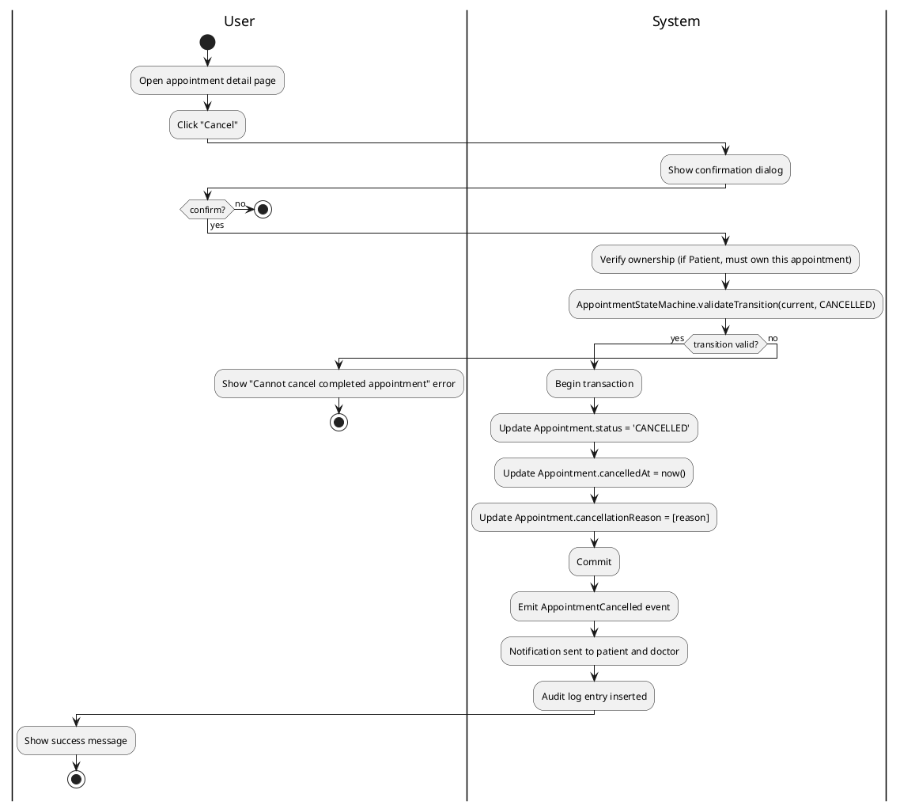
```plantuml
@startuml
|User|
start
:Open appointment detail page;
:Click "Cancel";
|System|
:Show confirmation dialog;
|User|
if (confirm?) then (no)
  stop
else (yes)
endif
|System|
:Verify ownership (if Patient, must own this appointment);
:AppointmentStateMachine.validateTransition(current, CANCELLED);
if (transition valid?) then (yes)
  :Begin transaction;
  :Update Appointment.status = 'CANCELLED';
  :Update Appointment.cancelledAt = now();
  :Update Appointment.cancellationReason = [reason];
  :Commit;
  :Emit AppointmentCancelled event;
  :Notification sent to patient and doctor;
  :Audit log entry inserted;
  |User|
  :Show success message;
  stop
else (no)
  |User|
  :Show "Cannot cancel completed appointment" error;
  stop
endif
@enduml
```

**Business Rules**

| Activity | BR Code | Description |
| --- | --- | --- |
| (3) | BR43 | **Ownership Check:** If `req.user.roleId == PATIENT`, ensure `appointment.patientId == req.user.patientId`. Else, return 403 with MSG 15. |
| (4) | BR44 | **State Machine Check:** Use `AppointmentStateMachine.canTransition(current, 'CANCELLED')`. Allowed from WAITING and CHECKED_IN. Not allowed from IN_PROGRESS, COMPLETED, NO_SHOW. |
| (5) | BR45 | **Cancellation Policy Rules:** • If cancelled < 2 hours before shift start, increment `patient.lateCancellationCount`. • If `patient.lateCancellationCount >= 3` within 30 days, flag patient for staff review (does NOT auto-ban). |

---

#### UC12: Reschedule Appointment

| Name | Reschedule Appointment |
| --- | --- |
| **Description** | This use case allows rescheduling an appointment to a different doctor shift while preserving the appointment record. |
| **Actor** | Patient, Receptionist |
| **Trigger** | When the user clicks the "Reschedule" button. |
| **Pre-condition** | The appointment exists and is in 'WAITING' status. |
| **Post-condition** | The appointment is updated with new doctorShiftId. The old slot is freed. The new slot is occupied. |

**Activities Flow**

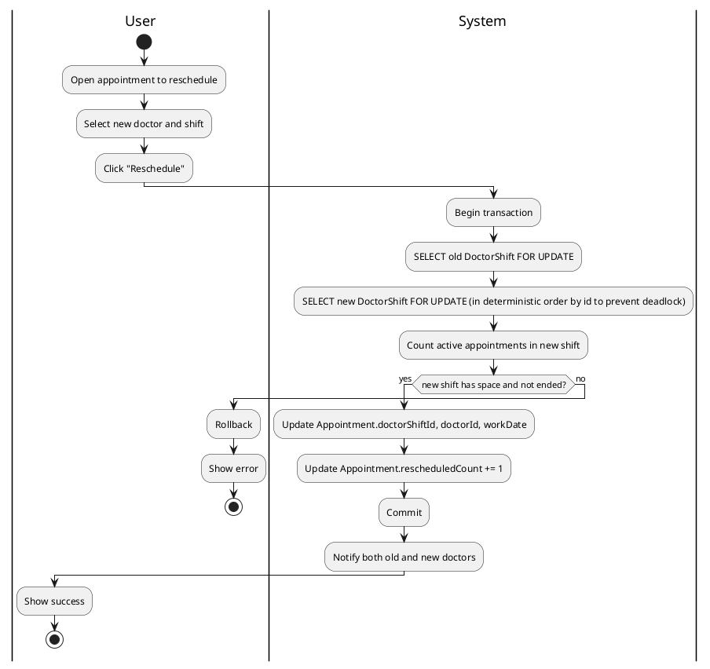
```plantuml
@startuml
|User|
start
:Open appointment to reschedule;
:Select new doctor and shift;
:Click "Reschedule";
|System|
:Begin transaction;
:SELECT old DoctorShift FOR UPDATE;
:SELECT new DoctorShift FOR UPDATE (in deterministic order by id to prevent deadlock);
:Count active appointments in new shift;
if (new shift has space and not ended?) then (yes)
  :Update Appointment.doctorShiftId, doctorId, workDate;
  :Update Appointment.rescheduledCount += 1;
  :Commit;
  :Notify both old and new doctors;
  |User|
  :Show success;
  stop
else (no)
  :Rollback;
  |User|
  :Show error;
  stop
endif
@enduml
```

**Business Rules**

| Activity | BR Code | Description |
| --- | --- | --- |
| (3) | BR46 | **Deadlock Prevention:** Always lock the DoctorShift rows in ascending order of `id` (lower id first) to prevent deadlock when multiple users reschedule simultaneously. |
| (4) | BR47 | **Reschedule Limit:** If `appointment.rescheduledCount >= 3`, deny with MSG 61 ("Maximum reschedules reached"). |

---

#### UC13: Check-in Patient

| Name | Check-in Patient |
| --- | --- |
| **Description** | This use case allows Receptionist to check in a patient when they arrive at the clinic, creating a Visit record. |
| **Actor** | Receptionist |
| **Trigger** | When the Receptionist clicks the "Check-in" button on appointment list. |
| **Pre-condition** | The Receptionist is logged in. The appointment exists and is in status 'WAITING'. The current time is within ±60 minutes of shift start. |
| **Post-condition** | The Appointment status is updated to 'CHECKED_IN'. A new Visit record is created with status 'IN_PROGRESS'. |

**Activities Flow**

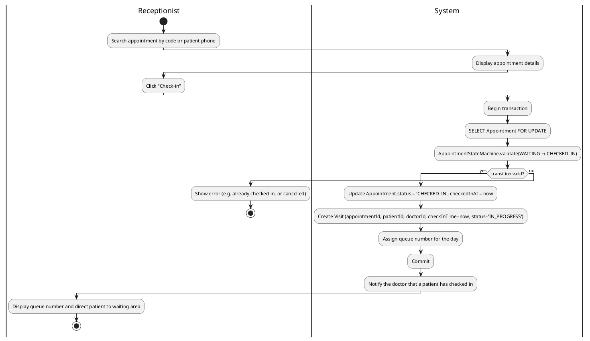
```plantuml
@startuml
|Receptionist|
start
:Search appointment by code or patient phone;
|System|
:Display appointment details;
|Receptionist|
:Click "Check-in";
|System|
:Begin transaction;
:SELECT Appointment FOR UPDATE;
:AppointmentStateMachine.validate(WAITING → CHECKED_IN);
if (transition valid?) then (yes)
  :Update Appointment.status = 'CHECKED_IN', checkedInAt = now;
  :Create Visit (appointmentId, patientId, doctorId, checkInTime=now, status='IN_PROGRESS');
  :Assign queue number for the day;
  :Commit;
  :Notify the doctor that a patient has checked in;
  |Receptionist|
  :Display queue number and direct patient to waiting area;
  stop
else (no)
  |Receptionist|
  :Show error (e.g. already checked in, or cancelled);
  stop
endif
@enduml
```

**Business Rules**

| Activity | BR Code | Description |
| --- | --- | --- |
| (4) | BR48 | **Time Window Rules:** • Allow check-in from `shift.startTime - 60 min` to `shift.endTime + 30 min`. • Outside window, show warning but allow override by Admin. |
| (5) | BR49 | **State Transition:** Use `AppointmentStateMachine.validateTransition`. Allowed only from WAITING. |
| (7) | BR50 | **Queue Number Rules:** • Sequential per doctor per shift, starting from 1. • `queueNumber = COUNT(visits WHERE doctorId=? AND DATE(checkInTime)=today) + 1`. |

---

#### UC14: Record Visit

| Name | Record Visit |
| --- | --- |
| **Description** | This use case allows a Doctor to record clinical examination details: symptoms, vital signs, diagnosis, and optionally attach images. |
| **Actor** | Doctor |
| **Trigger** | When the Doctor opens a visit in progress and starts entering data. |
| **Pre-condition** | The Doctor is logged in. The Visit is in status 'IN_PROGRESS' and assigned to the current doctor. |
| **Post-condition** | The Visit record is updated with clinical data. |

**Activities Flow**

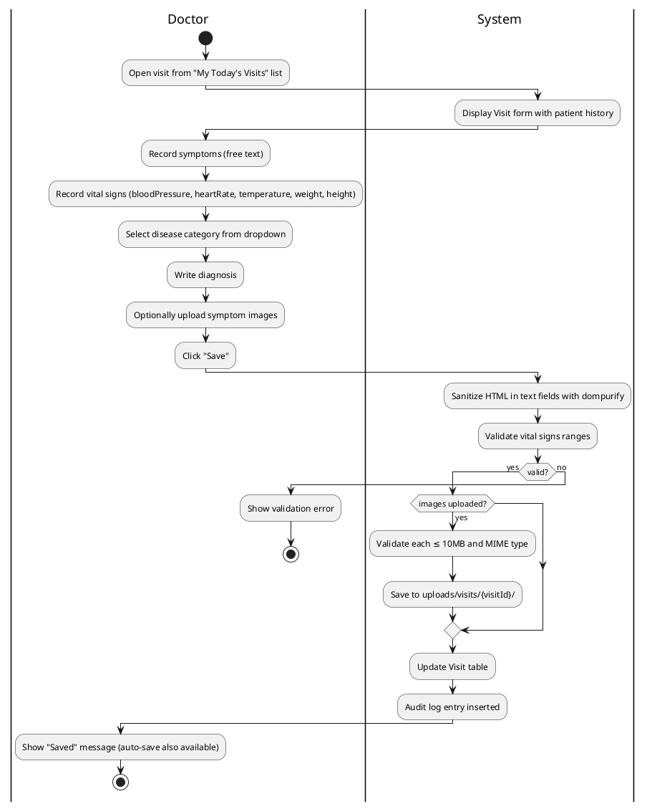
```plantuml
@startuml
|Doctor|
start
:Open visit from "My Today's Visits" list;
|System|
:Display Visit form with patient history;
|Doctor|
:Record symptoms (free text);
:Record vital signs (bloodPressure, heartRate, temperature, weight, height);
:Select disease category from dropdown;
:Write diagnosis;
:Optionally upload symptom images;
:Click "Save";
|System|
:Sanitize HTML in text fields with dompurify;
:Validate vital signs ranges;
if (valid?) then (yes)
  if (images uploaded?) then (yes)
    :Validate each ≤ 10MB and MIME type;
    :Save to uploads/visits/{visitId}/;
  else
  endif
  :Update Visit table;
  :Audit log entry inserted;
  |Doctor|
  :Show "Saved" message (auto-save also available);
  stop
else (no)
  |Doctor|
  :Show validation error;
  stop
endif
@enduml
```

**Business Rules**

| Activity | BR Code | Description |
| --- | --- | --- |
| (4) | BR51 | **Ownership Check:** `visit.doctorId == req.user.doctorId`. Else, return 403 with MSG 15. |
| (8) | BR52 | **Vital Signs Validation:** • bloodPressureSystolic ∈ [50, 250] • bloodPressureDiastolic ∈ [30, 150] • heartRate ∈ [30, 220] • temperature ∈ [30.0, 45.0] • weight ∈ [0.5, 500] • height ∈ [20, 250]. • Out-of-range values prompt for confirmation, not blocked. |
| (9) | BR53 | **HTML Sanitization:** Apply `DOMPurify.sanitize()` to [symptoms], [diagnosis] fields to prevent stored XSS. |
| (10) | BR54 | **Image Upload Rules:** Max 10MB per file, MIME ∈ {image/jpeg, image/png, image/webp}, max 5 images per visit. |
| (11) | BR55 | **Audit Rules:** Captures old values of diagnosis and vitals for full audit trail. |

---

#### UC15: Create Prescription

| Name | Create Prescription |
| --- | --- |
| **Description** | This use case allows a Doctor to create a prescription tied to a visit, specifying medicines, dosages, and instructions. |
| **Actor** | Doctor |
| **Trigger** | When the Doctor clicks "Create Prescription" on the visit page. |
| **Pre-condition** | The Doctor is logged in. The Visit is in status 'IN_PROGRESS' or 'COMPLETED'. |
| **Post-condition** | A new Prescription record with PrescriptionDetail entries is created. |

**Activities Flow**

```plantuml
@startuml
|Doctor|
start
:Click "Create Prescription";
|System|
:Display prescription form with medicine search;
|Doctor|
repeat
  :Search medicine by name or code;
  |System|
  :Show matching active medicines from inventory;
  |Doctor|
  :Select medicine;
  :Enter dosage, frequency, duration, instruction;
repeat while (more medicines?)
:Click "Save Prescription";
|System|
:Begin transaction;
:Validate each medicine is active and in stock (warning only);
:Generate prescriptionCode;
:Insert Prescription;
for each item: Insert PrescriptionDetail;
:Commit;
:Emit PrescriptionCreated event;
:Notification sent to patient;
|Doctor|
:Show success message;
:Optionally print prescription PDF;
stop
@enduml
```

**Business Rules**

| Activity | BR Code | Description |
| --- | --- | --- |
| (4) | BR56 | **Medicine Search Rules:** • `medicineRepository.searchByName([q])` with `WHERE name LIKE %?% AND isActive = true`. • Limit 20 results, ordered by relevance. |
| (7) | BR57 | **Prescription Detail Rules:** • [dosage] required, e.g. "1 tablet" • [frequency] required, e.g. "3 times/day" • [duration] required, e.g. "7 days" • [instruction] optional, e.g. "after meal". |
| (10) | BR58 | **Stock Warning:** If `medicine.stock < quantity_needed`, show warning but allow saving (patient may buy medicine elsewhere). |
| (11) | BR59 | **Code Generation:** `prescriptionCode = 'RX-' + YYYYMMDD + '-' + 5_digit_sequence`. |

---

#### UC16: Manage Medicine

| Name | Manage Medicine |
| --- | --- |
| **Description** | This use case allows Admin or authorized staff to create, update, or deactivate medicines in the catalog. |
| **Actor** | Admin |
| **Trigger** | When the Admin clicks "Add Medicine" or "Edit" on medicine list page. |
| **Pre-condition** | The Admin is logged in with permission `medicines.manage`. |
| **Post-condition** | A medicine is created, updated, or deactivated in the catalog. |

**Activities Flow**

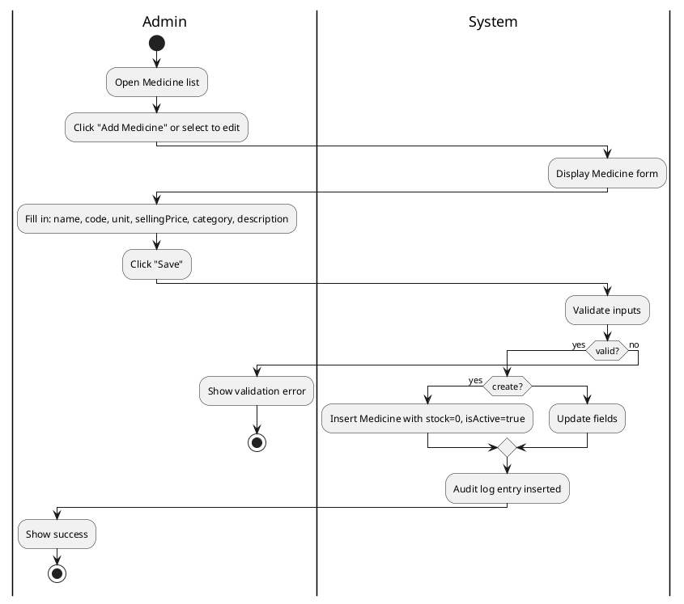
```plantuml
@startuml
|Admin|
start
:Open Medicine list;
:Click "Add Medicine" or select to edit;
|System|
:Display Medicine form;
|Admin|
:Fill in: name, code, unit, sellingPrice, category, description;
:Click "Save";
|System|
:Validate inputs;
if (valid?) then (yes)
  if (create?) then (yes)
    :Insert Medicine with stock=0, isActive=true;
  else
    :Update fields;
  endif
  :Audit log entry inserted;
  |Admin|
  :Show success;
  stop
else (no)
  |Admin|
  :Show validation error;
  stop
endif
@enduml
```

**Business Rules**

| Activity | BR Code | Description |
| --- | --- | --- |
| (4) | BR60 | **Validate Rules:** [name] not empty and unique, [code] unique, [sellingPrice] > 0, [unit] ∈ {viên, vỉ, hộp, lọ, ống, ml, gói}. |
| (5) | BR61 | **Stock Initialization:** New medicine starts with `stock = 0`. Stock can only be incremented via UC17 (Import). |

---

#### UC17: Import Medicine to Stock

| Name | Import Medicine to Stock |
| --- | --- |
| **Description** | This use case allows authorized staff to record an import (stock-in) of medicines from a supplier. |
| **Actor** | Admin |
| **Trigger** | When the Admin clicks "New Import" button. |
| **Pre-condition** | The Admin is logged in with permission `medicines.import`. |
| **Post-condition** | A MedicineImport record is created. The corresponding Medicine.stock is increased. |

**Activities Flow**

```plantuml
@startuml
|Admin|
start
:Click "New Import";
|System|
:Display import form;
|Admin|
:Fill supplier info, importDate;
repeat
  :Add line item (medicine, quantity, costPrice, expiryDate, batchNumber);
repeat while (more items?)
:Click "Save Import";
|System|
:Begin transaction;
:Validate each item: medicine exists, quantity > 0, expiryDate > today + 30 days;
if (all valid?) then (yes)
  :Insert MedicineImport header;
  for each item:
    :Insert MedicineImportDetail;
    :UPDATE Medicine SET stock = stock + quantity WHERE id = ?;
  endfor
  :Commit;
  :Audit log;
  |Admin|
  :Show success;
  stop
else (no)
  :Rollback;
  |Admin|
  :Show validation error;
  stop
endif
@enduml
```

**Business Rules**

| Activity | BR Code | Description |
| --- | --- | --- |
| (5) | BR62 | **Expiry Validation:** `expiryDate >= today + 30 days`. Else warn with MSG 62 ("Medicine expires soon"). Block if `expiryDate <= today`. |
| (6) | BR63 | **Stock Update:** Atomic increment within same transaction using `UPDATE Medicine SET stock = stock + ?`. |
| (7) | BR64 | **Cost Recording:** Store `costPrice` per import to enable margin reports. |

---

#### UC18: Create Invoice

| Name | Create Invoice |
| --- | --- |
| **Description** | This use case allows Receptionist to create an invoice for a completed visit, including consultation fee and optionally medicines from the prescription. The operation must be atomic across Invoice, InvoiceItem, MedicineExport, and Visit status. |
| **Actor** | Receptionist |
| **Trigger** | When the Receptionist clicks "Create Invoice" on a completed visit. |
| **Pre-condition** | The Receptionist is logged in. The Visit is in status 'COMPLETED' and not yet invoiced. |
| **Post-condition** | A new Invoice with InvoiceItems is created. If medicines are included, MedicineExport records are created and Medicine.stock is decremented. The Visit.status becomes 'INVOICED'. |

**Activities Flow**

```plantuml
@startuml
|Receptionist|
start
:Select a completed visit;
|System|
:Display visit summary with prescription items;
|Receptionist|
:Confirm consultation fee;
:For each prescribed medicine, choose to include in invoice or not;
:Click "Create Invoice";
|System|
:Begin transaction;
:SELECT Visit FOR UPDATE;
if (visit.status == 'COMPLETED' and not invoiced?) then (yes)
  :Generate invoiceCode;
  :Insert Invoice with status='PENDING', total=0;
  :Insert InvoiceItem (type='CONSULTATION', amount=fee);
  for each medicine item:
    :UPDATE Medicine SET stock = stock - qty WHERE id=? AND stock >= qty;
    if (affectedRows == 1?) then (yes)
      :Insert MedicineExport (invoiceId, medicineId, qty, price, exportDate);
      :Insert InvoiceItem (type='MEDICINE', medicineId, qty, unitPrice, subtotal);
    else (no)
      :Throw STOCK_INSUFFICIENT;
    endif
  endfor
  :UPDATE Invoice SET total = sum(items);
  :VisitStateMachine: COMPLETED → INVOICED;
  :UPDATE Visit SET status = 'INVOICED';
  :Commit;
  :Emit InvoiceCreated event;
  :Notification sent to patient;
  :Audit log entry inserted;
  |Receptionist|
  :Display invoice with print option;
  stop
else (no)
  :Rollback;
  |Receptionist|
  :Show error (already invoiced or invalid state);
  stop
endif
@enduml
```

**Business Rules**

| Activity | BR Code | Description |
| --- | --- | --- |
| (4) | BR65 | **Pre-fetch Rules:** Display prescription items with current stock levels and selling prices. Mark out-of-stock items with warning. |
| (7) | BR66 | **Atomic Transaction Rules (CRITICAL):** • Entire flow wrapped in `sequelize.transaction()`. • Visit row locked with `SELECT ... FOR UPDATE`. • Stock decrement uses conditional `UPDATE ... WHERE stock >= qty` to prevent over-deduction without explicit lock. • If `affectedRows == 0`, throw `STOCK_INSUFFICIENT` (MSG 63) and rollback entire transaction. |
| (8) | BR67 | **Invoice Code:** `invoiceCode = 'INV-' + YYYYMMDD + '-' + 5_digit_sequence`. |
| (10) | BR68 | **Pricing Rules:** Consultation fee comes from `SystemSettings.consultation_fee_default` or doctor-specific override. Medicine price comes from `Medicine.sellingPrice` at time of invoice (snapshot stored in InvoiceItem.unitPrice). |
| (12) | BR69 | **State Machine:** Use `VisitStateMachine.validateTransition(COMPLETED, INVOICED)`. |

---

#### UC19: Process Payment

| Name | Process Payment |
| --- | --- |
| **Description** | This use case allows Receptionist to record a payment against an invoice. Currently supports cash; structure ready for online gateways. |
| **Actor** | Receptionist |
| **Trigger** | When the Receptionist clicks "Record Payment" on an invoice. |
| **Pre-condition** | The Receptionist is logged in. The Invoice is in status 'PENDING'. |
| **Post-condition** | A Payment record is created. The Invoice.status changes to 'PAID' if fully paid. |

**Activities Flow**

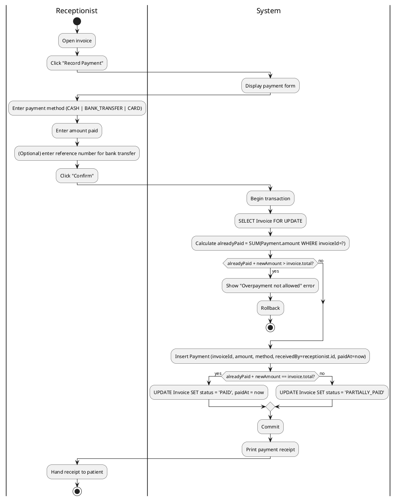
```plantuml
@startuml
|Receptionist|
start
:Open invoice;
:Click "Record Payment";
|System|
:Display payment form;
|Receptionist|
:Enter payment method (CASH | BANK_TRANSFER | CARD);
:Enter amount paid;
:(Optional) enter reference number for bank transfer;
:Click "Confirm";
|System|
:Begin transaction;
:SELECT Invoice FOR UPDATE;
:Calculate alreadyPaid = SUM(Payment.amount WHERE invoiceId=?);
if (alreadyPaid + newAmount > invoice.total?) then (yes)
  :Show "Overpayment not allowed" error;
  :Rollback;
  stop
else (no)
endif
:Insert Payment (invoiceId, amount, method, receivedBy=receptionist.id, paidAt=now);
if (alreadyPaid + newAmount == invoice.total?) then (yes)
  :UPDATE Invoice SET status = 'PAID', paidAt = now;
else (no)
  :UPDATE Invoice SET status = 'PARTIALLY_PAID';
endif
:Commit;
:Print payment receipt;
|Receptionist|
:Hand receipt to patient;
stop
@enduml
```

**Business Rules**

| Activity | BR Code | Description |
| --- | --- | --- |
| (4) | BR70 | **Payment Method Validation:** [method] ∈ {CASH, BANK_TRANSFER, CARD, MOMO, VNPAY, ZALOPAY}. CARD/online methods marked as "not yet implemented" if gateway not connected. |
| (7) | BR71 | **Amount Validation:** [amount] > 0 AND `alreadyPaid + amount <= invoice.total`. Else show MSG 64. |
| (10) | BR72 | **State Transition:** Use `InvoiceStateMachine`: PENDING → PARTIALLY_PAID → PAID. PAID is terminal except for REFUNDED. |

---

#### UC20: Process Refund

| Name | Process Refund |
| --- | --- |
| **Description** | This use case allows Admin to process a refund for a paid invoice (e.g. wrong medicine dispensed, service not delivered). |
| **Actor** | Admin |
| **Trigger** | When the Admin clicks "Issue Refund" on a paid invoice. |
| **Pre-condition** | The Admin is logged in with permission `invoices.refund`. The Invoice is in status 'PAID' or 'PARTIALLY_PAID'. |
| **Post-condition** | A Refund record is created. If refund covers medicines, those items can be returned to stock. Invoice.status becomes 'REFUNDED' or 'PARTIALLY_REFUNDED'. |

**Activities Flow**

```plantuml
@startuml
|Admin|
start
:Open invoice;
:Click "Issue Refund";
|System|
:Display refund form with invoice items;
|Admin|
:Select items to refund;
:For medicine items, choose whether to return to stock;
:Enter refund reason;
:Click "Confirm";
|System|
:Show confirmation dialog (Refer MSG 1);
|Admin|
if (confirmed?) then (no)
  stop
else (yes)
endif
|System|
:Begin transaction;
:Calculate refundAmount = sum of selected items;
:Insert Refund (invoiceId, amount, reason, processedBy=admin.id);
for each medicine item to return:
  :UPDATE Medicine SET stock = stock + qty;
  :Update MedicineExport.returnedQty;
endfor
if (refundAmount == invoice.total?) then (yes)
  :UPDATE Invoice SET status = 'REFUNDED';
else
  :UPDATE Invoice SET status = 'PARTIALLY_REFUNDED';
endif
:Commit;
:Audit log;
:Send refund notification to patient;
|Admin|
:Print refund receipt;
stop
@enduml
```

**Business Rules**

| Activity | BR Code | Description |
| --- | --- | --- |
| (5) | BR73 | **Refundable Items:** Only items not yet consumed (e.g. medicines patient hasn't picked up). Consultation fee usually non-refundable unless visit was cancelled. |
| (8) | BR74 | **Refund Amount:** `refundAmount <= total paid - already refunded`. Else error MSG 65. |
| (10) | BR75 | **Stock Restoration:** Only if medicine package is unopened and within 7 days of original export. Older returns require Admin override. |

---

#### UC21: Generate Payroll

| Name | Generate Payroll |
| --- | --- |
| **Description** | This use case allows Admin to generate monthly payroll for all employees based on base salary and attendance records. |
| **Actor** | Admin |
| **Trigger** | When the Admin clicks "Generate Payroll" for a target month. |
| **Pre-condition** | The Admin is logged in with permission `payroll.manage`. The target month has ended. Attendance records exist for the period. |
| **Post-condition** | Payroll records are created for all active employees. |

**Activities Flow**

```plantuml
@startuml
|Admin|
start
:Select target month (e.g. 2026-04);
:Click "Generate Payroll";
|System|
:Show confirmation;
|Admin|
if (confirmed?) then (no)
  stop
else (yes)
endif
|System|
:Begin transaction;
:Fetch all active Employees;
for each employee:
  :Aggregate Attendance: workDays, lateMinutes, overtimeHours for the month;
  :Calculate grossSalary = baseSalary;
  :Apply deductions = lateMinutes * lateRate / 60;
  :Apply bonus = overtimeHours * overtimeRate;
  :netSalary = grossSalary + bonus - deductions;
  :Insert Payroll (employeeId, month, gross, deductions, bonus, net, status='DRAFT');
endfor
:Commit;
|Admin|
:Review and approve each payroll;
:Set status to 'APPROVED';
:Notify employees;
stop
@enduml
```

**Business Rules**

| Activity | BR Code | Description |
| --- | --- | --- |
| (4) | BR76 | **Duplicate Check:** If Payroll for the same employee + month already exists with status != 'DRAFT', skip with warning. |
| (7) | BR77 | **Calculation:** `lateRate` and `overtimeRate` configurable in SystemSettings. Default lateRate = baseSalary/22/8/60 (per minute). Default overtimeRate = baseSalary/22/8 * 1.5 (per hour). |
| (8) | BR78 | **Approval Workflow:** Payroll starts in DRAFT. Admin must explicitly approve to lock it. Once APPROVED, becomes immutable. |

---

#### UC22: Generate Doctor Schedule

| Name | Generate Doctor Schedule |
| --- | --- |
| **Description** | This use case allows automatic or manual generation of doctor shift assignments for a future period, based on Shift Templates. |
| **Actor** | Admin, System (cron job) |
| **Trigger** | Weekly cron job, or Admin clicks "Generate Schedule" button. |
| **Pre-condition** | Shift Templates are defined for each shift (morning/afternoon/evening). Doctors have specialty and availability info. |
| **Post-condition** | DoctorShift records are created for the target week. |

**Activities Flow**

```plantuml
@startuml
|Trigger|
start
if (manual or cron?) then (manual)
  |Admin|
  :Select target week;
  :Click "Generate";
else (cron)
  |System|
  :Cron fires every Sunday 23:00;
endif
|System|
:For each day in target week (Mon-Sun):
:    For each ShiftTemplate (morning, afternoon, evening):
:        Select doctors based on availability and rotation policy;
:        Insert DoctorShift (doctorId, shiftId, workDate, maxSlots);
:Log generation result;
|Admin|
:Review and adjust assignments;
stop
@enduml
```

**Business Rules**

| Activity | BR Code | Description |
| --- | --- | --- |
| (1) | BR79 | **Cron Schedule:** `0 23 * * 0` (every Sunday at 23:00). Only the leader instance executes (when `ENABLE_SCHEDULER=true`). |
| (4) | BR80 | **Rotation Policy:** Round-robin within specialty. Avoid scheduling same doctor for 2 consecutive shifts on same day. Honor doctor's preferred days (stored in Doctor.preferredDays). |
| (5) | BR81 | **Default maxSlots:** Read from `SystemSettings.default_slots_per_shift` (default 15). |

---

#### UC23: Record Attendance

| Name | Record Attendance |
| --- | --- |
| **Description** | This use case allows employees to clock in and clock out, recording their attendance. |
| **Actor** | Employee (Doctor, Receptionist) |
| **Trigger** | When the employee clicks "Clock In" or "Clock Out" button. |
| **Pre-condition** | The employee is logged in. |
| **Post-condition** | An Attendance record is created or updated. |

**Activities Flow**

```plantuml
@startuml
|Employee|
start
:Open Attendance page;
|System|
:Display today's status (not clocked in / clocked in / clocked out);
|Employee|
if (action == "Clock In"?) then (yes)
  |System|
  if (already clocked in today?) then (yes)
    |Employee|
    :Show "Already clocked in" error;
    stop
  else (no)
  endif
  :Insert Attendance (employeeId, date=today, clockInTime=now);
  :If now > scheduled start + 15 min, mark lateMinutes;
else (clock out)
  |System|
  :Fetch today's Attendance;
  :Update clockOutTime = now;
  :Calculate workMinutes;
  :If workMinutes > scheduled + 30, mark overtime;
endif
|Employee|
:Show updated status;
stop
@enduml
```

**Business Rules**

| Activity | BR Code | Description |
| --- | --- | --- |
| (3) | BR82 | **Duplicate Clock-in Prevention:** Use unique constraint `(employeeId, date)` on Attendance table. |
| (5) | BR83 | **Late Calculation:** `lateMinutes = max(0, clockInTime - scheduledStart - 15_min_grace)`. |
| (7) | BR84 | **Overtime Calculation:** `overtimeMinutes = max(0, workMinutes - scheduledDuration - 30_min_grace)`. |

---

#### UC24: View Audit Logs

| Name | View Audit Logs |
| --- | --- |
| **Description** | This use case allows Admin to query and inspect audit log entries for compliance and incident investigation. |
| **Actor** | Admin |
| **Trigger** | When the Admin opens the Audit Log page. |
| **Pre-condition** | The Admin is logged in with permission `audit_logs.read`. |
| **Post-condition** | Audit log entries matching the filter are displayed. |

**Activities Flow**

```plantuml
@startuml
|Admin|
start
:Open Audit Log page;
|System|
:Display filter form (date range, user, tableName, action);
|Admin|
:Set filters;
:Click "Search";
|System|
:Build query with filters;
:Apply pagination (page, limit=50);
:Fetch from AuditLog table;
:Return paged results;
|Admin|
:View list;
:Click an entry to see old vs new values diff;
stop
@enduml
```

**Business Rules**

| Activity | BR Code | Description |
| --- | --- | --- |
| (4) | BR85 | **Filter Rules:** [dateFrom, dateTo] (max 90-day range), [userId], [tableName], [action] ∈ {CREATE, UPDATE, DELETE, VIEW, EXPORT}. |
| (6) | BR86 | **Pagination:** Default page=1, limit=50, max limit=200. |
| (8) | BR87 | **Diff Display:** Show oldValue and newValue as JSON, with diff highlighting (e.g. using `jsondiffpatch`). |

---

#### UC25: Generate Report

| Name | Generate Report |
| --- | --- |
| **Description** | This use case allows Admin to generate analytical reports (revenue, visits, inventory, payroll) for a specified period, exportable as Excel or PDF with charts. |
| **Actor** | Admin |
| **Trigger** | When the Admin clicks "Generate Report" button. |
| **Pre-condition** | The Admin is logged in with permission `reports.read`. |
| **Post-condition** | A report file (Excel/PDF) is downloaded by the user. |

**Activities Flow**

```plantuml
@startuml
|Admin|
start
:Open Reports page;
:Select report type (Revenue | Visits | Inventory | Payroll);
:Set date range;
:Select format (Excel | PDF);
:Click "Generate";
|System|
:Validate inputs and permission;
:Run aggregate queries on replica DB (if configured);
:Build report data structure;
if (format == Excel?) then (yes)
  :Use exceljs to build workbook;
  :Add header, data rows, summary rows;
  :Stream file to client;
else (PDF)
  :Use pdfkit to build PDF;
  :Render charts using chartjs-node-canvas;
  :Embed charts and tables;
  :Stream file to client;
endif
|Admin|
:Receive downloaded file;
stop
@enduml
```

**Business Rules**

| Activity | BR Code | Description |
| --- | --- | --- |
| (4) | BR88 | **Date Range:** Max 12 months per report. If exceeded, show error MSG 66. |
| (7) | BR89 | **Read Replica:** If `DB_REPLICA_URL` is configured, route aggregate queries to replica via Sequelize `useMaster: false`. |
| (10) | BR90 | **Streaming:** For large reports (>5000 rows), use Excel streaming writer to avoid memory issues. |
| (11) | BR91 | **Chart Generation:** Use chartjs-node-canvas to render PNG charts at 800x400, embed via `pdfkit.image()`. |

---

#### UC26: Update System Settings

| Name | Update System Settings |
| --- | --- |
| **Description** | This use case allows Admin to change runtime business parameters without redeploying the system. |
| **Actor** | Admin |
| **Trigger** | When the Admin clicks "Save Settings" on the System Settings page. |
| **Pre-condition** | The Admin is logged in with permission `system_settings.manage`. |
| **Post-condition** | The settings are persisted in SystemSettings table. In-process cache is invalidated. New requests use updated values. |

**Activities Flow**

```plantuml
@startuml
|Admin|
start
:Open System Settings page;
|System|
:Display current settings (slots/shift, expiry threshold, consultation fee, notification config, etc.);
|Admin|
:Modify values;
:Click "Save";
|System|
:Show confirmation;
|Admin|
if (confirmed?) then (no)
  stop
else (yes)
endif
|System|
:Validate each value type and range;
if (valid?) then (yes)
  :UPDATE SystemSettings;
  :Invalidate in-process cache for SystemSettingsService;
  :Audit log;
  |Admin|
  :Show success;
  stop
else (no)
  |Admin|
  :Show validation error;
  stop
endif
@enduml
```

**Business Rules**

| Activity | BR Code | Description |
| --- | --- | --- |
| (3) | BR92 | **Settings Schema:** Each setting has a defined key, type, validation rule. Examples: • `default_slots_per_shift` (int, 1-50) • `consultation_fee_default` (decimal, > 0) • `medicine_expiry_warning_days` (int, 1-180) • `late_cancellation_threshold_hours` (int, 1-72) • `notification_email_enabled` (boolean). |
| (7) | BR93 | **Cache Invalidation:** Call `systemSettingsService.refreshCache()`. Wrapper has TTL of 60s; explicit invalidation makes change effective within 1 second. |
| (8) | BR94 | **Audit Rules:** Each key change captured separately with old/new values. |

---

#### UC27: Toggle Maintenance Mode

| Name | Toggle Maintenance Mode |
| --- | --- |
| **Description** | This use case allows Admin to enable or disable maintenance mode, which blocks normal user API access while keeping admin endpoints available. |
| **Actor** | Admin |
| **Trigger** | When the Admin clicks "Enable/Disable Maintenance" on System Settings. |
| **Pre-condition** | The Admin is logged in with permission `maintenance.toggle`. |
| **Post-condition** | The maintenance flag is updated. Non-admin requests receive 503 within ≤ 1 second. |

**Activities Flow**

```plantuml
@startuml
|Admin|
start
:Click "Enable Maintenance" or "Disable Maintenance";
|System|
:Show strong confirmation dialog with banner preview;
|Admin|
if (confirmed?) then (no)
  stop
else (yes)
endif
|System|
:UPDATE SystemSettings SET value=? WHERE key='maintenance_mode';
:Invalidate in-process cache;
:Audit log with action='TOGGLE_MAINTENANCE';
|Admin|
:Show success with current status;
stop

note right
  When maintenance is ON:
  - checkMaintenance middleware
    returns 503 for non-admin requests
  - Admin endpoints (/api/admin/*, /api/auth/*)
    are bypassed
  - Frontend shows maintenance banner
end note
@enduml
```

**Business Rules**

| Activity | BR Code | Description |
| --- | --- | --- |
| (2) | BR95 | **Confirmation Required:** Strong confirmation dialog showing impact (number of currently logged-in users). |
| (4) | BR96 | **Effective Time:** ≤ 1 second from save to enforcement (limited by in-process cache TTL of 1 second when maintenance mode changes). |
| (5) | BR97 | **Bypass Rules:** Middleware bypasses for routes matching `/api/auth/*`, `/api/admin/*`, and any request whose JWT roleId == ADMIN. |

---

### 2.2. List Description

`Clinic Management System List Description.xlsx`

(Separate file containing detailed UI specifications for all forms and pages.)

### 2.3. View Description

`Clinic Management System View Description.xlsx`

(Separate file containing detailed screen layouts and component specifications.)

---

## 3. Non-functional Requirements

### 3.1. User Access and Security

| Function \\ Actor | Admin | Doctor | Receptionist | Patient |
| --- | :---: | :---: | :---: | :---: |
| Sign In | x | x | x | x |
| Sign Up | | | | x |
| Forgot Password | x | x | x | x |
| Sign In with Google OAuth | | | | x |
| Sign Out | x | x | x | x |
| Change Password | x | x | x | x |
| Update Own Profile | x | x | x | x |
| Manage Employee Account | x | | | |
| Book Appointment Online | | | | x |
| Book Appointment Offline | | | x | |
| Cancel Own Appointment | | | | x |
| Cancel Any Appointment | x | | x | |
| Reschedule Own Appointment | | | | x |
| Reschedule Any Appointment | x | | x | |
| Check-in Patient | x | | x | |
| Record Visit | | x | | |
| Create Prescription | | x | | |
| View Own Prescription | | | | x |
| Manage Medicine | x | | | |
| Import Medicine to Stock | x | | | |
| Create Invoice | x | | x | |
| View Own Invoice | | | | x |
| Process Payment | x | | x | |
| Process Refund | x | | | |
| Generate Payroll | x | | | |
| View Own Payroll | | x | x | |
| Generate Doctor Schedule | x | | | |
| View Own Schedule | | x | | |
| Record Own Attendance | | x | x | |
| View Audit Logs | x | | | |
| Generate Report | x | | | |
| View Dashboard | x | | | |
| Update System Settings | x | | | |
| Toggle Maintenance Mode | x | | | |

**Legend:** `x` = User has permission to perform the action.

---

### 3.2. Performance Requirements

**Number of users**

- Number of concurrent users: 50 (typical) — 100 (peak during morning registration hours)
- Number of business users: 500 — 1500 registered patients per clinic + 5-20 staff members

**Data volume**

- Number of records (steady state after 3 years):
  - Patient: 5,000 — 20,000
  - Appointment: 50,000 — 200,000 (≈ 50–80 per day)
  - Visit: 50,000 — 200,000
  - Prescription: 40,000 — 180,000
  - Invoice: 50,000 — 200,000
  - AuditLog: 500,000 — 2,000,000
- Data growth rate: ~5 MB/day (excluding file uploads)
- File upload growth: ~50 MB/day (avatars + symptom images)

**Level of availability**

- 99% uptime for core business flows (appointment booking, visit recording, invoice creation, payment).
- Maximum downtime: ~3.65 days/year (including planned maintenance).
- Recovery Time Objective (RTO): < 30 minutes for service restoration after failure.
- Recovery Point Objective (RPO): < 1 hour data loss tolerance.

**Response time**

- P95 < 500 ms for list/search APIs (patients, appointments, prescriptions, invoices, medicines).
- Dashboard aggregate queries < 1.5 seconds.
- Monthly report generation < 5 seconds.
- JWT verification < 100 ms.
- OTP email delivery < 30 seconds.
- Token revocation effective within ≤ 1 second across the system.

**Usage frequency**

- The system is used continuously during clinic operating hours (typically 7:00 — 20:00 local time, 7 days/week).
- Peak usage occurs during morning registration (7:00 — 9:00) and end-of-day invoicing (17:00 — 19:00).
- Maintenance windows are scheduled outside operating hours.

**Concurrency requirements**

- Up to 10 patients may attempt to book the same near-full doctor shift simultaneously without over-booking.
- The system must reject excess bookings with clear error messages.
- 0 cases of over-booking allowed (validated via concurrent test).

---

### 3.3. Implementation Requirements

**Location**

Ho Chi Minh City, Viet Nam (primary). Can be deployed on-premise at clinic location or in cloud (AWS ap-southeast-1, GCP asia-southeast1, Azure SEA region).

**Read-only Duration**

1 day (during planned major migrations, e.g. schema upgrades that cannot be done online).

**Read-only Timeframe**

00:00 — 04:00 (off-hours) on the day of maintenance.

**Maintenance Window**

Every week on Sunday evening at 23:00, lasting 1 to 2 hours. During this time, developers can deploy new versions, apply migrations, and perform infrastructure changes. Maintenance mode is enabled to block normal user traffic while admins can still access for monitoring.

**Overall conversion timeline**

- Initial data import (existing patient records from legacy system): one-time at go-live.
- Backup schedule: daily full backup at 02:00, weekly archive on Sunday.

**Deployment topology**

- Single-instance on-premise (Docker Compose): for clinics with stable on-site IT.
- Multi-instance cloud (Kubernetes or ECS): for clinic chains, with N stateless API instances behind a load balancer, MySQL primary+replica, Redis cluster, S3-compatible object storage for uploads.

**Browser compatibility**

- Chrome, Edge, Firefox, Safari: latest 2 major versions.
- No support for Internet Explorer.
- Mobile: responsive design supporting iOS Safari 14+ and Android Chrome 90+.

**Localization**

- Primary language: Vietnamese.
- All error codes are language-agnostic UPPER_SNAKE strings; frontend maps to localized text.
- Future support for English planned (i18n framework in frontend).

---

## 4. Appendixes

### Glossary

The list below contains all the necessary terms to interpret the document, including acronyms and abbreviations.

| Term | Description |
| --- | --- |
| **BR** | **B**usiness **R**ule |
| **CBR** | **C**ommon **B**usiness **R**ule |
| **DB** | **D**ata**b**ase |
| **MSG** | **M**essa**g**e |
| **UC** | **U**se **C**ase |
| **N/A** | **N**ot **A**vailable or **N**ot **A**pplicable, used to indicate when information in a certain section could not be provided because it does not apply to this application. |
| **UI** | **U**ser **I**nterface |
| **SRS** | **S**oftware **R**equirements **S**pecification |
| **TBD** | **T**o **b**e **d**etermined or to be defined |
| **OTP** | **O**ne-**T**ime **P**assword |
| **JWT** | **J**SON **W**eb **T**oken |
| **RBAC** | **R**ole-**B**ased **A**ccess **C**ontrol |
| **OAuth** | Open Authorization standard for delegated authentication |
| **PII** | **P**ersonally **I**dentifiable **I**nformation |
| **CRUD** | **C**reate, **R**ead, **U**pdate, **D**elete |
| **Appointment** | A scheduled meeting between patient and doctor at a specific shift. |
| **Visit** | A clinical examination event derived from a checked-in appointment, containing diagnosis and vitals. |
| **Prescription** | A list of medicines prescribed by a doctor during a visit. |
| **DoctorShift** | An assignment of a doctor to a specific shift on a specific date, with maxSlots. |
| **Shift** | A standardized work period (e.g. morning shift 7:00–11:00). |
| **Invoice** | A billing document for a completed visit, containing consultation fee and medicine items. |
| **Medicine Export** | A record of medicines dispensed to a patient as part of an invoice; decrements stock. |
| **Medicine Import** | A record of medicines stocked in from a supplier; increments stock. |
| **No-show** | An appointment status indicating the patient did not check in by the end of the shift. |
| **State Machine** | A centralized utility enforcing valid status transitions for Appointment, Visit, and Invoice entities. |
| **Audit Log** | A record of every mutating action capturing actor, action, target, before/after values, and timestamp. |
| **Maintenance Mode** | A runtime flag that returns 503 to non-admin users while allowing admins to continue operations. |
| **Token Blacklist** | A Redis-backed set of revoked JWT tokens checked on every authenticated request. |

---

### Messages

This section describes the details of messages used in business rules e.g. error messages, confirmation messages, etc.

| Message Code | Message Content | Button |
| --- | --- | --- |
| MSG 1 | Are you certain with this decision? | OK / Cancel |
| MSG 2 | You need to fill in all fields. | |
| MSG 3 | Operation completed successfully. | |
| MSG 4 | Payment failed. Please check your account. | |
| MSG 5 | Payment successful. | |
| MSG 6 | Are you sure you have received your service? | OK / Cancel |
| MSG 7 | Are you certain to approve this item? | |
| MSG 8 | Approve successful. | |
| MSG 9 | Are you certain to reject this item? | |
| MSG 10 | Reject successful. | |
| MSG 11 | File size is too large. | |
| MSG 12 | Item does not exist. | |
| MSG 13 | Price cannot be less than 0. | |
| MSG 14 | Description must contain at least 50 characters. | |
| MSG 15 | You don't have permission to perform this action. | |
| MSG 16 | Record updated. | |
| MSG 17 | Update failed. | |
| MSG 18 | The record does not exist. | |
| MSG 19 | Cannot delete a record with dependent data. | |
| MSG 20 | Delete successful. | |
| MSG 21 | Delete failed. | |
| MSG 22 | Email or password is incorrect. | |
| MSG 23 | Your account has been suspended. Please contact the clinic. | |
| MSG 24 | Logged in successfully. | |
| MSG 25 | Invalid password. Password must contain at least 8 characters, including letters, numbers, and special characters. | |
| MSG 26 | Phone number has been used. | |
| MSG 27 | Email has been registered. | |
| MSG 28 | Successfully registered. Please sign in. | |
| MSG 29 | Phone / email already exists. | |
| MSG 30 | Invalid phone number. | |
| MSG 31 | Invalid email format. | |
| MSG 32 | User not found. | |
| MSG 33 | Invalid or expired verification link. | |
| MSG 34 | New password must not be the same as the old password. | |
| MSG 35 | The message contains inappropriate words. | |
| MSG 36 | Network error. Please try again. | |
| MSG 37 | Invalid payment information. | |
| MSG 38 | Refund successful. | |
| MSG 39 | Refund failed. | |
| MSG 40 | Confirm successful. | |
| MSG 41 | Operation failed. | |
| MSG 42 | Thank you. | |
| MSG 43 | Status updated. | |
| MSG 44 | Action required. | OK / Cancel |
| MSG 45 | Phone number is not valid. | |
| MSG 46 | OTP is incorrect. | |
| MSG 47 | Thank you for your feedback. We will review it. | |
| MSG 48 | New record has been created. | |
| MSG 49 | This name already exists. | |
| MSG 50 | Update successful. | |
| MSG 51 | ALERT. Do you want to delete this? This action cannot be undone. | OK / Cancel |
| MSG 52 | Account change successful. | |
| MSG 53 | This account is invalid. | |
| MSG 54 | Document was updated successfully. | |
| MSG 55 | Feedback handled successfully. | |
| MSG 56 | OAuth authentication failed. Please try signing in with email and password. | |
| MSG 57 | You have been signed out successfully. | |
| MSG 58 | Invalid file format. Only JPEG, PNG, and WebP are allowed. | |
| MSG 59 | All slots for this shift have been booked. Please choose another shift. | |
| MSG 60 | This shift has already ended. Please choose another shift. | |
| MSG 61 | You have reached the maximum number of reschedules for this appointment. | |
| MSG 62 | This medicine will expire within 30 days. Please confirm to proceed. | OK / Cancel |
| MSG 63 | Stock is insufficient for this medicine. | |
| MSG 64 | Payment amount cannot exceed the invoice total. | |
| MSG 65 | Refund amount cannot exceed the paid amount. | |
| MSG 66 | Date range cannot exceed 12 months. | |
| MSG 67 | The system is under maintenance. Please try again later. | |
| MSG 68 | Your session has expired. Please sign in again. | |
| MSG 69 | Too many requests. Please slow down and try again later. | |
| MSG 70 | The doctor is not on duty for the selected shift. | |

---

### Issues List

| ID | Issue | Status | Assigned To | Notes |
| --- | --- | --- | --- | --- |
| ISS-001 | Online payment gateway (VNPay / MoMo) integration not yet implemented. Only cash and bank transfer (manual reconciliation) are supported. | Open | Backend Team | Structure ready; gateway sandbox accounts pending. |
| ISS-002 | Multi-instance deployment requires additional infrastructure changes (Redis-backed rate limit, scheduler leader flag). | Open | DevOps | See SAD Section 9 for migration plan. |
| ISS-003 | English UI translation not yet implemented. Currently Vietnamese only. | Deferred | Frontend Team | Phase 2 deliverable. |
| ISS-004 | Lab result integration with external lab systems not in scope for v1.0. | Out of Scope | — | Possible future enhancement. |
| ISS-005 | Telemedicine (video consultation) not supported in v1.0. | Out of Scope | — | — |
| ISS-006 | Insurance claim processing not supported in v1.0. | Out of Scope | — | Pending regulatory clarification. |

---

*End of Software Requirements Specification document.*
